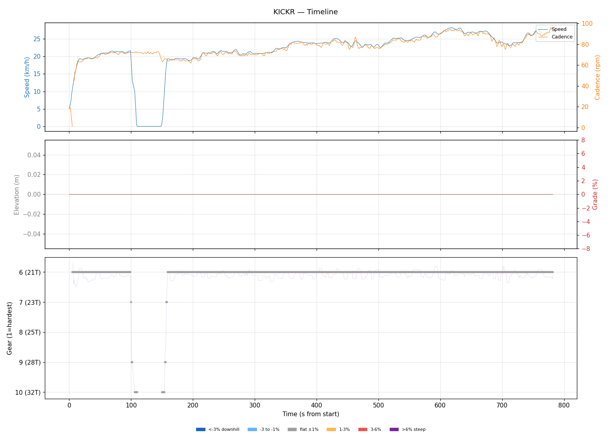
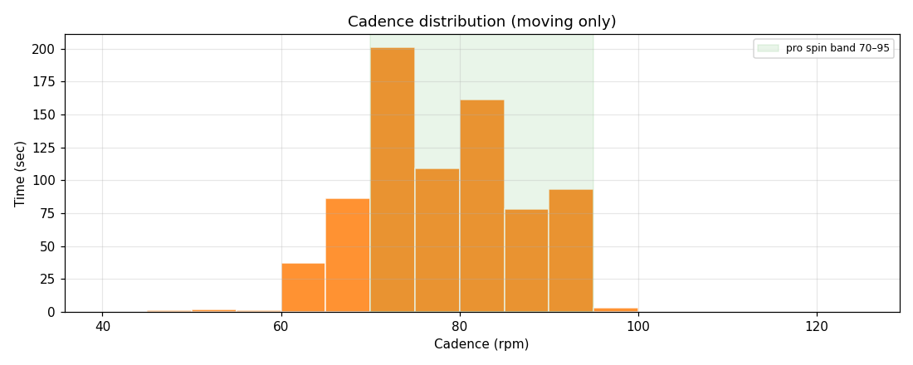
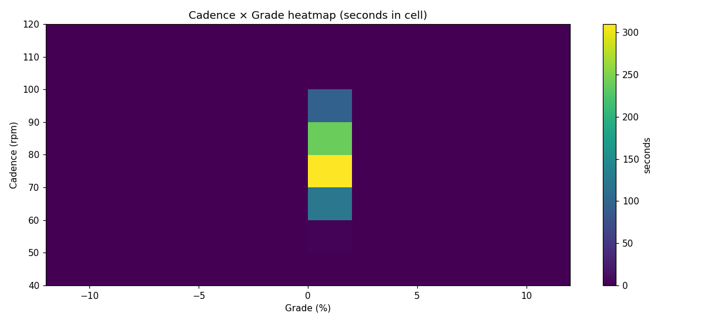
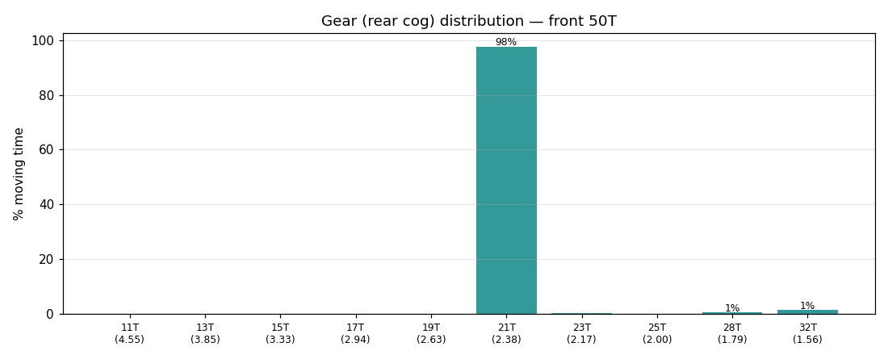
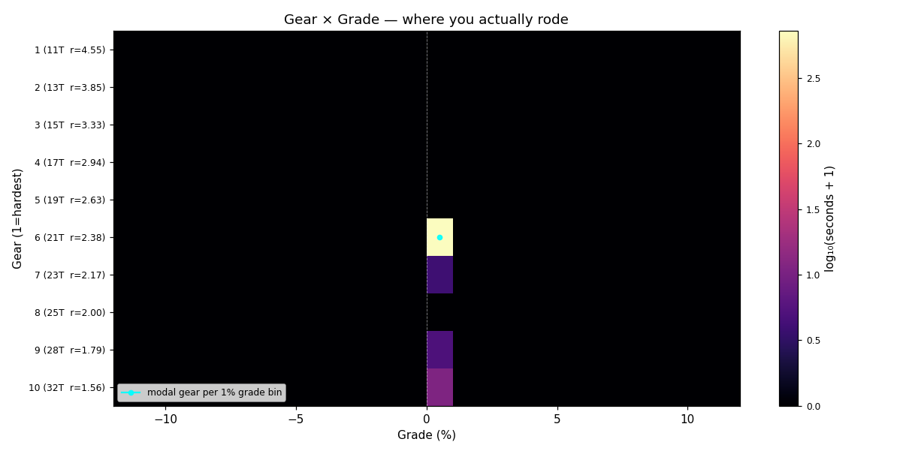
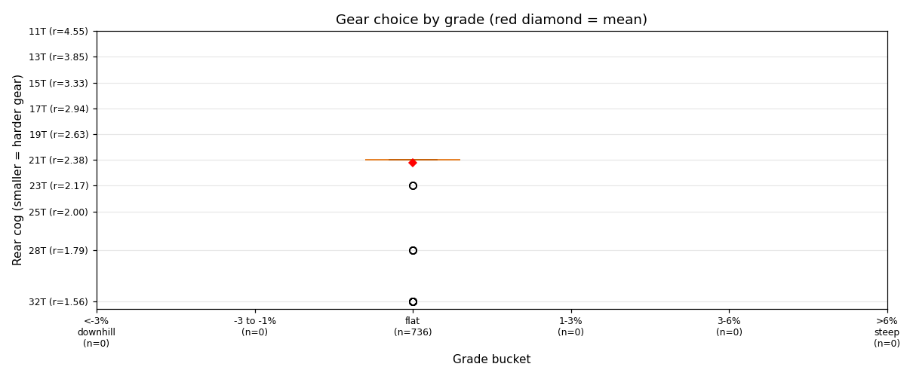
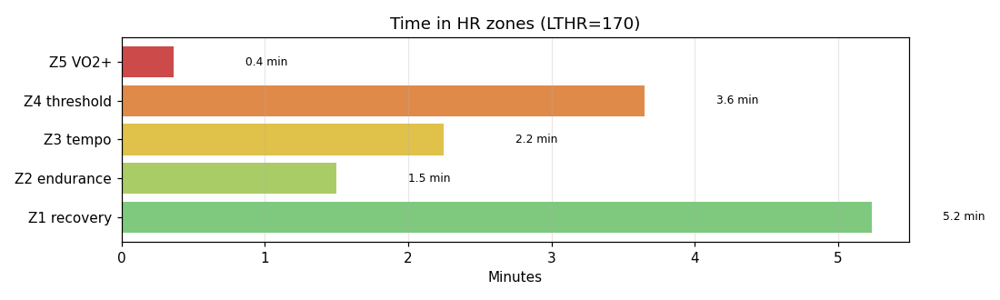

# KICKR

**2026-02-27 17:49**

> Short ride — 4.7 km, 0 m gain (flat). Easy day: hrTSS 12. Cadence in good range (mean 78 rpm, SD 9). Aerobic durability sound (decoupling -4.8%).

Shorter than recent average (23.4 km).

## Summary

| | |
|---|---|
| Distance | 4.71 km |
| Moving time | 0:12:14 |
| Total time | 0:13:02 |
| Avg speed | 23.0 km/h |
| Max speed | 28.2 km/h |
| Elev gain / loss | 0 / 0 m |
| Max grade | 0.0% |
| Avg HR | 150 bpm |
| Max HR | 171 bpm |
| Avg cadence | 78 rpm |
| **hrTSS** | **12** |
| TRIMP (Banister) | 24.3 |
| EF (speed/HR) | 2.55 |
| Pa:Hr decoupling | -4.8% |

## Timeline

## Cadence

| Stat | Value |
|---|---|
| Mean | 78 rpm |
| Median | 78 rpm |
| SD | 9 |
| Grind (<70) | 16% |
| Normal (70–85) | 61% |
| Spin (85–100) | 23% |
| High (>100) | 0% |

## Gear selection

| Cog | Ratio | Time(s) | % moving |
|---|---|---|---|
| 21T | 2.38 | 719 | 97.7% |
| 23T | 2.17 | 3 | 0.4% |
| 28T | 1.79 | 4 | 0.5% |
| 32T | 1.56 | 10 | 1.4% |

### Gear by grade bucket

| Grade bucket | Time (s) | Avg cog | Modal cog |
|---|---|---|---|
| downhill (<-3%) | 0 | – | – |
| false flat down | 0 | – | – |
| flat | 736 | 21.2T | 21T (98%) |
| false flat up | 0 | – | – |
| rolling climb | 0 | – | – |
| steep climb (>6%) | 0 | – | – |

### Interpretation
- Never used the hardest cogs — no descents/sustained tailwinds.
- Most-used cog: 21T (98% of moving time).

## HR zones

LTHR assumed: **170 bpm** (configurable in `secrets/profile.json`).

## Climbs

_No detected climbs._

---

_Generated by bike-report. Bike: 2020 Allez Sport, 50T × 11-32T._
