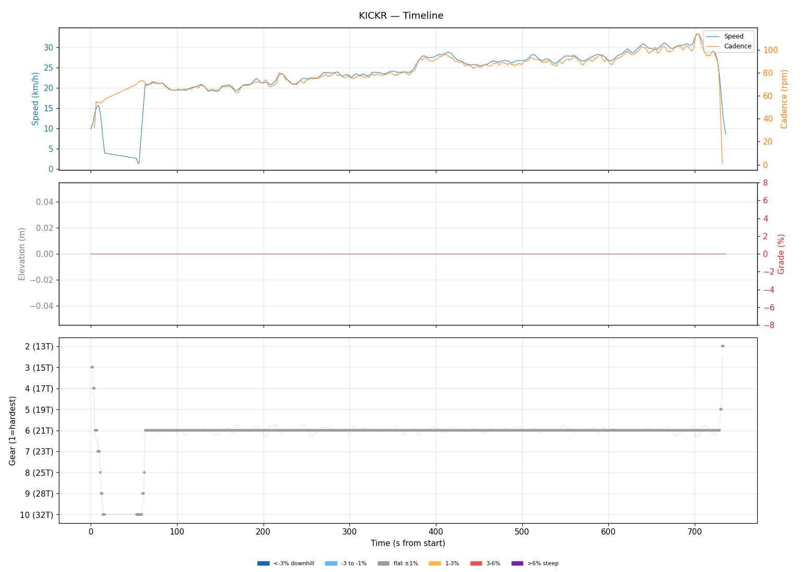
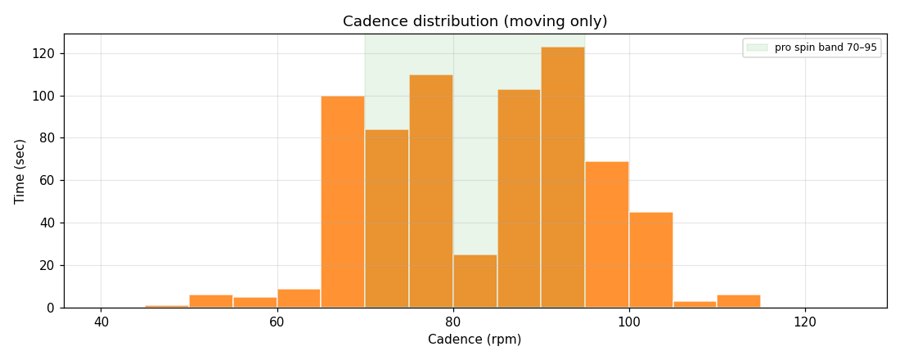
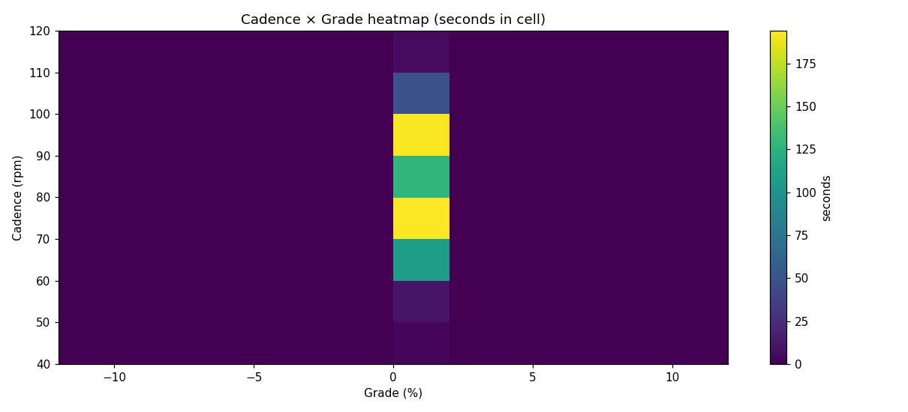
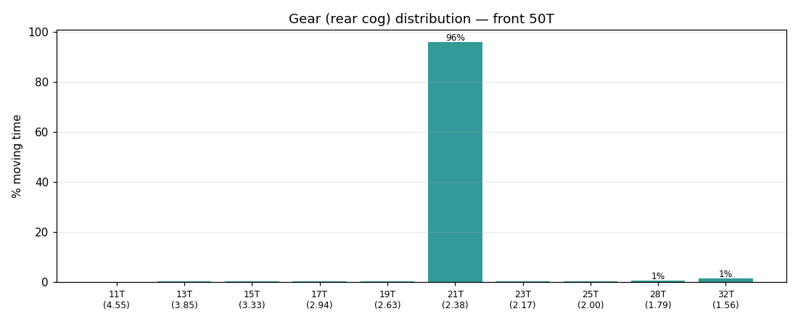
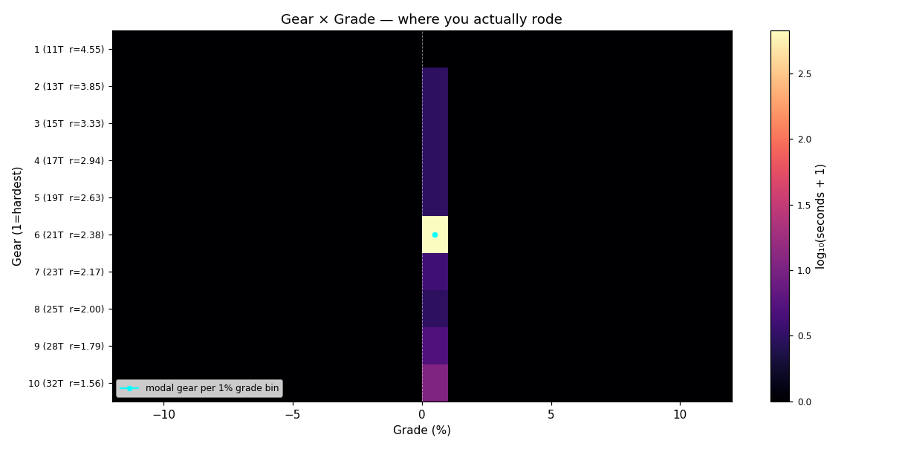
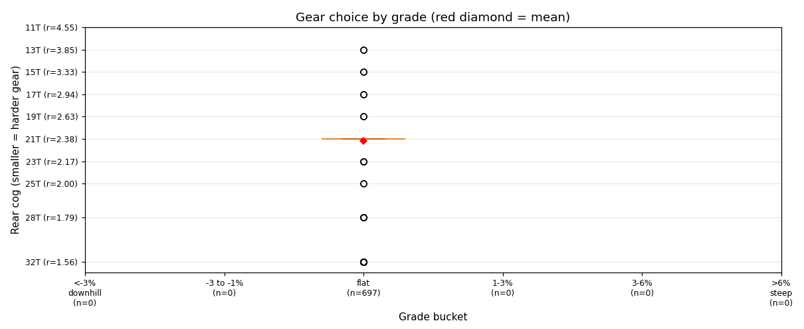
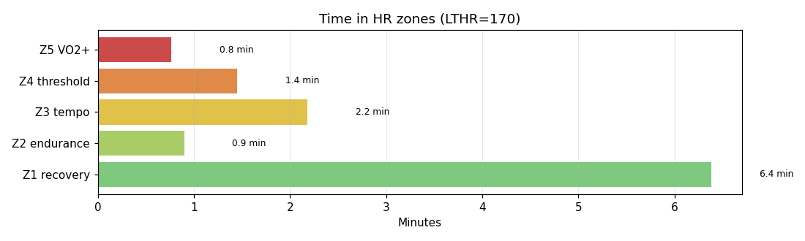

# KICKR

**2026-03-08 18:47**

> Short ride — 4.8 km, 0 m gain (flat). Easy day: hrTSS 9. Cadence in good range (mean 83 rpm, SD 12). Aerobic durability sound (decoupling -3.6%).

Shorter than recent average (17.2 km).

## Summary

| | |
|---|---|
| Distance | 4.77 km |
| Moving time | 0:11:35 |
| Total time | 0:12:16 |
| Avg speed | 24.6 km/h |
| Max speed | 33.4 km/h |
| Elev gain / loss | 0 / 0 m |
| Max grade | 0.0% |
| Avg HR | 142 bpm |
| Max HR | 174 bpm |
| Avg cadence | 83 rpm |
| **hrTSS** | **9** |
| TRIMP (Banister) | 18.9 |
| EF (speed/HR) | 2.88 |
| Pa:Hr decoupling | -3.6% |

## Timeline

## Cadence

| Stat | Value |
|---|---|
| Mean | 83 rpm |
| Median | 85 rpm |
| SD | 12 |
| Grind (<70) | 18% |
| Normal (70–85) | 32% |
| Spin (85–100) | 43% |
| High (>100) | 8% |

## Gear selection

| Cog | Ratio | Time(s) | % moving |
|---|---|---|---|
| 13T | 3.85 | 2 | 0.3% |
| 15T | 3.33 | 2 | 0.3% |
| 17T | 2.94 | 2 | 0.3% |
| 19T | 2.63 | 2 | 0.3% |
| 21T | 2.38 | 670 | 96.1% |
| 23T | 2.17 | 3 | 0.4% |
| 25T | 2.00 | 2 | 0.3% |
| 28T | 1.79 | 4 | 0.6% |
| 32T | 1.56 | 10 | 1.4% |

### Gear by grade bucket

| Grade bucket | Time (s) | Avg cog | Modal cog |
|---|---|---|---|
| downhill (<-3%) | 0 | – | – |
| false flat down | 0 | – | – |
| flat | 697 | 21.2T | 21T (96%) |
| false flat up | 0 | – | – |
| rolling climb | 0 | – | – |
| steep climb (>6%) | 0 | – | – |

### Interpretation
- Never used the hardest cogs — no descents/sustained tailwinds.
- Most-used cog: 21T (96% of moving time).

## HR zones

LTHR assumed: **170 bpm** (configurable in `secrets/profile.json`).

## Climbs

_No detected climbs._

---

_Generated by bike-report. Bike: 2020 Allez Sport, 50T × 11-32T._
