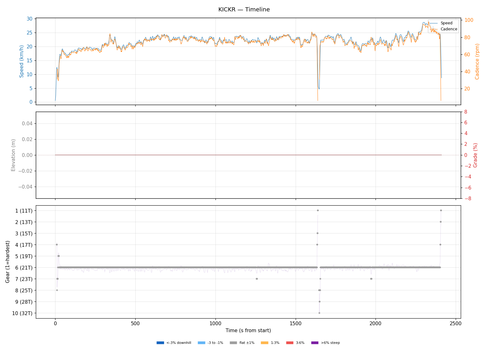
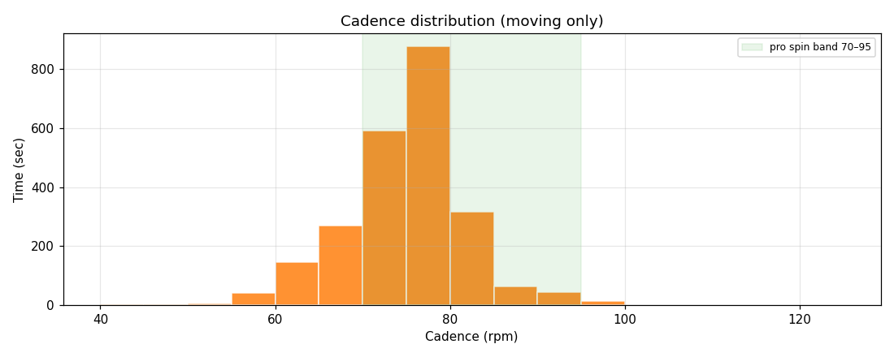
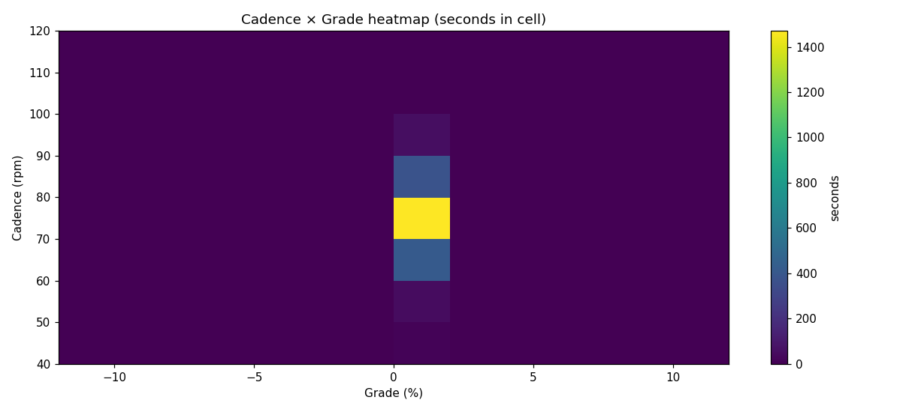
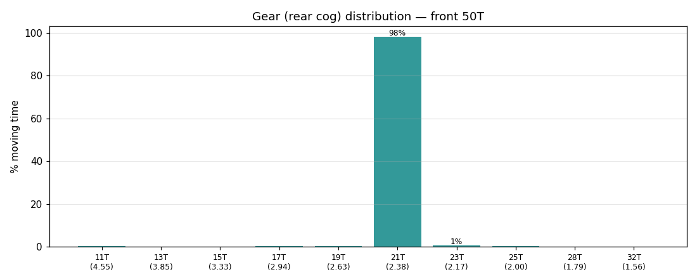
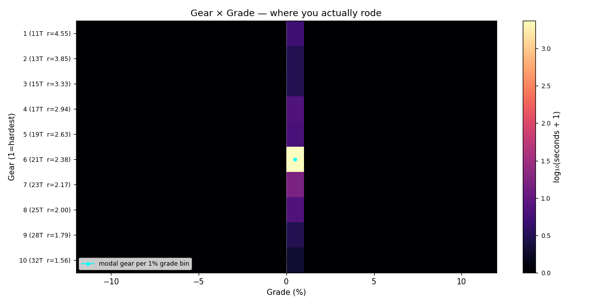
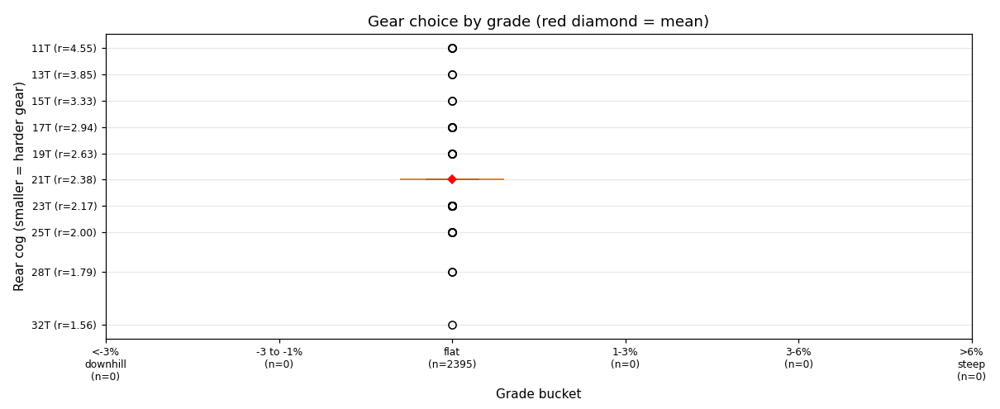
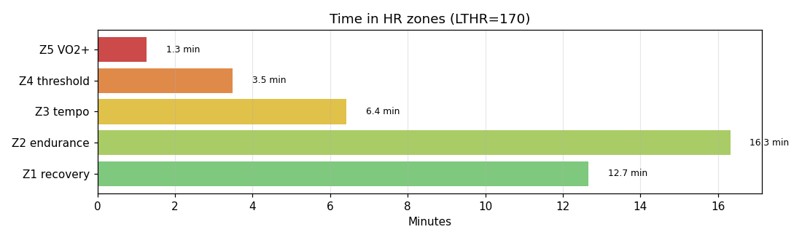

# KICKR

**2026-04-12 08:49**

> Standard ride — 14.7 km, 0 m gain (flat). Easy day: hrTSS 32. Cadence in good range (mean 74 rpm, SD 7). Aerobic durability sound (decoupling 1.3%).

Slower pace than recent (-1.8 km/h).

## Summary

| | |
|---|---|
| Distance | 14.74 km |
| Moving time | 0:40:01 |
| Total time | 0:40:12 |
| Avg speed | 22.1 km/h |
| Max speed | 28.9 km/h |
| Elev gain / loss | 0 / 0 m |
| Max grade | 0.0% |
| Avg HR | 148 bpm |
| Max HR | 173 bpm |
| Avg cadence | 74 rpm |
| **hrTSS** | **32** |
| TRIMP (Banister) | 69.8 |
| EF (speed/HR) | 2.49 |
| Pa:Hr decoupling | 1.3% |

## Timeline

## Cadence

| Stat | Value |
|---|---|
| Mean | 74 rpm |
| Median | 75 rpm |
| SD | 7 |
| Grind (<70) | 20% |
| Normal (70–85) | 75% |
| Spin (85–100) | 5% |
| High (>100) | 0% |

## Gear selection

| Cog | Ratio | Time(s) | % moving |
|---|---|---|---|
| 11T | 4.55 | 4 | 0.2% |
| 13T | 3.85 | 2 | 0.1% |
| 15T | 3.33 | 2 | 0.1% |
| 17T | 2.94 | 6 | 0.3% |
| 19T | 2.63 | 5 | 0.2% |
| 21T | 2.38 | 2352 | 98.2% |
| 23T | 2.17 | 15 | 0.6% |
| 25T | 2.00 | 6 | 0.3% |
| 28T | 1.79 | 2 | 0.1% |
| 32T | 1.56 | 1 | 0.0% |

### Gear by grade bucket

| Grade bucket | Time (s) | Avg cog | Modal cog |
|---|---|---|---|
| downhill (<-3%) | 0 | – | – |
| false flat down | 0 | – | – |
| flat | 2395 | 21.0T | 21T (98%) |
| false flat up | 0 | – | – |
| rolling climb | 0 | – | – |
| steep climb (>6%) | 0 | – | – |

### Interpretation
- No use of climbing cogs (25T+) — terrain didn't demand it, or you're under-utilising bailout.
- Never used the hardest cogs — no descents/sustained tailwinds.
- Most-used cog: 21T (98% of moving time).

## HR zones

LTHR assumed: **170 bpm** (configurable in `secrets/profile.json`).

## Climbs

_No detected climbs._

---

_Generated by bike-report. Bike: 2020 Allez Sport, 50T × 11-32T._
