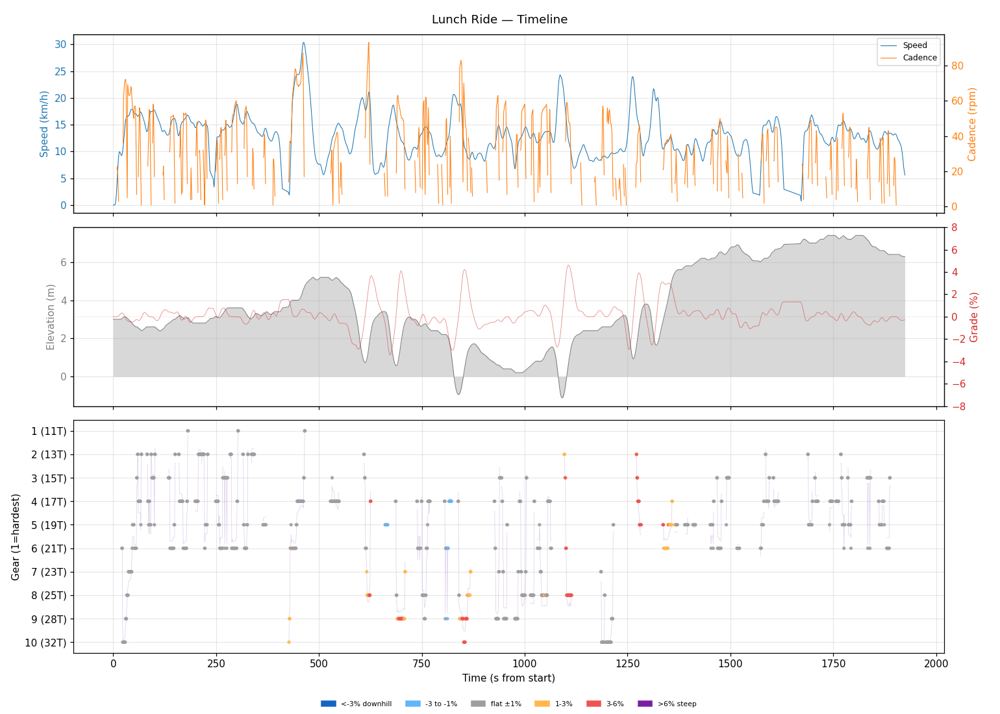
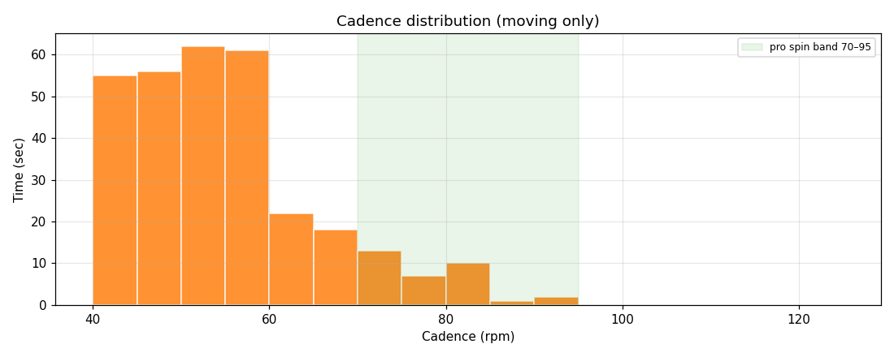
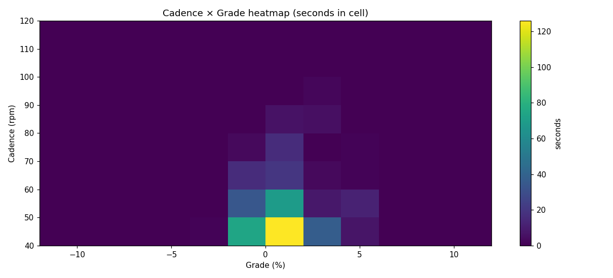
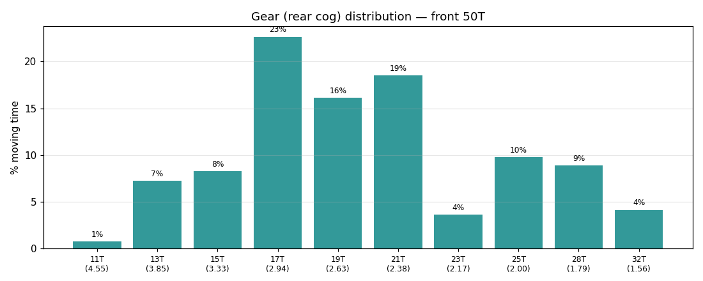
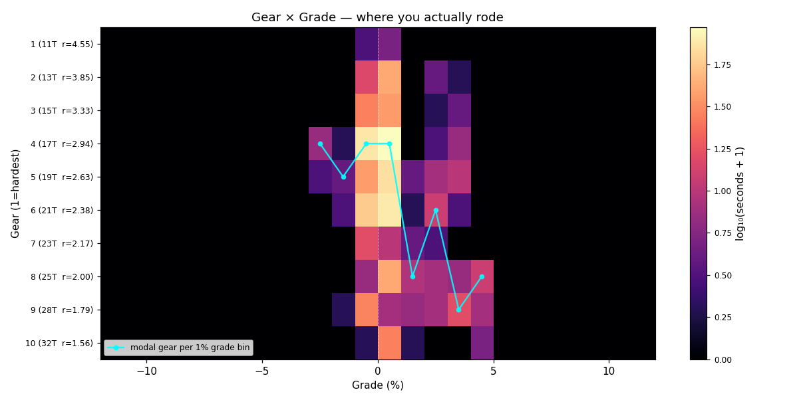
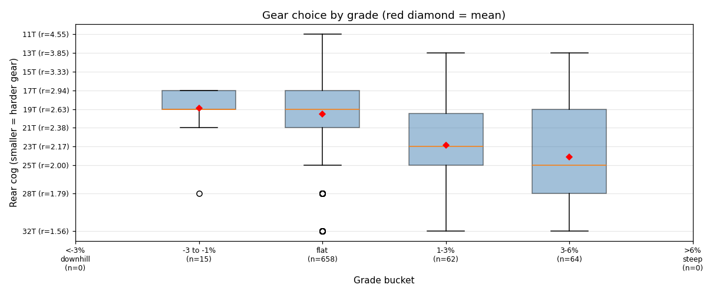
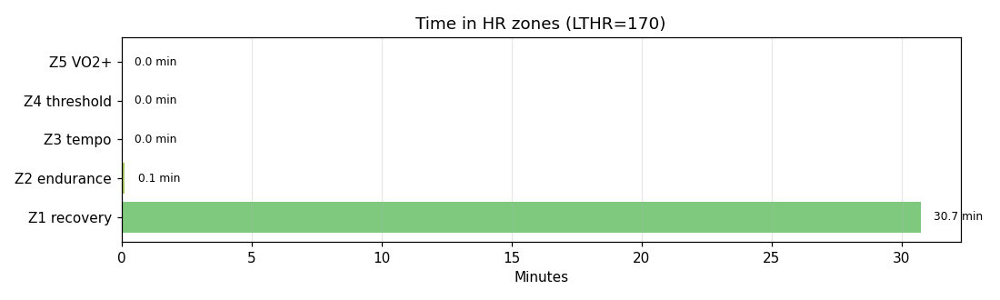

# Lunch Ride

**2026-04-19 12:01**

> Short ride — 6.7 km, 29 m gain (mostly flat with bumps). Easy day: hrTSS 13. Grinding tendency — 93% time below 70 rpm. Mild decoupling 7.6%.

Shorter than recent average (18.8 km). Slower pace than recent (-9.8 km/h).

## Summary

| | |
|---|---|
| Distance | 6.70 km |
| Moving time | 0:30:13 |
| Total time | 0:32:04 |
| Avg speed | 13.2 km/h |
| Max speed | 30.4 km/h |
| Elev gain / loss | 29 / 25 m |
| Max grade | 4.6% |
| Avg HR | 112 bpm |
| Max HR | 147 bpm |
| Avg cadence | 49 rpm |
| **hrTSS** | **13** |
| TRIMP (Banister) | 20.6 |
| EF (speed/HR) | 1.97 |
| Pa:Hr decoupling | 7.6% |

## Timeline

## Cadence

| Stat | Value |
|---|---|
| Mean | 49 rpm |
| Median | 47 rpm |
| SD | 13 |
| Grind (<70) | 93% |
| Normal (70–85) | 7% |
| Spin (85–100) | 1% |
| High (>100) | 0% |

## Gear selection

| Cog | Ratio | Time(s) | % moving |
|---|---|---|---|
| 11T | 4.55 | 6 | 0.8% |
| 13T | 3.85 | 58 | 7.3% |
| 15T | 3.33 | 66 | 8.3% |
| 17T | 2.94 | 181 | 22.7% |
| 19T | 2.63 | 129 | 16.1% |
| 21T | 2.38 | 148 | 18.5% |
| 23T | 2.17 | 29 | 3.6% |
| 25T | 2.00 | 78 | 9.8% |
| 28T | 1.79 | 71 | 8.9% |
| 32T | 1.56 | 33 | 4.1% |

### Gear by grade bucket

| Grade bucket | Time (s) | Avg cog | Modal cog |
|---|---|---|---|
| downhill (<-3%) | 0 | – | – |
| false flat down | 15 | 18.9T | 17T (47%) |
| flat | 658 | 19.6T | 17T (25%) |
| false flat up | 62 | 22.8T | 25T (24%) |
| rolling climb | 64 | 24.1T | 28T (34%) |
| steep climb (>6%) | 0 | – | – |

### Interpretation
- Significant climbing-cog use (23% in 25T+).
- Most-used cog: 17T (23% of moving time).
- On rolling climbs (3-6%): mostly 28T.

## HR zones

LTHR assumed: **170 bpm** (configurable in `secrets/profile.json`).

## Climbs

_No detected climbs._

---

_Generated by bike-report. Bike: 2020 Allez Sport, 50T × 11-32T._
