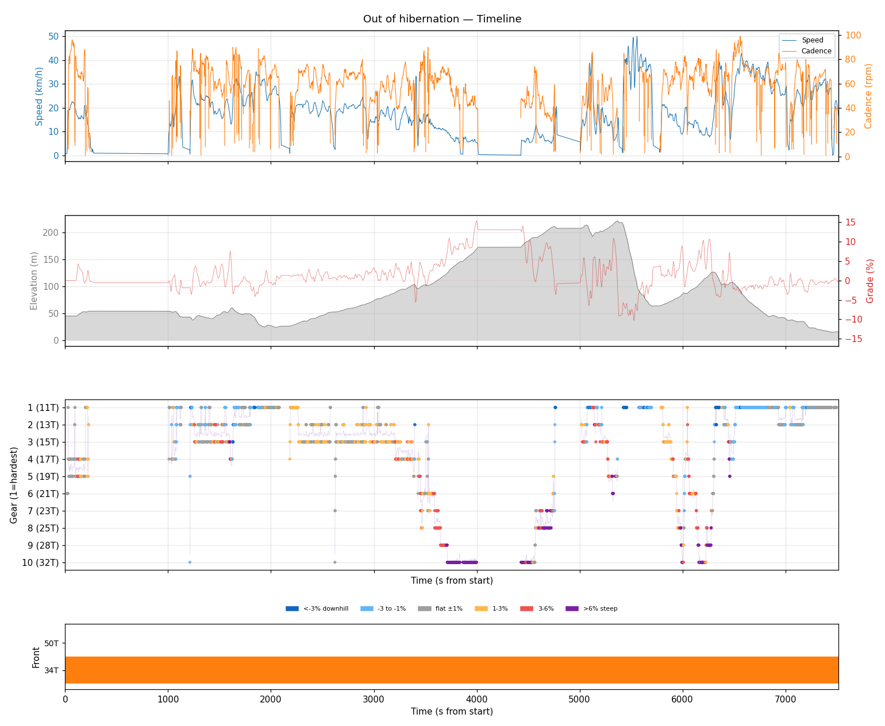
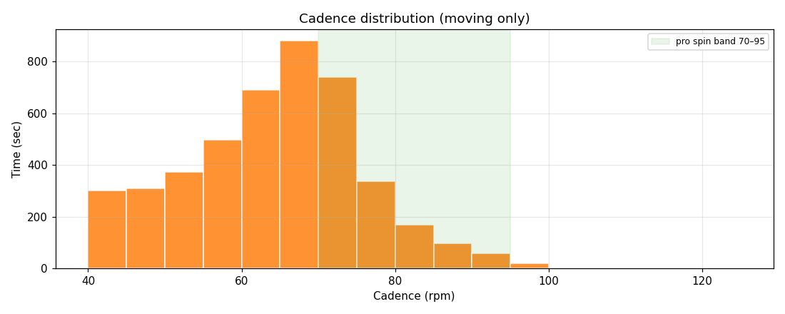
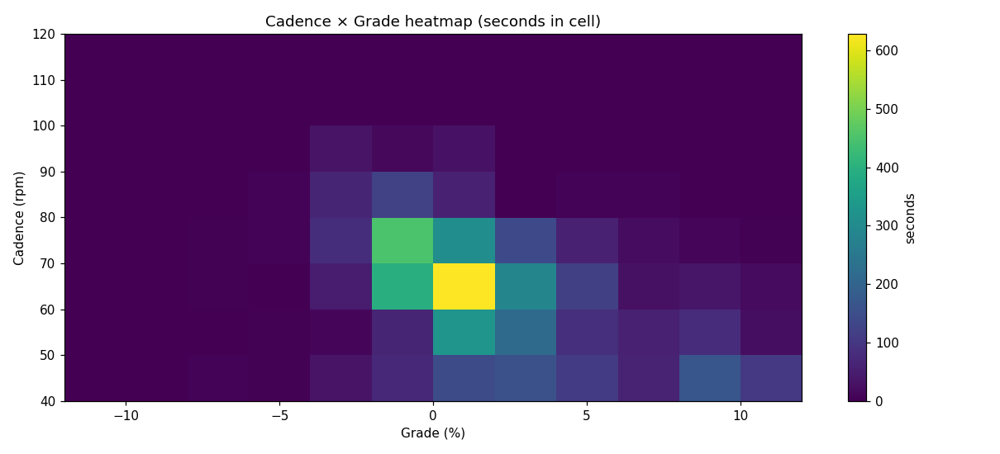
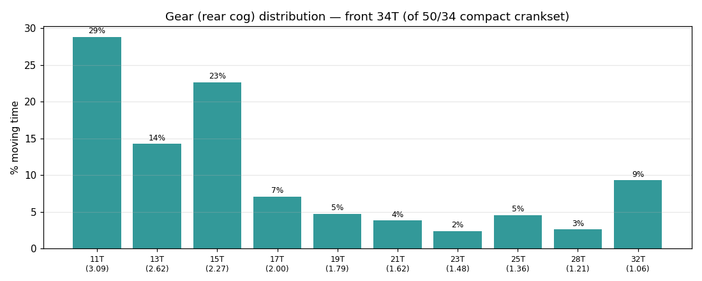
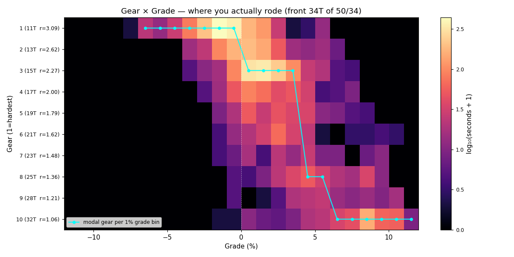
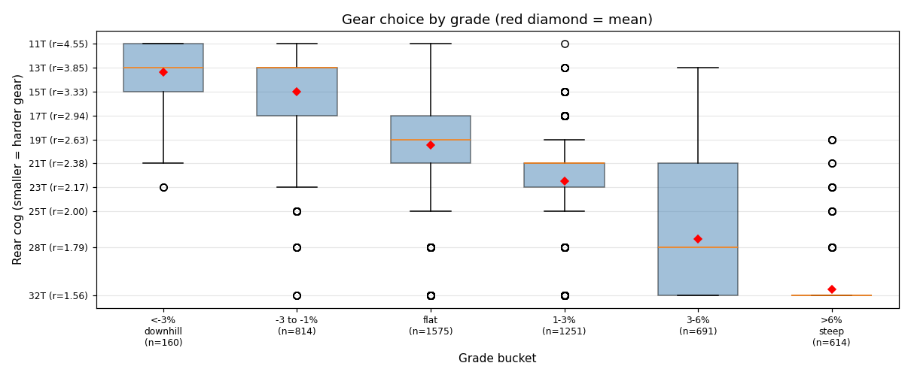
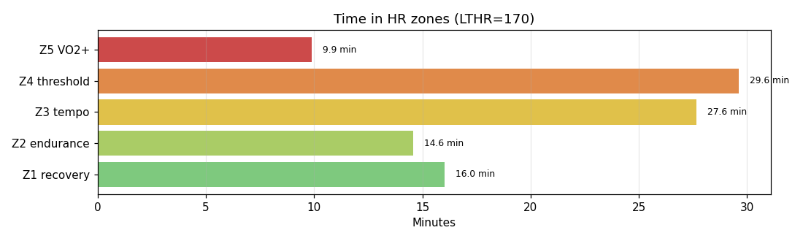

# Out of hibernation

**2026-04-26 10:32**

> Endurance ride — 32.4 km, 357 m gain (rolling). Solid aerobic effort: hrTSS 113. Grinding tendency — 70% time below 70 rpm. Aerobic durability sound (decoupling -10.7%). 2 climb(s); biggest: 1158m @ 7.4% (cat 4, VAM 312).

Longer than recent average (20.6 km). Slower pace than recent (-3.6 km/h).

## Summary

| | |
|---|---|
| Distance | 32.36 km |
| Moving time | 1:34:40 |
| Total time | 2:05:17 |
| Avg speed | 20.4 km/h |
| Max speed | 50.0 km/h |
| Elev gain / loss | 357 / 387 m |
| Max grade | 15.4% |
| Avg HR | 156 bpm |
| Max HR | 188 bpm |
| Avg cadence | 63 rpm |
| **hrTSS** | **113** |
| TRIMP (Banister) | 208.3 |
| EF (speed/HR) | 2.18 |
| Pa:Hr decoupling | -10.7% |

## Timeline

## Cadence

| Stat | Value |
|---|---|
| Mean | 62 rpm |
| Median | 64 rpm |
| SD | 13 |
| Grind (<70) | 70% |
| Normal (70–85) | 26% |
| Spin (85–100) | 4% |
| High (>100) | 0% |

## Gear selection — front **34T** (of 50/34 compact crankset)

| Cog | Ratio | Time(s) | % moving |
|---|---|---|---|
| 11T | 3.09 | 1471 | 28.8% |
| 13T | 2.62 | 727 | 14.2% |
| 15T | 2.27 | 1156 | 22.6% |
| 17T | 2.00 | 359 | 7.0% |
| 19T | 1.79 | 242 | 4.7% |
| 21T | 1.62 | 194 | 3.8% |
| 23T | 1.48 | 119 | 2.3% |
| 25T | 1.36 | 232 | 4.5% |
| 28T | 1.21 | 132 | 2.6% |
| 32T | 1.06 | 473 | 9.3% |

### Gear by grade bucket

| Grade bucket | Time (s) | Avg cog | Modal cog |
|---|---|---|---|
| downhill (<-3%) | 160 | 11.3T | 11T (89%) |
| false flat down | 814 | 11.7T | 11T (79%) |
| flat | 1575 | 14.0T | 11T (34%) |
| false flat up | 1251 | 15.7T | 15T (45%) |
| rolling climb | 691 | 20.6T | 15T (21%) |
| steep climb (>6%) | 614 | 29.2T | 32T (66%) |

### Interpretation
- Fast riding (43% in 11–13T) — descents or paceline.
- Most-used cog: 11T (29% of moving time).
- On rolling climbs (3-6%): mostly 15T.

## HR zones

LTHR assumed: **170 bpm** (configurable in `secrets/profile.json`).

## Climbs

| Length | Avg grade | Gain | Duration | VAM | Cat | Avg HR | Avg cad | Modal cog |
|---|---|---|---|---|---|---|---|---|
| 1.16 km | 7.4% | 85 m | 0:16:24 | 312 | cat 4 | 169 | 53 | 32T |
| 0.76 km | 5.1% | 39 m | 0:04:03 | 575 | cat uncat | 175 | 65 | 21T |

---

_Generated by bike-report. Bike: 2020 Allez Sport — Praxis Alba 50/34 compact, Shimano HG500 11-32T 10-spd. This ride analyzed assuming **34T** front. Override per-ride with `#34T` or `#50T` in Strava description._
