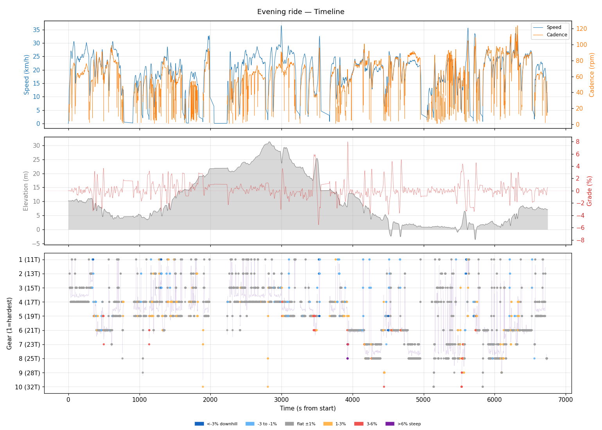
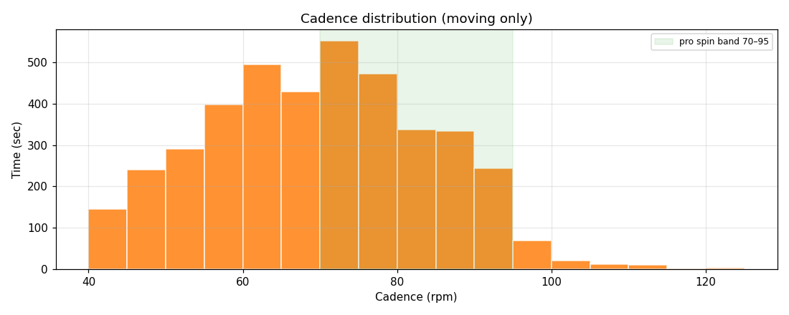
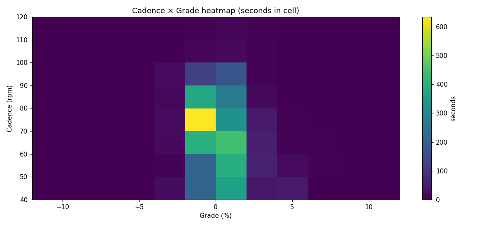
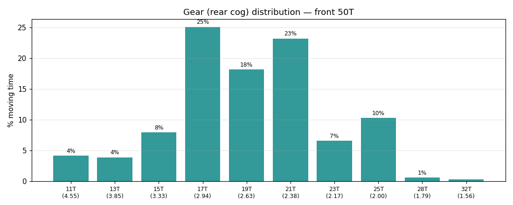
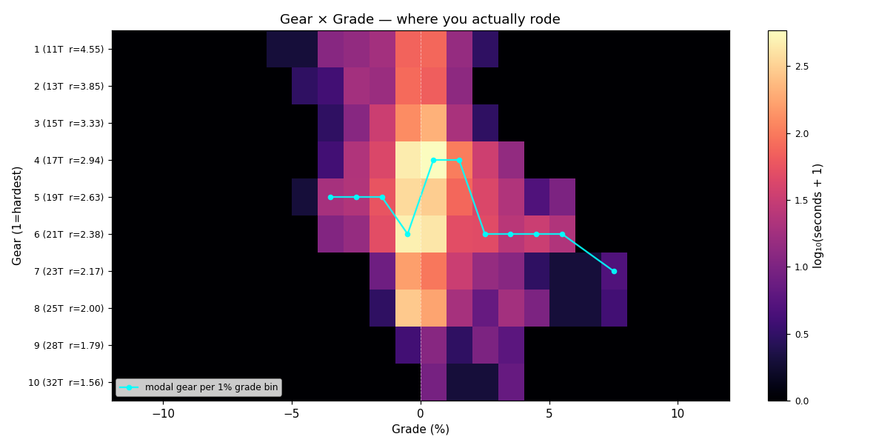
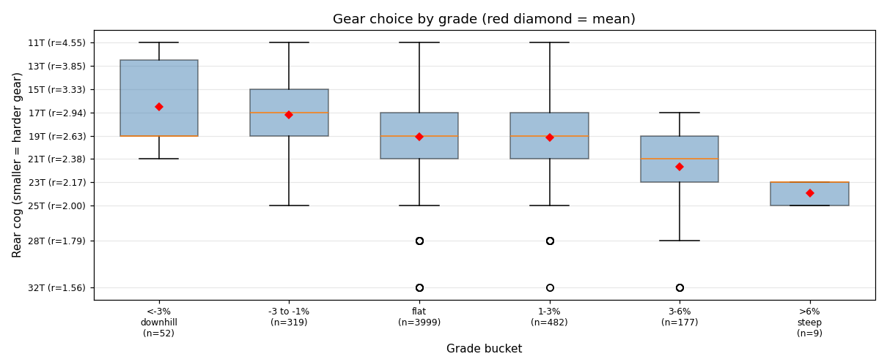
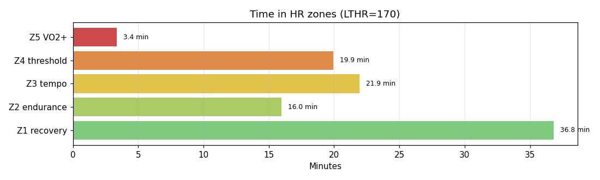

# Evening ride

**2026-04-29 18:11**

> Endurance ride — 33.6 km, 137 m gain (mostly flat with bumps). Solid aerobic effort: hrTSS 87. Grinding tendency — 53% time below 70 rpm. Mild decoupling 6.4%.

Longer than recent average (21.5 km).

## Summary

| | |
|---|---|
| Distance | 33.56 km |
| Moving time | 1:35:16 |
| Total time | 1:52:26 |
| Avg speed | 21.0 km/h |
| Max speed | 36.6 km/h |
| Elev gain / loss | 137 / 140 m |
| Max grade | 8.0% |
| Avg HR | 150 bpm |
| Max HR | 182 bpm |
| Avg cadence | 67 rpm |
| **hrTSS** | **87** |
| TRIMP (Banister) | 179.5 |
| EF (speed/HR) | 2.34 |
| Pa:Hr decoupling | 6.4% |

## Timeline

## Cadence

| Stat | Value |
|---|---|
| Mean | 67 rpm |
| Median | 68 rpm |
| SD | 16 |
| Grind (<70) | 53% |
| Normal (70–85) | 31% |
| Spin (85–100) | 15% |
| High (>100) | 1% |

## Gear selection

| Cog | Ratio | Time(s) | % moving |
|---|---|---|---|
| 11T | 4.55 | 208 | 4.1% |
| 13T | 3.85 | 196 | 3.9% |
| 15T | 3.33 | 399 | 7.9% |
| 17T | 2.94 | 1263 | 25.1% |
| 19T | 2.63 | 913 | 18.1% |
| 21T | 2.38 | 1166 | 23.1% |
| 23T | 2.17 | 330 | 6.6% |
| 25T | 2.00 | 517 | 10.3% |
| 28T | 1.79 | 30 | 0.6% |
| 32T | 1.56 | 16 | 0.3% |

### Gear by grade bucket

| Grade bucket | Time (s) | Avg cog | Modal cog |
|---|---|---|---|
| downhill (<-3%) | 52 | 16.5T | 19T (37%) |
| false flat down | 319 | 17.2T | 19T (24%) |
| flat | 3999 | 19.1T | 17T (26%) |
| false flat up | 482 | 19.2T | 17T (28%) |
| rolling climb | 177 | 21.7T | 21T (44%) |
| steep climb (>6%) | 9 | 23.9T | 23T (56%) |

### Interpretation
- Most-used cog: 17T (25% of moving time).
- On rolling climbs (3-6%): mostly 21T.

## HR zones

LTHR assumed: **170 bpm** (configurable in `secrets/profile.json`).

## Climbs

_No detected climbs._

---

_Generated by bike-report. Bike: 2020 Allez Sport, 50T × 11-32T._
