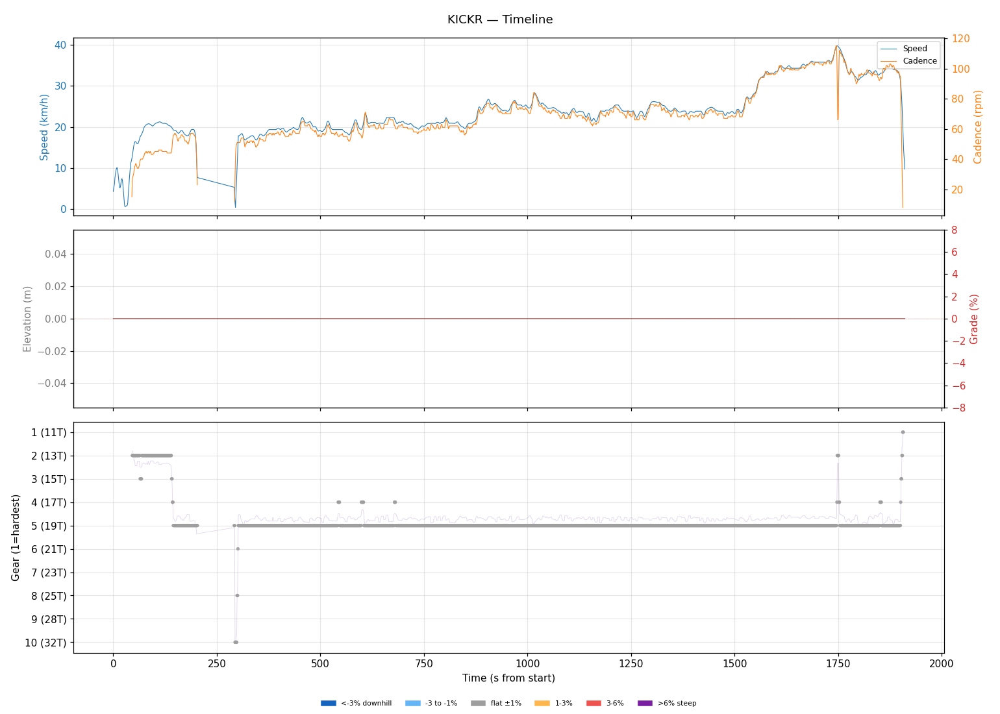
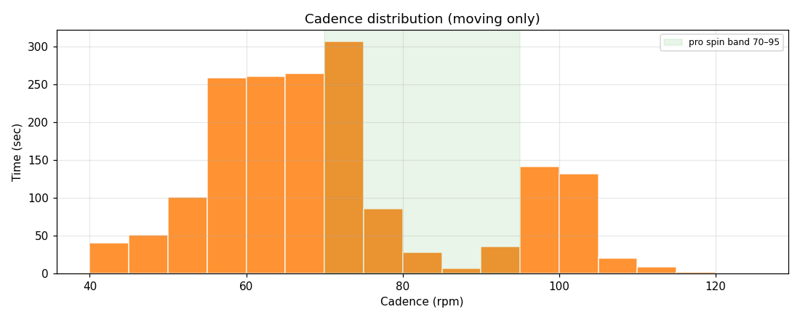
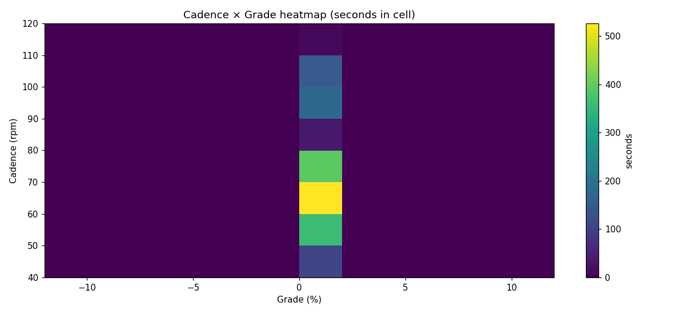
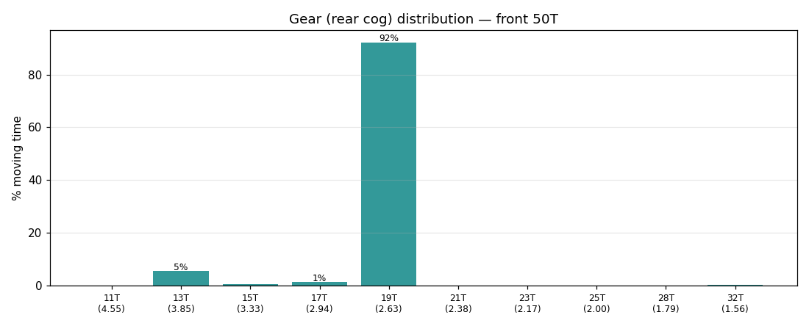
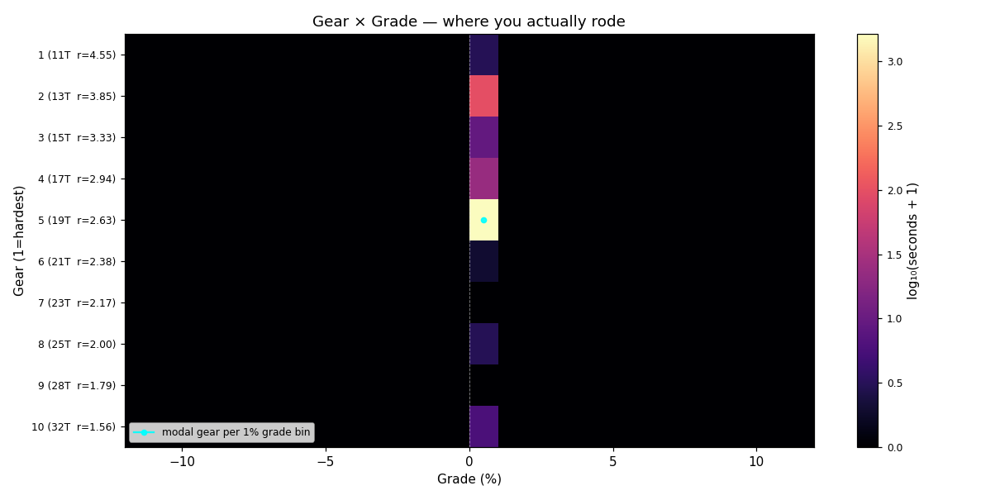
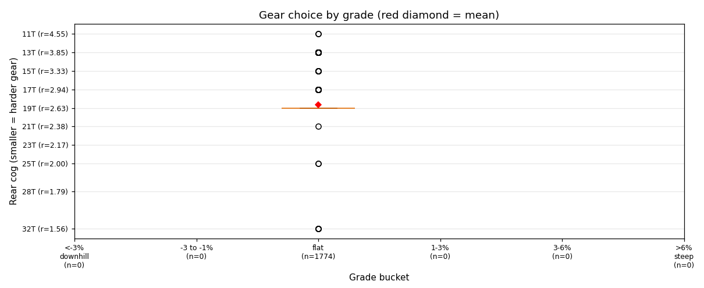
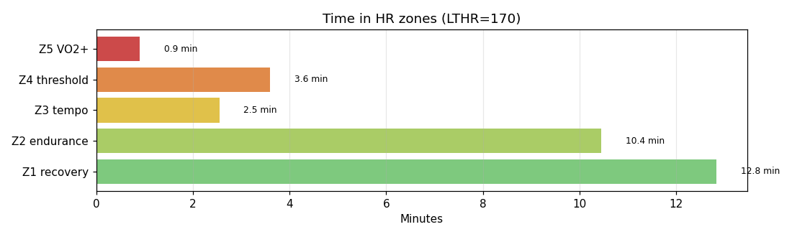

# KICKR

**2026-05-08 08:02**

> Standard ride — 12.1 km, 0 m gain (flat). Easy day: hrTSS 23. Grinding tendency — 56% time below 70 rpm. Aerobic durability sound (decoupling -20.7%).

Shorter than recent average (28.2 km). Faster pace than recent (+1.9 km/h).

## Summary

| | |
|---|---|
| Distance | 12.12 km |
| Moving time | 0:30:01 |
| Total time | 0:31:51 |
| Avg speed | 24.2 km/h |
| Max speed | 39.7 km/h |
| Elev gain / loss | 0 / 0 m |
| Max grade | 0.0% |
| Avg HR | 144 bpm |
| Max HR | 175 bpm |
| Avg cadence | 70 rpm |
| **hrTSS** | **23** |
| TRIMP (Banister) | 50.2 |
| EF (speed/HR) | 2.79 |
| Pa:Hr decoupling | -20.7% |

## Timeline

## Cadence

| Stat | Value |
|---|---|
| Mean | 70 rpm |
| Median | 68 rpm |
| SD | 17 |
| Grind (<70) | 56% |
| Normal (70–85) | 24% |
| Spin (85–100) | 10% |
| High (>100) | 9% |

## Gear selection

| Cog | Ratio | Time(s) | % moving |
|---|---|---|---|
| 11T | 4.55 | 2 | 0.1% |
| 13T | 3.85 | 97 | 5.5% |
| 15T | 3.33 | 8 | 0.5% |
| 17T | 2.94 | 23 | 1.3% |
| 19T | 2.63 | 1636 | 92.2% |
| 21T | 2.38 | 1 | 0.1% |
| 25T | 2.00 | 2 | 0.1% |
| 32T | 1.56 | 5 | 0.3% |

### Gear by grade bucket

| Grade bucket | Time (s) | Avg cog | Modal cog |
|---|---|---|---|
| downhill (<-3%) | 0 | – | – |
| false flat down | 0 | – | – |
| flat | 1774 | 18.7T | 19T (92%) |
| false flat up | 0 | – | – |
| rolling climb | 0 | – | – |
| steep climb (>6%) | 0 | – | – |

### Interpretation
- No use of climbing cogs (25T+) — terrain didn't demand it, or you're under-utilising bailout.
- Most-used cog: 19T (92% of moving time).

## HR zones

LTHR assumed: **170 bpm** (configurable in `secrets/profile.json`).

## Climbs

_No detected climbs._

---

_Generated by bike-report. Bike: 2020 Allez Sport, 50T × 11-32T._
