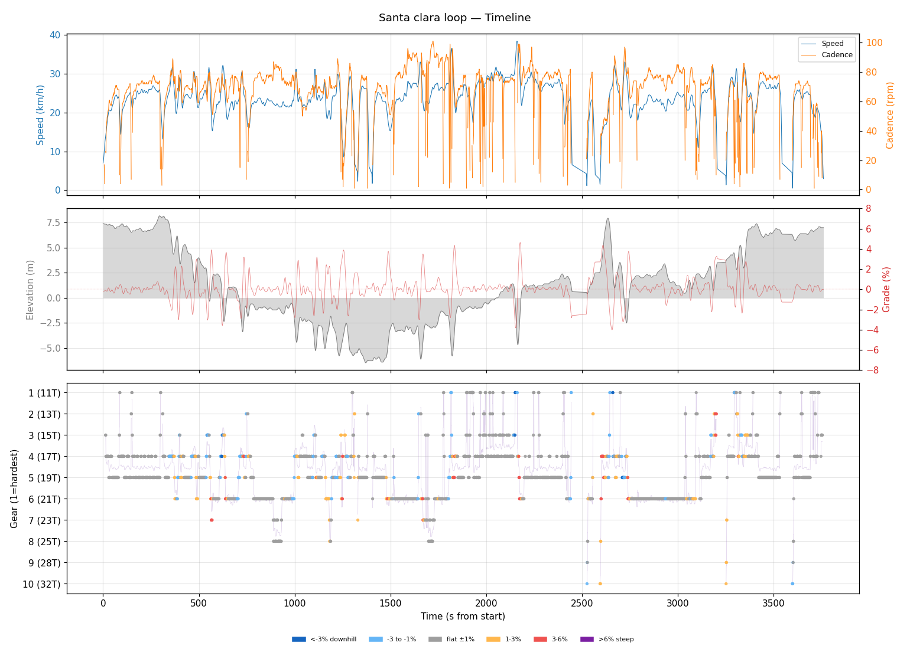
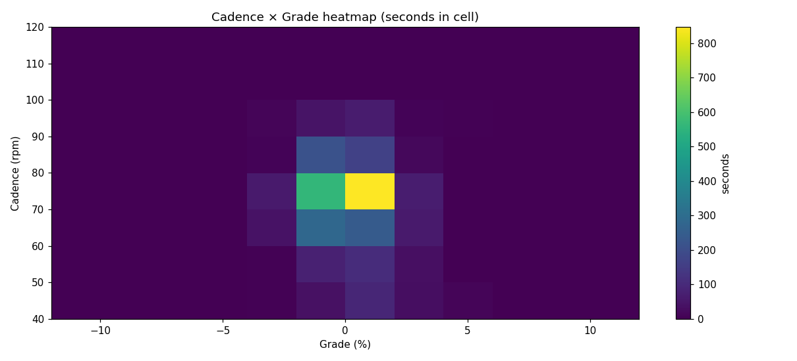
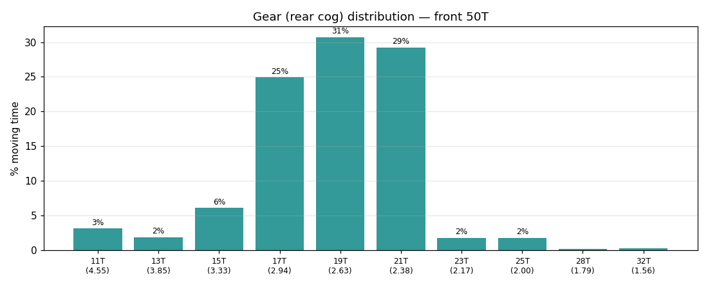
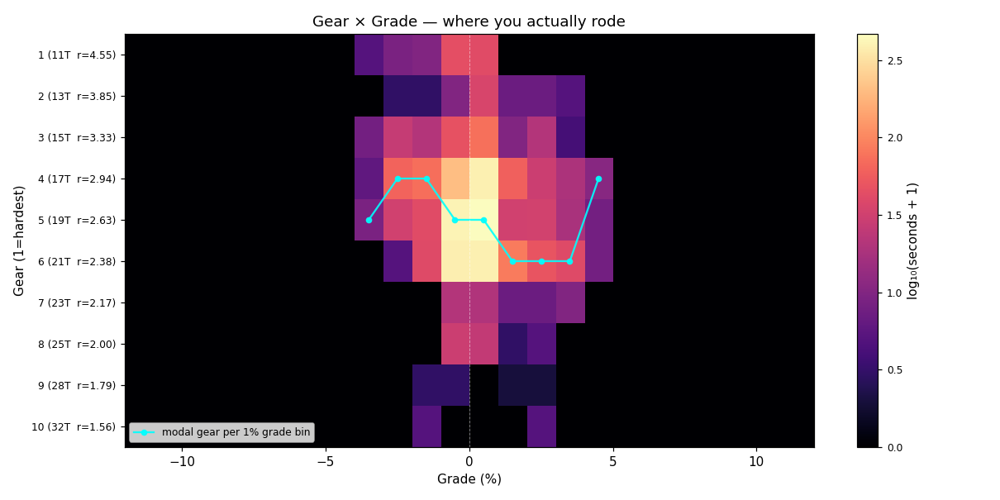
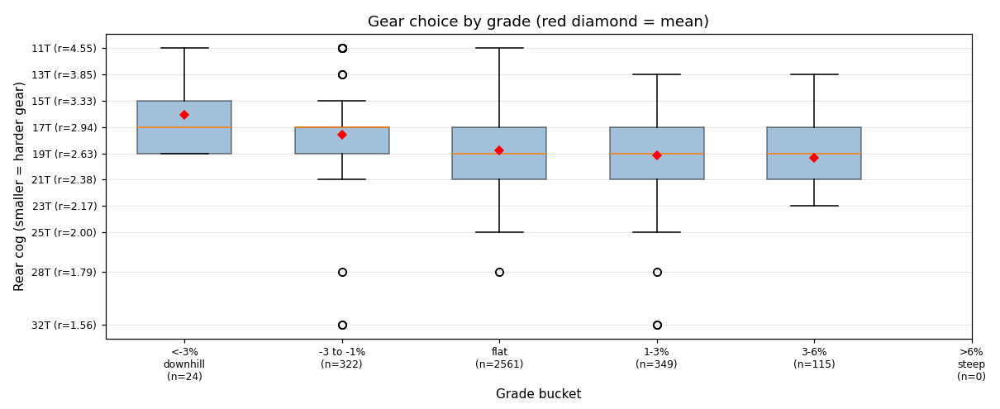
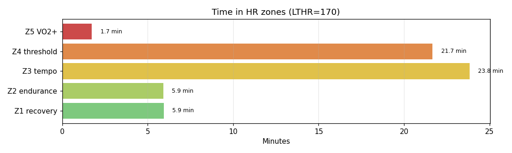

# Santa clara loop

**2026-05-08 18:44**

> Standard ride — 23.4 km, 96 m gain (mostly flat with bumps). Solid aerobic effort: hrTSS 68. Cadence in good range (mean 71 rpm, SD 11). Aerobic durability sound (decoupling -3.5%).

In line with recent rides.

## Summary

| | |
|---|---|
| Distance | 23.44 km |
| Moving time | 0:58:32 |
| Total time | 1:02:40 |
| Avg speed | 23.9 km/h |
| Max speed | 38.4 km/h |
| Elev gain / loss | 96 / 97 m |
| Max grade | 4.6% |
| Avg HR | 157 bpm |
| Max HR | 174 bpm |
| Avg cadence | 71 rpm |
| **hrTSS** | **68** |
| TRIMP (Banister) | 125.9 |
| EF (speed/HR) | 2.55 |
| Pa:Hr decoupling | -3.5% |

## Timeline

## Cadence

| Stat | Value |
|---|---|
| Mean | 71 rpm |
| Median | 73 rpm |
| SD | 11 |
| Grind (<70) | 33% |
| Normal (70–85) | 59% |
| Spin (85–100) | 8% |
| High (>100) | 0% |

## Gear selection

| Cog | Ratio | Time(s) | % moving |
|---|---|---|---|
| 11T | 4.55 | 106 | 3.1% |
| 13T | 3.85 | 64 | 1.9% |
| 15T | 3.33 | 205 | 6.1% |
| 17T | 2.94 | 840 | 24.9% |
| 19T | 2.63 | 1036 | 30.7% |
| 21T | 2.38 | 986 | 29.2% |
| 23T | 2.17 | 60 | 1.8% |
| 25T | 2.00 | 60 | 1.8% |
| 28T | 1.79 | 6 | 0.2% |
| 32T | 1.56 | 8 | 0.2% |

### Gear by grade bucket

| Grade bucket | Time (s) | Avg cog | Modal cog |
|---|---|---|---|
| downhill (<-3%) | 24 | 16.1T | 19T (33%) |
| false flat down | 322 | 17.6T | 17T (41%) |
| flat | 2561 | 18.8T | 19T (34%) |
| false flat up | 349 | 19.2T | 21T (38%) |
| rolling climb | 115 | 19.3T | 21T (41%) |
| steep climb (>6%) | 0 | – | – |

### Interpretation
- Most-used cog: 19T (31% of moving time).
- On rolling climbs (3-6%): mostly 21T.

## HR zones

LTHR assumed: **170 bpm** (configurable in `secrets/profile.json`).

## Climbs

_No detected climbs._

---

_Generated by bike-report. Bike: 2020 Allez Sport, 50T × 11-32T._
