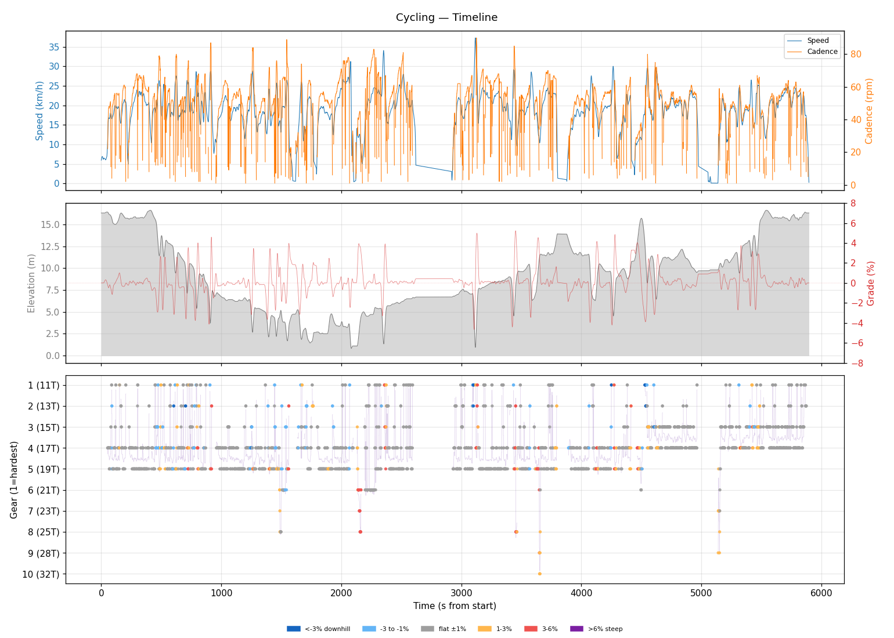
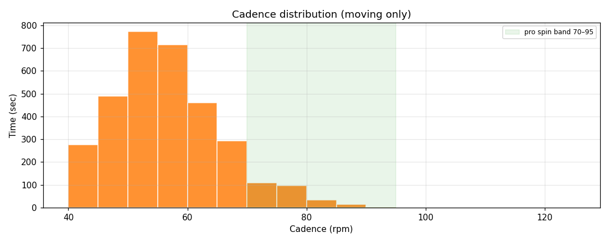
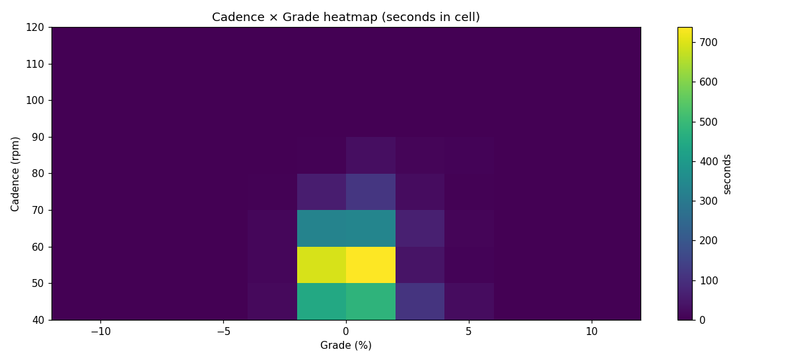
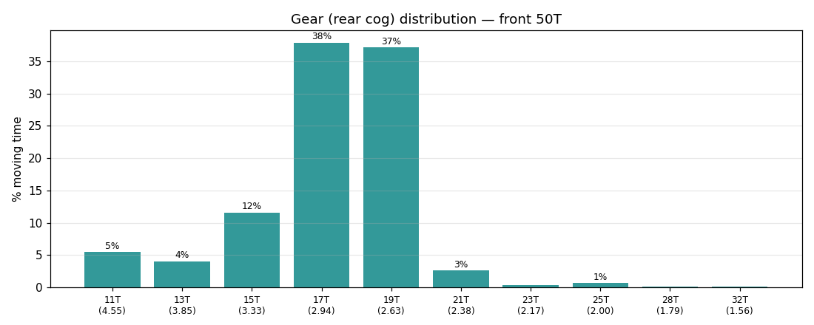
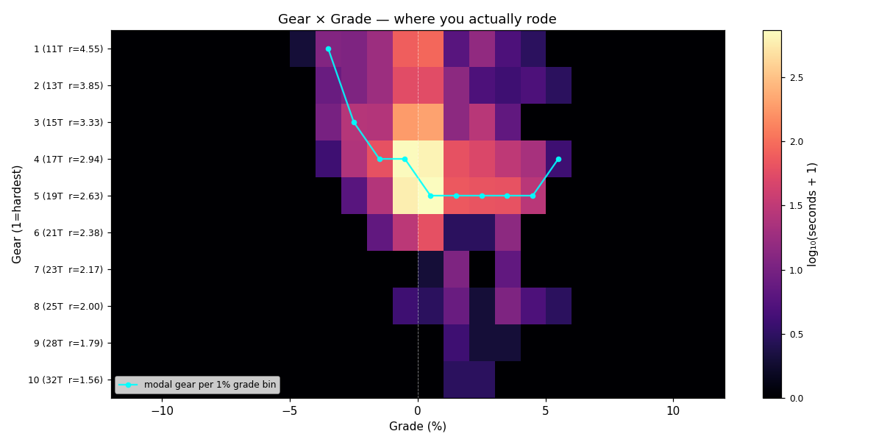
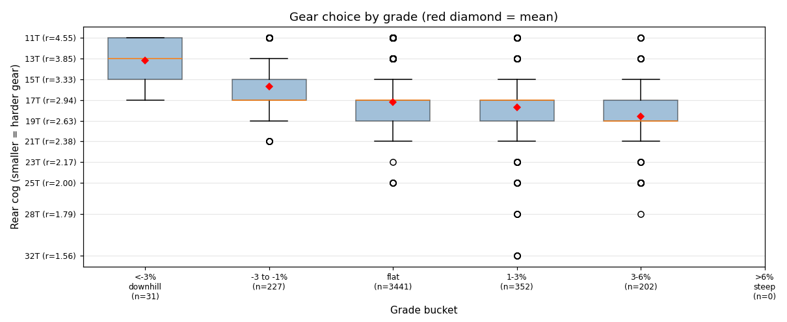
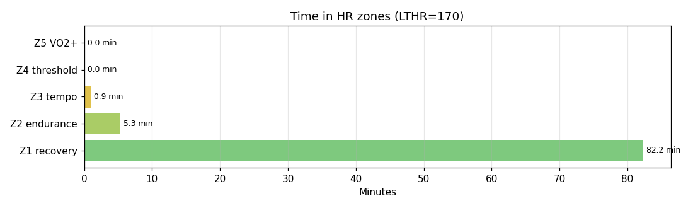

# Cycling

**2026-05-10 17:06**

> Standard ride — 27.9 km, 117 m gain (mostly flat with bumps). Easy day: hrTSS 39. Grinding tendency — 93% time below 70 rpm. Aerobic durability sound (decoupling -2.2%).

First logged ride — baseline established.

## Summary

| | |
|---|---|
| Distance | 27.88 km |
| Moving time | 1:26:52 |
| Total time | 1:38:16 |
| Avg speed | 19.2 km/h |
| Max speed | 37.3 km/h |
| Elev gain / loss | 117 / 117 m |
| Max grade | 5.2% |
| Avg HR | 131 bpm |
| Max HR | 156 bpm |
| Avg cadence | 54 rpm |
| **hrTSS** | **39** |
| TRIMP (Banister) | 102.1 |
| EF (speed/HR) | 2.44 |
| Pa:Hr decoupling | -2.2% |

## Timeline

## Cadence

| Stat | Value |
|---|---|
| Mean | 54 rpm |
| Median | 54 rpm |
| SD | 11 |
| Grind (<70) | 93% |
| Normal (70–85) | 7% |
| Spin (85–100) | 0% |
| High (>100) | 0% |

## Gear selection

| Cog | Ratio | Time(s) | % moving |
|---|---|---|---|
| 11T | 4.55 | 233 | 5.5% |
| 13T | 3.85 | 171 | 4.0% |
| 15T | 3.33 | 493 | 11.6% |
| 17T | 2.94 | 1611 | 37.9% |
| 19T | 2.63 | 1578 | 37.1% |
| 21T | 2.38 | 112 | 2.6% |
| 23T | 2.17 | 17 | 0.4% |
| 25T | 2.00 | 29 | 0.7% |
| 28T | 1.79 | 5 | 0.1% |
| 32T | 1.56 | 4 | 0.1% |

### Gear by grade bucket

| Grade bucket | Time (s) | Avg cog | Modal cog |
|---|---|---|---|
| downhill (<-3%) | 31 | 13.2T | 11T (39%) |
| false flat down | 227 | 15.7T | 17T (38%) |
| flat | 3441 | 17.2T | 17T (39%) |
| false flat up | 352 | 17.7T | 19T (38%) |
| rolling climb | 202 | 18.6T | 19T (45%) |
| steep climb (>6%) | 0 | – | – |

### Interpretation
- No use of climbing cogs (25T+) — terrain didn't demand it, or you're under-utilising bailout.
- Most-used cog: 17T (38% of moving time).
- On rolling climbs (3-6%): mostly 19T.

## HR zones

LTHR assumed: **170 bpm** (configurable in `secrets/profile.json`).

## Climbs

_No detected climbs._

---

_Generated by bike-report. Bike: 2020 Allez Sport, 50T × 11-32T._
