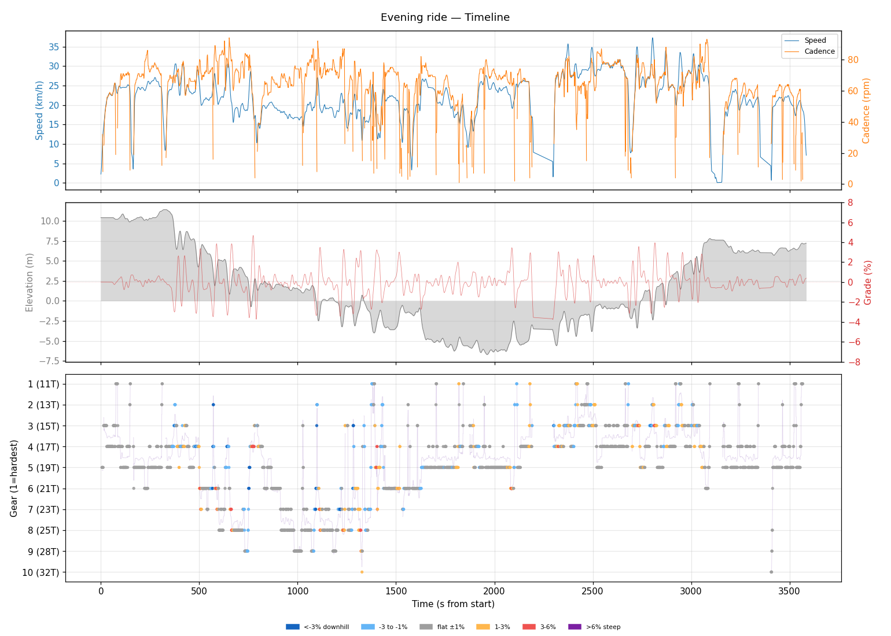
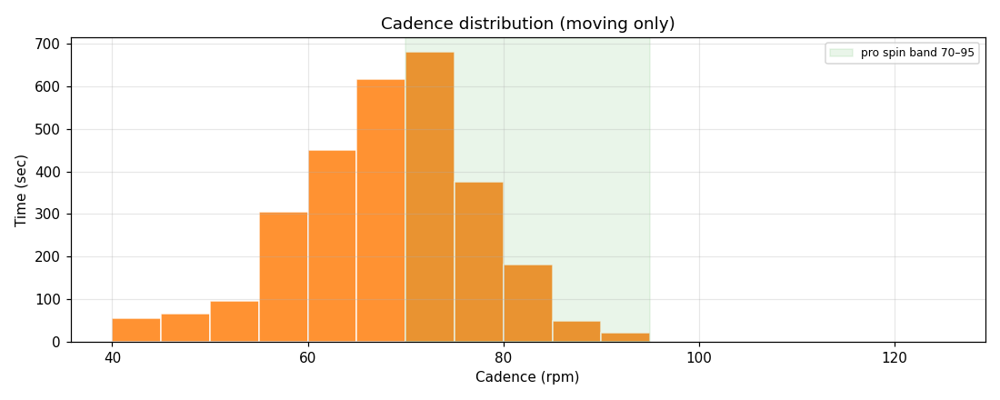
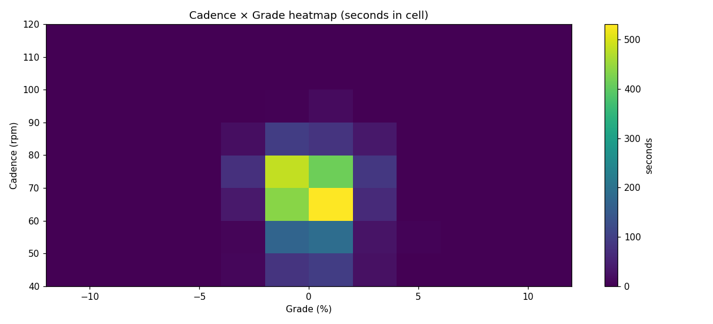
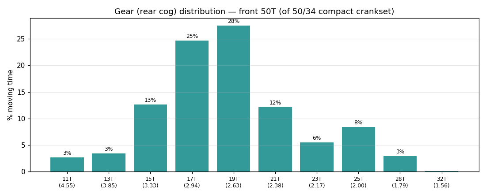
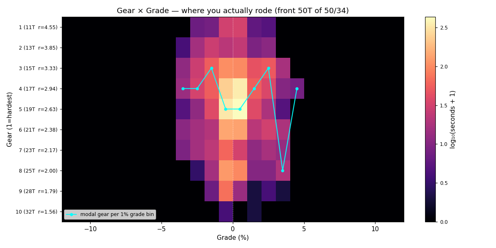
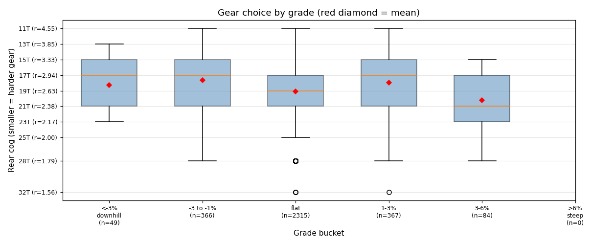
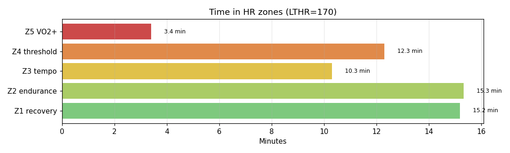

# Evening ride

**2026-05-12 18:22**

> Standard ride — 20.9 km, 95 m gain (mostly flat with bumps). Easy day: hrTSS 54. Grinding tendency — 56% time below 70 rpm. Aerobic durability sound (decoupling -11.4%).

First logged ride — baseline established.

## Summary

| | |
|---|---|
| Distance | 20.90 km |
| Moving time | 0:55:51 |
| Total time | 0:59:45 |
| Avg speed | 22.4 km/h |
| Max speed | 37.3 km/h |
| Elev gain / loss | 95 / 98 m |
| Max grade | 4.7% |
| Avg HR | 152 bpm |
| Max HR | 179 bpm |
| Avg cadence | 67 rpm |
| **hrTSS** | **54** |
| TRIMP (Banister) | 108.8 |
| EF (speed/HR) | 2.46 |
| Pa:Hr decoupling | -11.4% |

## Timeline

## Cadence

| Stat | Value |
|---|---|
| Mean | 67 rpm |
| Median | 68 rpm |
| SD | 11 |
| Grind (<70) | 56% |
| Normal (70–85) | 41% |
| Spin (85–100) | 2% |
| High (>100) | 0% |

## Gear selection — front **50T** (of 50/34 compact crankset)

| Cog | Ratio | Time(s) | % moving |
|---|---|---|---|
| 11T | 4.55 | 84 | 2.6% |
| 13T | 3.85 | 109 | 3.4% |
| 15T | 3.33 | 403 | 12.7% |
| 17T | 2.94 | 785 | 24.7% |
| 19T | 2.63 | 876 | 27.5% |
| 21T | 2.38 | 385 | 12.1% |
| 23T | 2.17 | 175 | 5.5% |
| 25T | 2.00 | 267 | 8.4% |
| 28T | 1.79 | 93 | 2.9% |
| 32T | 1.56 | 4 | 0.1% |

### Gear by grade bucket

| Grade bucket | Time (s) | Avg cog | Modal cog |
|---|---|---|---|
| downhill (<-3%) | 49 | 18.3T | 17T (27%) |
| false flat down | 366 | 17.7T | 17T (23%) |
| flat | 2315 | 19.1T | 19T (33%) |
| false flat up | 367 | 18.0T | 15T (26%) |
| rolling climb | 84 | 20.2T | 25T (21%) |
| steep climb (>6%) | 0 | – | – |

### Interpretation
- Most-used cog: 19T (28% of moving time).
- On rolling climbs (3-6%): mostly 25T.

## HR zones

LTHR assumed: **170 bpm** (configurable in `secrets/profile.json`).

## Climbs

_No detected climbs._

---

_Generated by bike-report. Bike: 2020 Allez Sport — Praxis Alba 50/34 compact, Shimano HG500 11-32T 10-spd. This ride analyzed assuming **50T** front. Override per-ride with `#34T` or `#50T` in Strava description._
