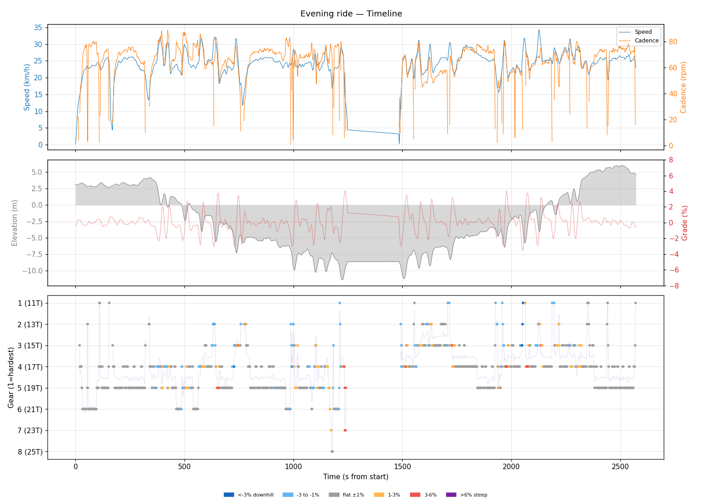
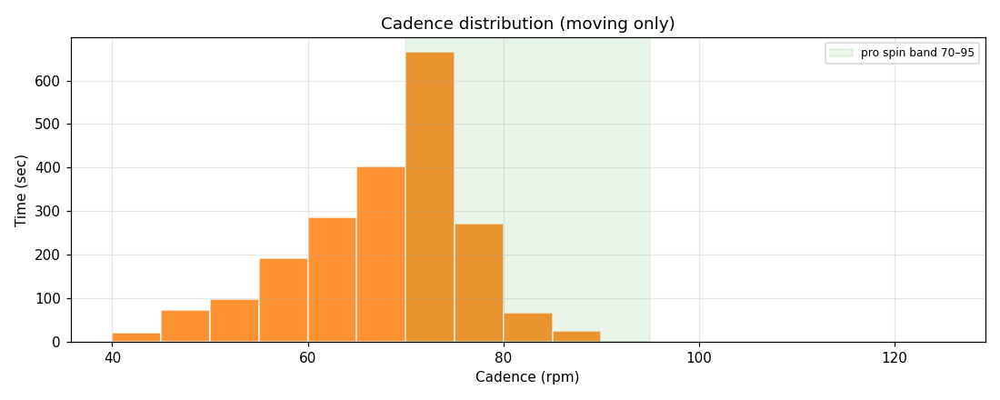
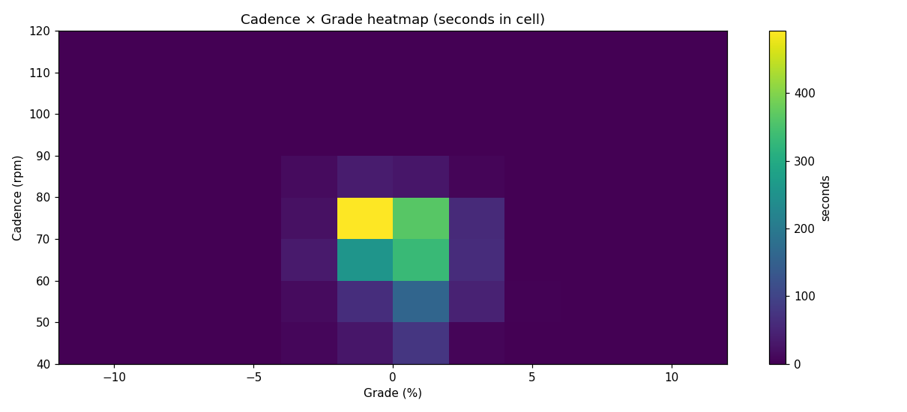
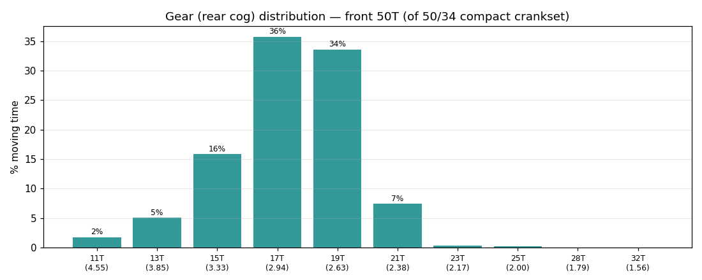
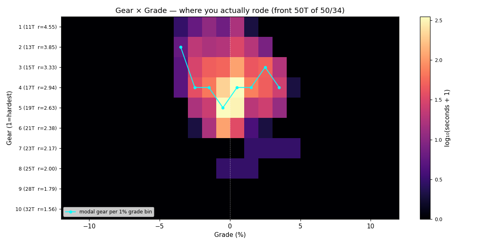
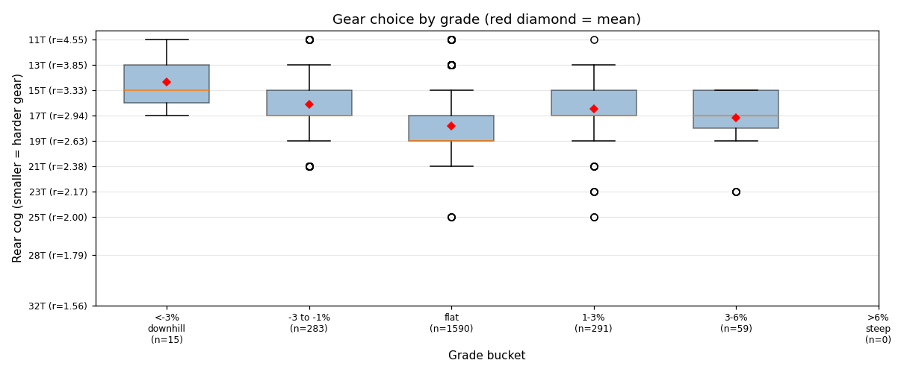
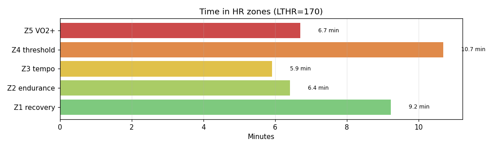

# Evening ride

**2026-05-13 19:13**

> Standard ride — 15.8 km, 75 m gain (mostly flat with bumps). Easy day: hrTSS 46. Grinding tendency — 52% time below 70 rpm. Aerobic durability sound (decoupling 2.4%).

First logged ride — baseline established.

## Summary

| | |
|---|---|
| Distance | 15.78 km |
| Moving time | 0:38:41 |
| Total time | 0:42:52 |
| Avg speed | 24.4 km/h |
| Max speed | 34.3 km/h |
| Elev gain / loss | 75 / 73 m |
| Max grade | 4.0% |
| Avg HR | 155 bpm |
| Max HR | 180 bpm |
| Avg cadence | 67 rpm |
| **hrTSS** | **46** |
| TRIMP (Banister) | 82.4 |
| EF (speed/HR) | 2.62 |
| Pa:Hr decoupling | 2.4% |

## Timeline

## Cadence

| Stat | Value |
|---|---|
| Mean | 67 rpm |
| Median | 69 rpm |
| SD | 9 |
| Grind (<70) | 52% |
| Normal (70–85) | 47% |
| Spin (85–100) | 1% |
| High (>100) | 0% |

## Gear selection — front **50T** (of 50/34 compact crankset)

| Cog | Ratio | Time(s) | % moving |
|---|---|---|---|
| 11T | 4.55 | 39 | 1.7% |
| 13T | 3.85 | 113 | 5.0% |
| 15T | 3.33 | 354 | 15.8% |
| 17T | 2.94 | 800 | 35.7% |
| 19T | 2.63 | 752 | 33.6% |
| 21T | 2.38 | 166 | 7.4% |
| 23T | 2.17 | 8 | 0.4% |
| 25T | 2.00 | 6 | 0.3% |

### Gear by grade bucket

| Grade bucket | Time (s) | Avg cog | Modal cog |
|---|---|---|---|
| downhill (<-3%) | 15 | 14.3T | 13T (33%) |
| false flat down | 283 | 16.2T | 17T (36%) |
| flat | 1590 | 17.8T | 19T (41%) |
| false flat up | 291 | 16.5T | 17T (41%) |
| rolling climb | 59 | 17.2T | 17T (46%) |
| steep climb (>6%) | 0 | – | – |

### Interpretation
- No use of climbing cogs (25T+) — terrain didn't demand it, or you're under-utilising bailout.
- Most-used cog: 17T (36% of moving time).
- On rolling climbs (3-6%): mostly 17T.

## HR zones

LTHR assumed: **170 bpm** (configurable in `secrets/profile.json`).

## Climbs

_No detected climbs._

---

_Generated by bike-report. Bike: 2020 Allez Sport — Praxis Alba 50/34 compact, Shimano HG500 11-32T 10-spd. This ride analyzed assuming **50T** front. Override per-ride with `#34T` or `#50T` in Strava description._
