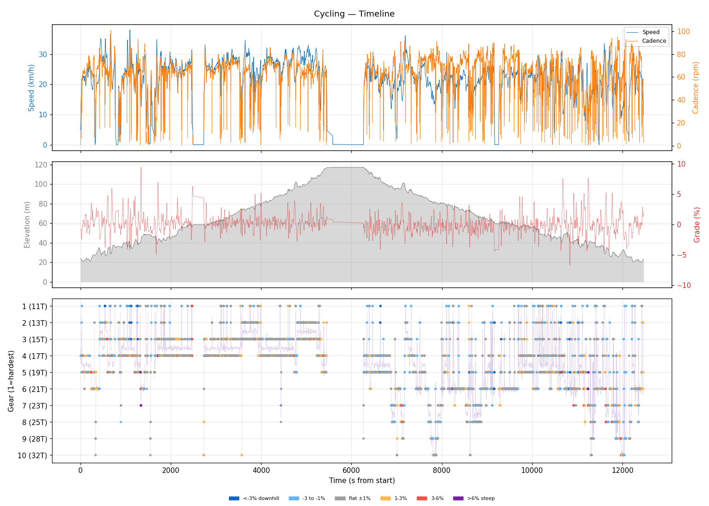
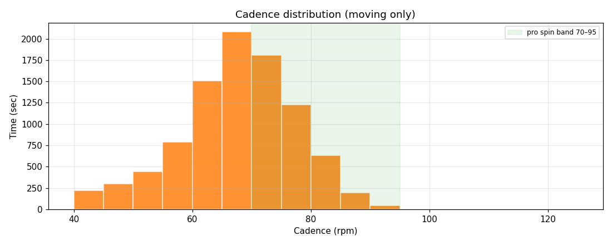
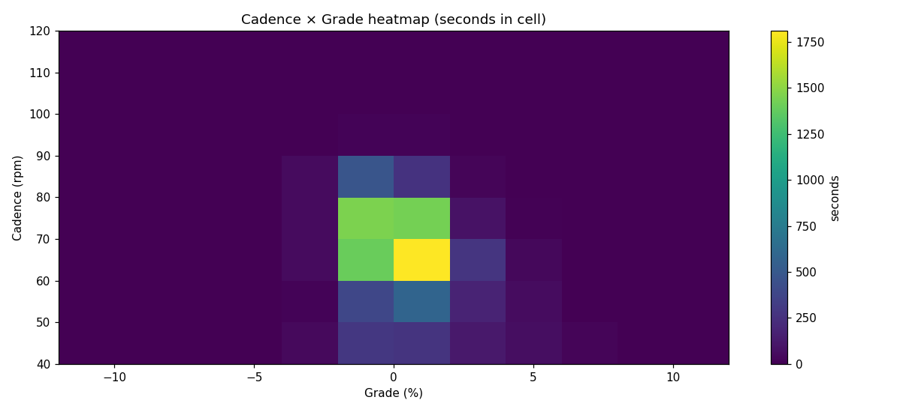
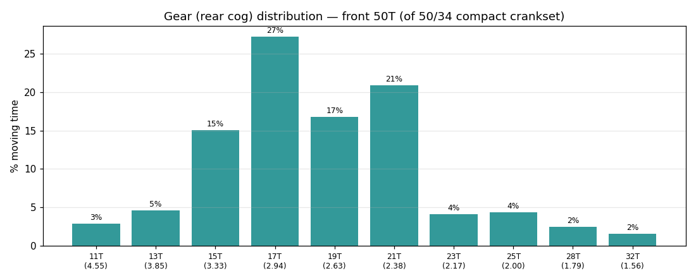
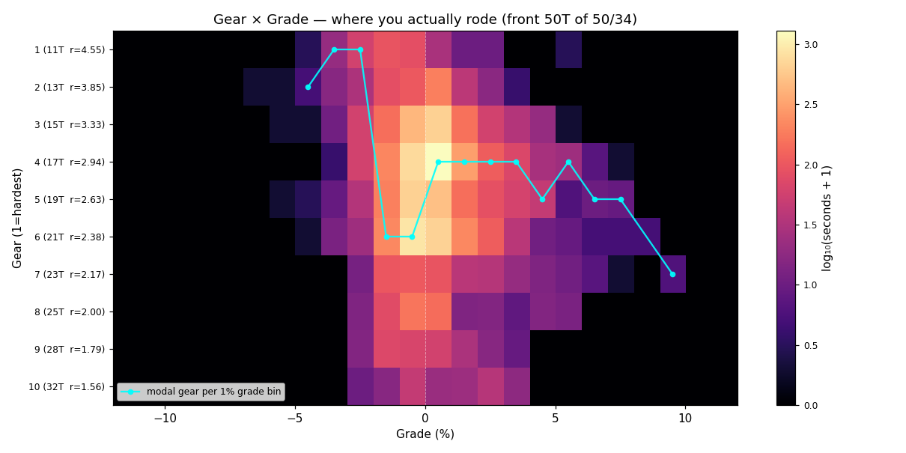
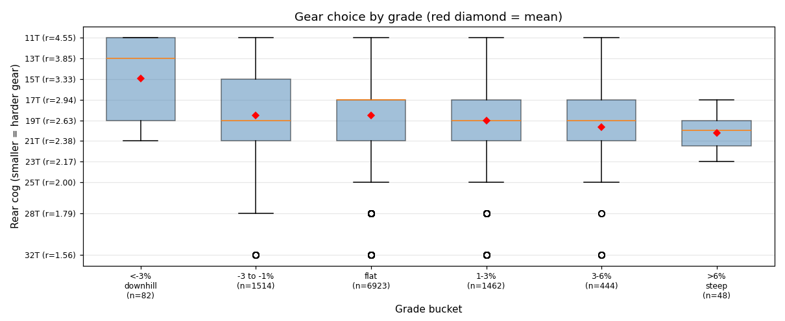
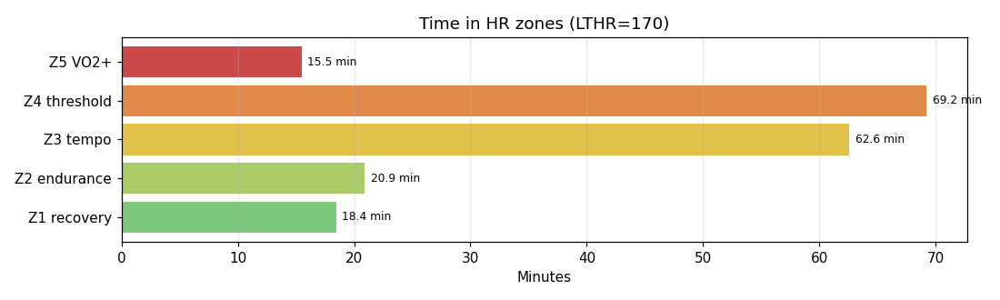

# Cycling

**2026-05-17 16:32**

> Long ride — 70.3 km, 383 m gain (mostly flat with bumps). High effort: hrTSS 227. Grinding tendency — 59% time below 70 rpm. Aerobic decoupling 15.7% — high; check pacing/hydration.

First logged ride — baseline established.

## Summary

| | |
|---|---|
| Distance | 70.25 km |
| Moving time | 3:04:07 |
| Total time | 3:27:48 |
| Avg speed | 22.8 km/h |
| Max speed | 38.0 km/h |
| Elev gain / loss | 383 / 384 m |
| Max grade | 9.4% |
| Avg HR | 158 bpm |
| Max HR | 176 bpm |
| Avg cadence | 66 rpm |
| **hrTSS** | **227** |
| TRIMP (Banister) | 408.6 |
| EF (speed/HR) | 2.41 |
| Pa:Hr decoupling | 15.7% |

## Timeline

## Cadence

| Stat | Value |
|---|---|
| Mean | 66 rpm |
| Median | 67 rpm |
| SD | 11 |
| Grind (<70) | 59% |
| Normal (70–85) | 38% |
| Spin (85–100) | 3% |
| High (>100) | 0% |

## Gear selection — front **50T** (of 50/34 compact crankset)

| Cog | Ratio | Time(s) | % moving |
|---|---|---|---|
| 11T | 4.55 | 303 | 2.9% |
| 13T | 3.85 | 483 | 4.6% |
| 15T | 3.33 | 1579 | 15.1% |
| 17T | 2.94 | 2854 | 27.3% |
| 19T | 2.63 | 1759 | 16.8% |
| 21T | 2.38 | 2187 | 20.9% |
| 23T | 2.17 | 433 | 4.1% |
| 25T | 2.00 | 455 | 4.3% |
| 28T | 1.79 | 257 | 2.5% |
| 32T | 1.56 | 163 | 1.6% |

### Gear by grade bucket

| Grade bucket | Time (s) | Avg cog | Modal cog |
|---|---|---|---|
| downhill (<-3%) | 82 | 15.0T | 11T (27%) |
| false flat down | 1514 | 18.5T | 17T (18%) |
| flat | 6923 | 18.5T | 17T (29%) |
| false flat up | 1462 | 19.1T | 17T (29%) |
| rolling climb | 444 | 19.7T | 17T (27%) |
| steep climb (>6%) | 48 | 20.2T | 19T (35%) |

### Interpretation
- Most-used cog: 17T (27% of moving time).
- On rolling climbs (3-6%): mostly 17T.

## HR zones

LTHR assumed: **170 bpm** (configurable in `secrets/profile.json`).

## Climbs

_No detected climbs._

---

_Generated by bike-report. Bike: 2020 Allez Sport — Praxis Alba 50/34 compact, Shimano HG500 11-32T 10-spd. This ride analyzed assuming **50T** front. Override per-ride with `#34T` or `#50T` in Strava description._
