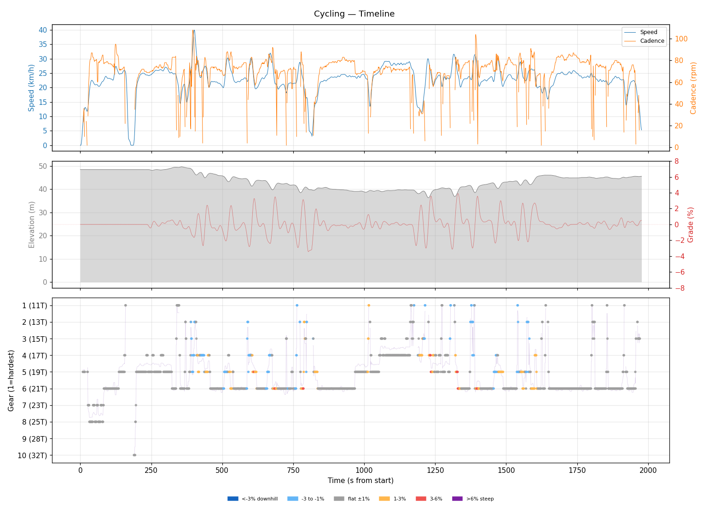
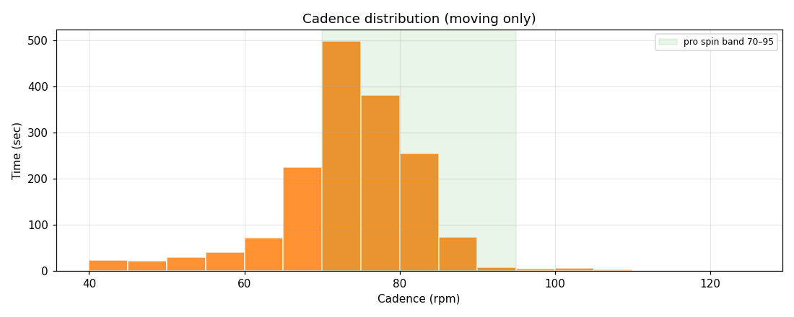
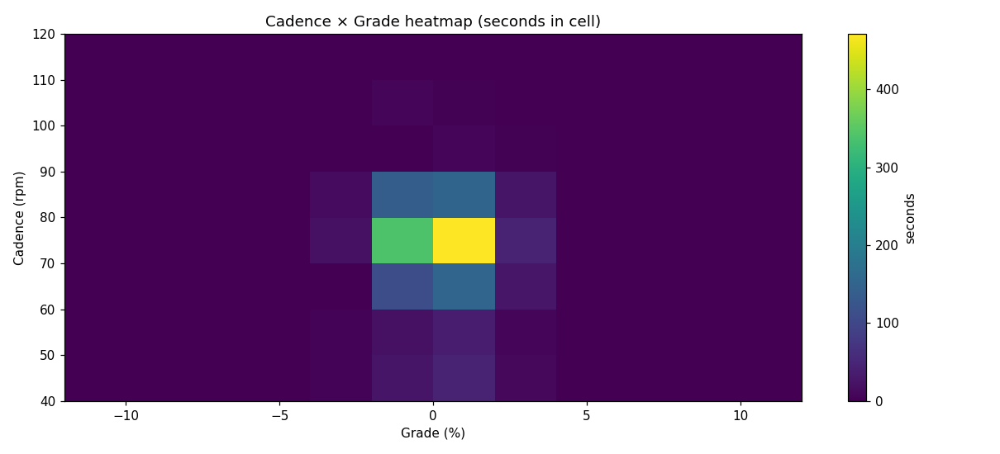
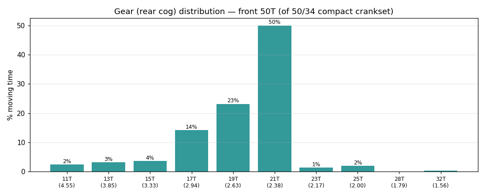
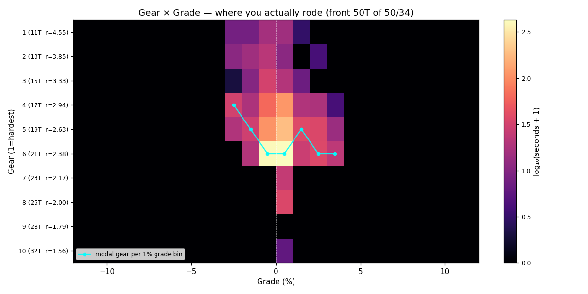
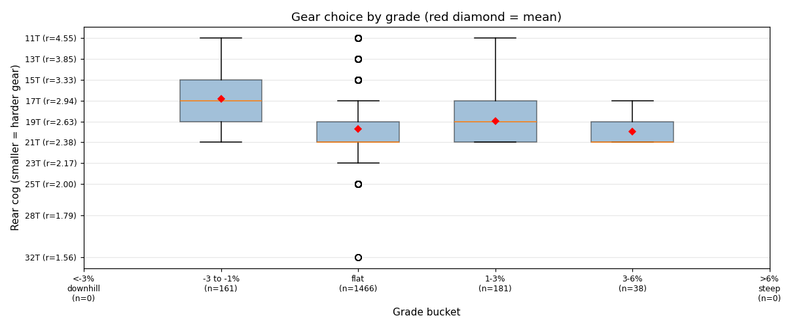
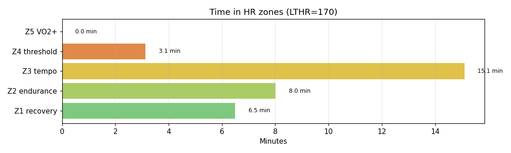

# Cycling

**2026-05-20 19:33**

> Standard ride — 12.4 km, 46 m gain (flat). Easy day: hrTSS 29. Cadence in good range (mean 72 rpm, SD 11). Aerobic durability sound (decoupling 3.0%).

First logged ride — baseline established.

## Summary

| | |
|---|---|
| Distance | 12.45 km |
| Moving time | 0:32:13 |
| Total time | 0:32:57 |
| Avg speed | 23.1 km/h |
| Max speed | 39.9 km/h |
| Elev gain / loss | 46 / 49 m |
| Max grade | 3.9% |
| Avg HR | 150 bpm |
| Max HR | 166 bpm |
| Avg cadence | 72 rpm |
| **hrTSS** | **29** |
| TRIMP (Banister) | 60.0 |
| EF (speed/HR) | 2.57 |
| Pa:Hr decoupling | 3.0% |

## Timeline

## Cadence

| Stat | Value |
|---|---|
| Mean | 72 rpm |
| Median | 74 rpm |
| SD | 11 |
| Grind (<70) | 27% |
| Normal (70–85) | 67% |
| Spin (85–100) | 5% |
| High (>100) | 1% |

## Gear selection — front **50T** (of 50/34 compact crankset)

| Cog | Ratio | Time(s) | % moving |
|---|---|---|---|
| 11T | 4.55 | 45 | 2.4% |
| 13T | 3.85 | 58 | 3.1% |
| 15T | 3.33 | 66 | 3.6% |
| 17T | 2.94 | 261 | 14.1% |
| 19T | 2.63 | 428 | 23.2% |
| 21T | 2.38 | 924 | 50.1% |
| 23T | 2.17 | 24 | 1.3% |
| 25T | 2.00 | 35 | 1.9% |
| 32T | 1.56 | 5 | 0.3% |

### Gear by grade bucket

| Grade bucket | Time (s) | Avg cog | Modal cog |
|---|---|---|---|
| downhill (<-3%) | 0 | – | – |
| false flat down | 161 | 16.8T | 17T (29%) |
| flat | 1466 | 19.7T | 21T (56%) |
| false flat up | 181 | 19.0T | 19T (40%) |
| rolling climb | 38 | 20.0T | 21T (58%) |
| steep climb (>6%) | 0 | – | – |

### Interpretation
- Most-used cog: 21T (50% of moving time).
- On rolling climbs (3-6%): mostly 21T.

## HR zones

LTHR assumed: **170 bpm** (configurable in `secrets/profile.json`).

## Climbs

_No detected climbs._

---

_Generated by bike-report. Bike: 2020 Allez Sport — Praxis Alba 50/34 compact, Shimano HG500 11-32T 10-spd. This ride analyzed assuming **50T** front. Override per-ride with `#34T` or `#50T` in Strava description._
