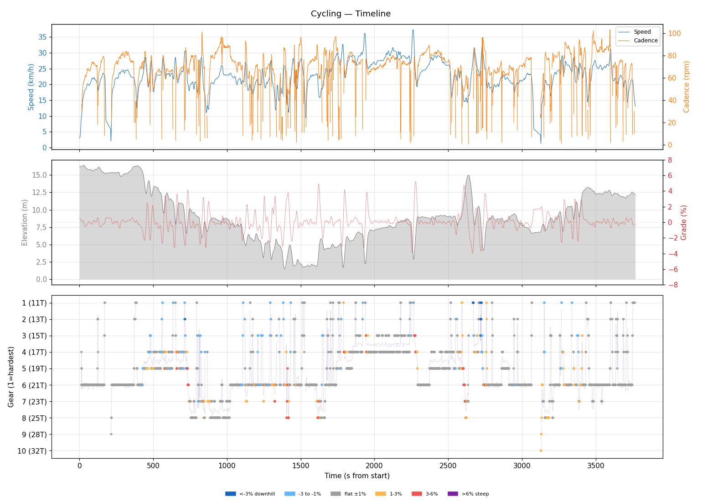
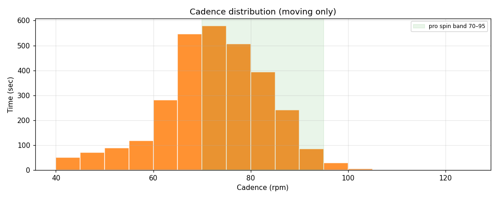
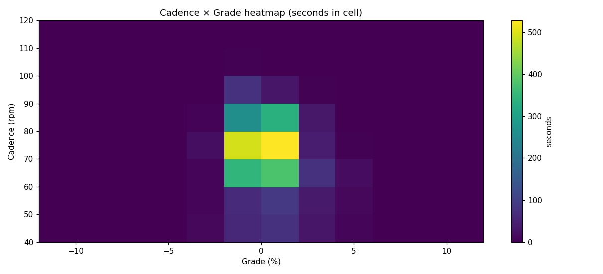
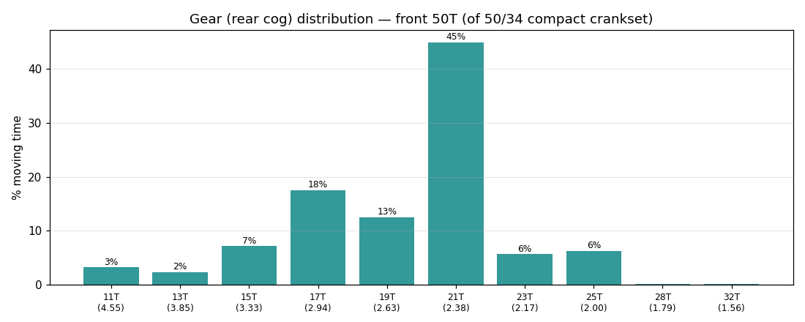
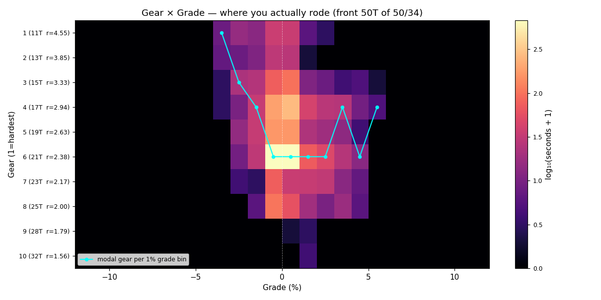
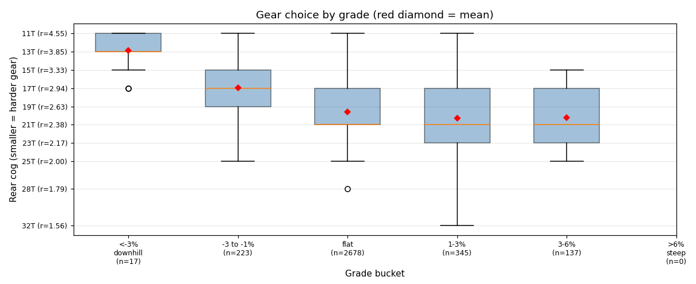
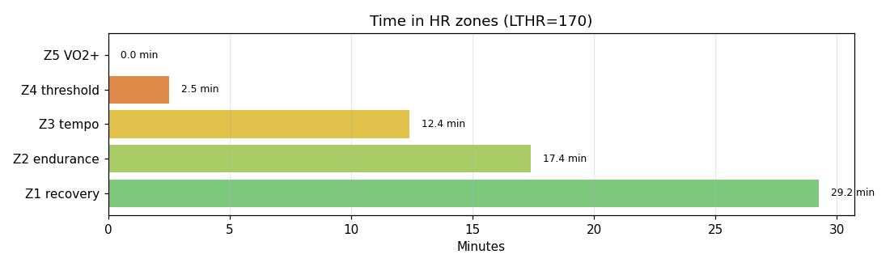

# Cycling

**2026-05-21 19:01**

> Standard ride — 23.5 km, 96 m gain (mostly flat with bumps). Easy day: hrTSS 41. Cadence in good range (mean 71 rpm, SD 12). Aerobic durability sound (decoupling -1.8%).

First logged ride — baseline established.

## Summary

| | |
|---|---|
| Distance | 23.55 km |
| Moving time | 1:01:17 |
| Total time | 1:02:48 |
| Avg speed | 23.0 km/h |
| Max speed | 37.3 km/h |
| Elev gain / loss | 96 / 100 m |
| Max grade | 5.2% |
| Avg HR | 143 bpm |
| Max HR | 167 bpm |
| Avg cadence | 71 rpm |
| **hrTSS** | **41** |
| TRIMP (Banister) | 96.7 |
| EF (speed/HR) | 2.68 |
| Pa:Hr decoupling | -1.8% |

## Timeline

## Cadence

| Stat | Value |
|---|---|
| Mean | 71 rpm |
| Median | 72 rpm |
| SD | 12 |
| Grind (<70) | 40% |
| Normal (70–85) | 48% |
| Spin (85–100) | 12% |
| High (>100) | 0% |

## Gear selection — front **50T** (of 50/34 compact crankset)

| Cog | Ratio | Time(s) | % moving |
|---|---|---|---|
| 11T | 4.55 | 110 | 3.2% |
| 13T | 3.85 | 79 | 2.3% |
| 15T | 3.33 | 244 | 7.2% |
| 17T | 2.94 | 598 | 17.6% |
| 19T | 2.63 | 426 | 12.5% |
| 21T | 2.38 | 1530 | 45.0% |
| 23T | 2.17 | 193 | 5.7% |
| 25T | 2.00 | 214 | 6.3% |
| 28T | 1.79 | 3 | 0.1% |
| 32T | 1.56 | 3 | 0.1% |

### Gear by grade bucket

| Grade bucket | Time (s) | Avg cog | Modal cog |
|---|---|---|---|
| downhill (<-3%) | 17 | 12.9T | 11T (41%) |
| false flat down | 223 | 17.0T | 19T (21%) |
| flat | 2678 | 19.6T | 21T (50%) |
| false flat up | 345 | 20.3T | 21T (34%) |
| rolling climb | 137 | 20.2T | 17T (27%) |
| steep climb (>6%) | 0 | – | – |

### Interpretation
- Most-used cog: 21T (45% of moving time).
- On rolling climbs (3-6%): mostly 17T.

## HR zones

LTHR assumed: **170 bpm** (configurable in `secrets/profile.json`).

## Climbs

_No detected climbs._

---

_Generated by bike-report. Bike: 2020 Allez Sport — Praxis Alba 50/34 compact, Shimano HG500 11-32T 10-spd. This ride analyzed assuming **50T** front. Override per-ride with `#34T` or `#50T` in Strava description._
