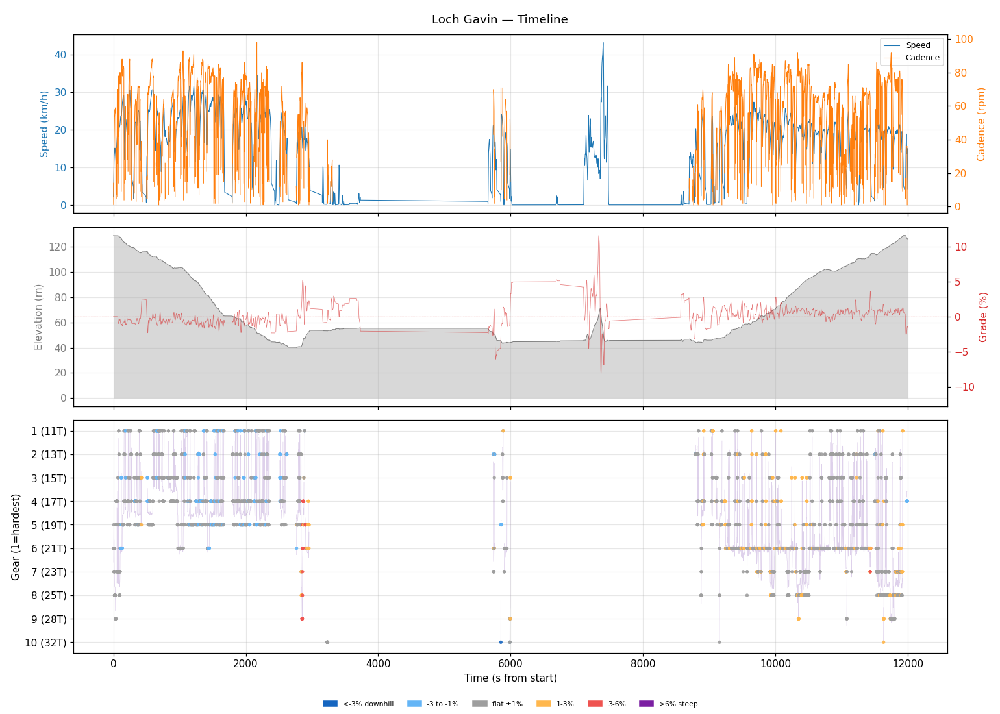
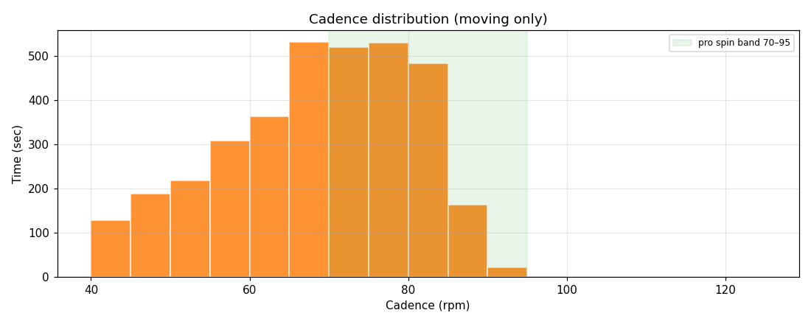
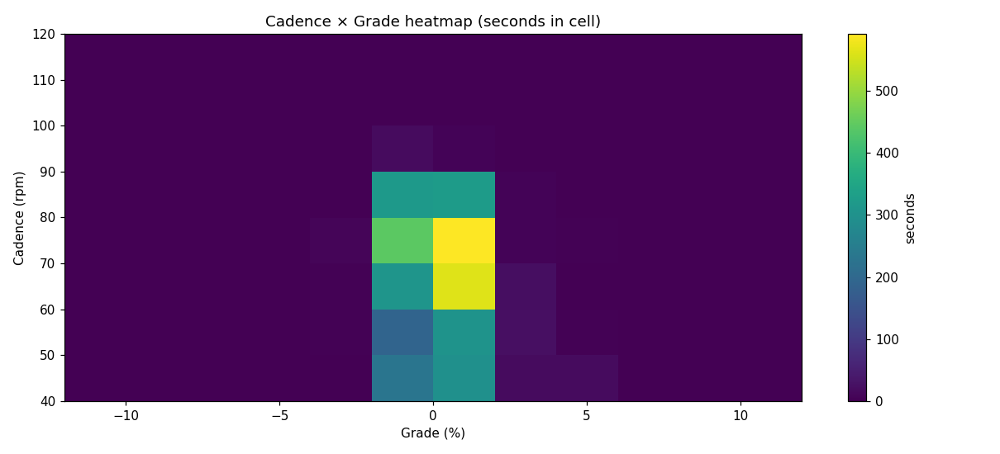
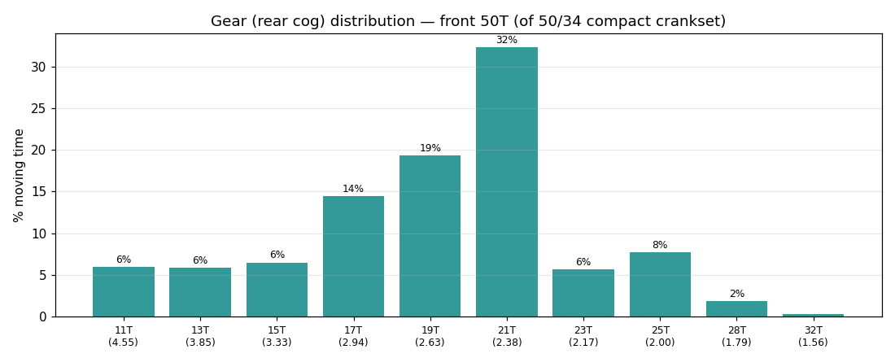
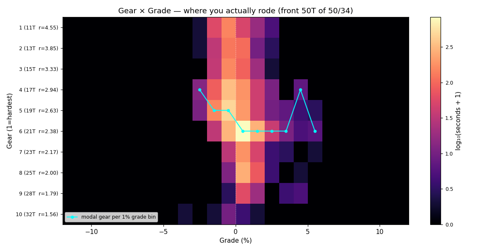
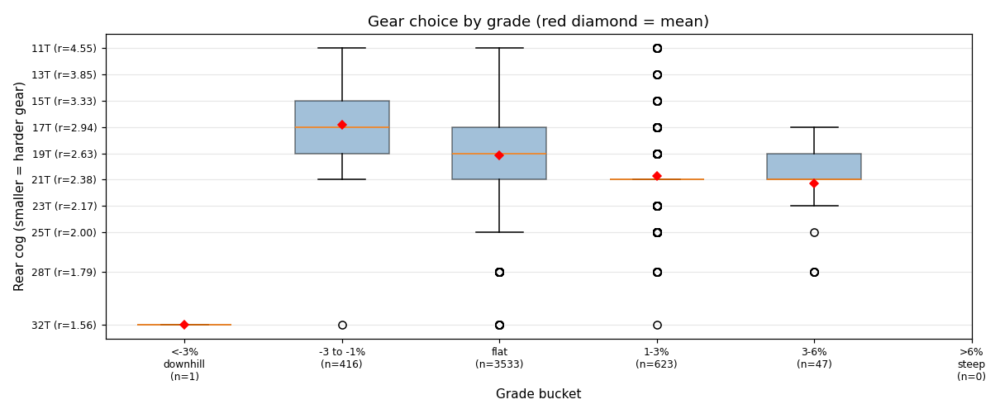
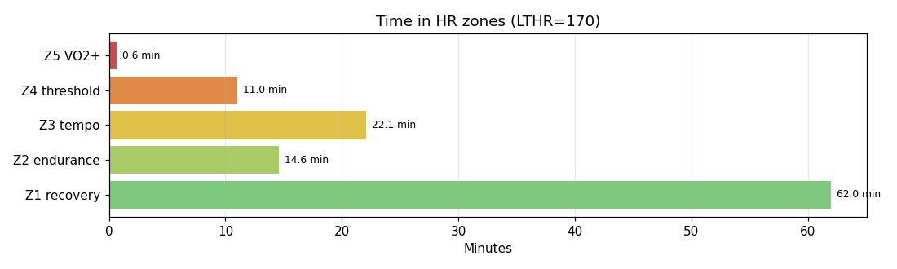

# Loch Gavin

**2026-05-23 12:46**

> Endurance ride — 33.7 km, 162 m gain (mostly flat with bumps). Solid aerobic effort: hrTSS 78. Grinding tendency — 54% time below 70 rpm. Aerobic decoupling 22.8% — high; check pacing/hydration.

First logged ride — baseline established.

## Summary

| | |
|---|---|
| Distance | 33.74 km |
| Moving time | 1:40:51 |
| Total time | 3:20:00 |
| Avg speed | 19.8 km/h |
| Max speed | 43.2 km/h |
| Elev gain / loss | 162 / 164 m |
| Max grade | 11.6% |
| Avg HR | 140 bpm |
| Max HR | 173 bpm |
| Avg cadence | 66 rpm |
| **hrTSS** | **78** |
| TRIMP (Banister) | 161.1 |
| EF (speed/HR) | 2.36 |
| Pa:Hr decoupling | 22.8% |

## Timeline

## Cadence

| Stat | Value |
|---|---|
| Mean | 66 rpm |
| Median | 68 rpm |
| SD | 14 |
| Grind (<70) | 54% |
| Normal (70–85) | 41% |
| Spin (85–100) | 5% |
| High (>100) | 0% |

## Gear selection — front **50T** (of 50/34 compact crankset)

| Cog | Ratio | Time(s) | % moving |
|---|---|---|---|
| 11T | 4.55 | 274 | 5.9% |
| 13T | 3.85 | 270 | 5.8% |
| 15T | 3.33 | 300 | 6.5% |
| 17T | 2.94 | 669 | 14.5% |
| 19T | 2.63 | 893 | 19.3% |
| 21T | 2.38 | 1495 | 32.4% |
| 23T | 2.17 | 263 | 5.7% |
| 25T | 2.00 | 356 | 7.7% |
| 28T | 1.79 | 85 | 1.8% |
| 32T | 1.56 | 15 | 0.3% |

### Gear by grade bucket

| Grade bucket | Time (s) | Avg cog | Modal cog |
|---|---|---|---|
| downhill (<-3%) | 1 | 32.0T | 32T (100%) |
| false flat down | 416 | 16.8T | 19T (39%) |
| flat | 3533 | 19.1T | 21T (32%) |
| false flat up | 623 | 20.7T | 21T (51%) |
| rolling climb | 47 | 21.3T | 21T (40%) |
| steep climb (>6%) | 0 | – | – |

### Interpretation
- Most-used cog: 21T (32% of moving time).
- On rolling climbs (3-6%): mostly 21T.

## HR zones

LTHR assumed: **170 bpm** (configurable in `secrets/profile.json`).

## Climbs

_No detected climbs._

---

_Generated by bike-report. Bike: 2020 Allez Sport — Praxis Alba 50/34 compact, Shimano HG500 11-32T 10-spd. This ride analyzed assuming **50T** front. Override per-ride with `#34T` or `#50T` in Strava description._
