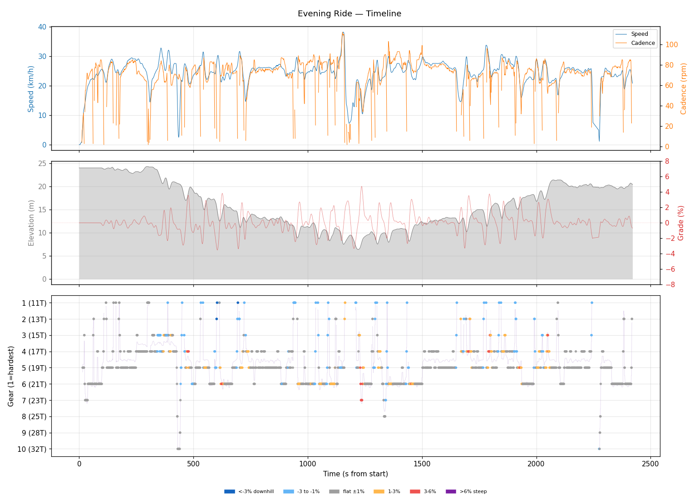
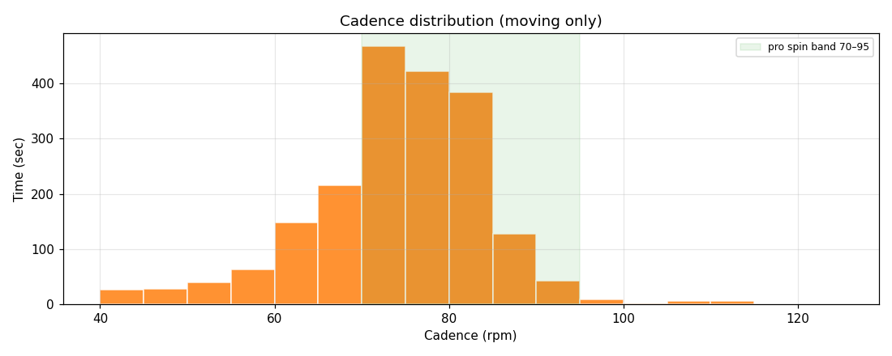
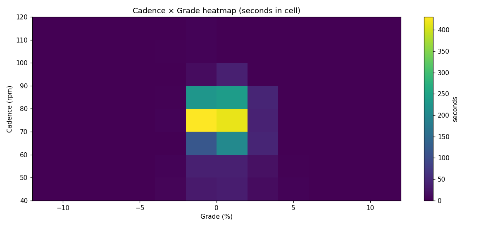
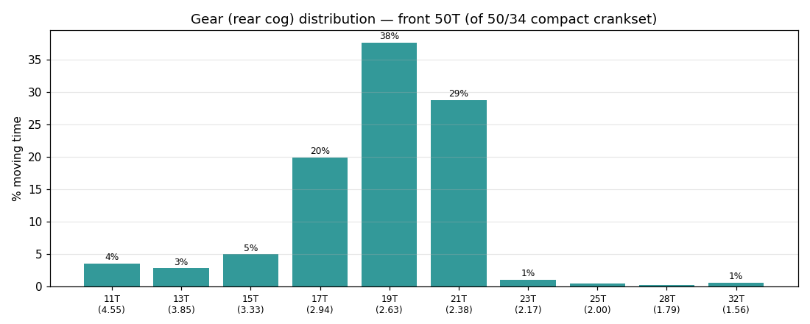
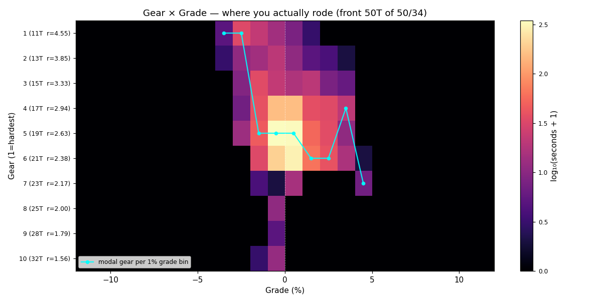
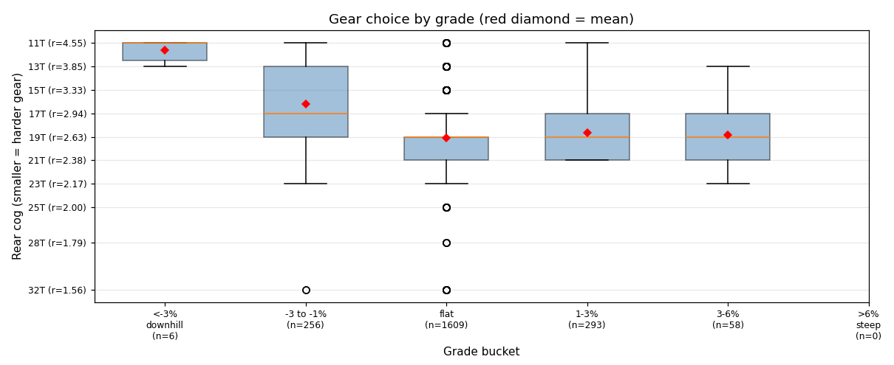
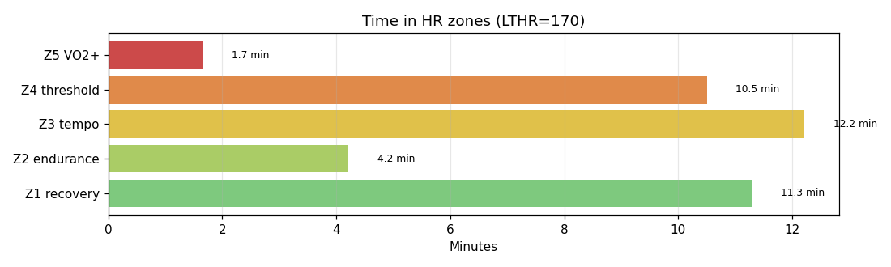

# Evening Ride

**2026-05-25 19:42**

> Standard ride — 16.2 km, 75 m gain (mostly flat with bumps). Easy day: hrTSS 40. Cadence in good range (mean 73 rpm, SD 11). Aerobic decoupling 19.3% — high; check pacing/hydration.

First logged ride — baseline established.

## Summary

| | |
|---|---|
| Distance | 16.23 km |
| Moving time | 0:39:32 |
| Total time | 0:40:21 |
| Avg speed | 24.6 km/h |
| Max speed | 38.2 km/h |
| Elev gain / loss | 75 / 79 m |
| Max grade | 4.7% |
| Avg HR | 142 bpm |
| Max HR | 176 bpm |
| Avg cadence | 73 rpm |
| **hrTSS** | **40** |
| TRIMP (Banister) | 68.7 |
| EF (speed/HR) | 2.89 |
| Pa:Hr decoupling | 19.3% |

## Timeline

## Cadence

| Stat | Value |
|---|---|
| Mean | 73 rpm |
| Median | 74 rpm |
| SD | 11 |
| Grind (<70) | 27% |
| Normal (70–85) | 63% |
| Spin (85–100) | 9% |
| High (>100) | 1% |

## Gear selection — front **50T** (of 50/34 compact crankset)

| Cog | Ratio | Time(s) | % moving |
|---|---|---|---|
| 11T | 4.55 | 79 | 3.6% |
| 13T | 3.85 | 62 | 2.8% |
| 15T | 3.33 | 110 | 5.0% |
| 17T | 2.94 | 443 | 19.9% |
| 19T | 2.63 | 837 | 37.7% |
| 21T | 2.38 | 640 | 28.8% |
| 23T | 2.17 | 24 | 1.1% |
| 25T | 2.00 | 10 | 0.5% |
| 28T | 1.79 | 4 | 0.2% |
| 32T | 1.56 | 13 | 0.6% |

### Gear by grade bucket

| Grade bucket | Time (s) | Avg cog | Modal cog |
|---|---|---|---|
| downhill (<-3%) | 6 | 11.7T | 11T (67%) |
| false flat down | 256 | 16.2T | 19T (22%) |
| flat | 1609 | 19.1T | 19T (42%) |
| false flat up | 293 | 18.7T | 21T (34%) |
| rolling climb | 58 | 18.8T | 17T (34%) |
| steep climb (>6%) | 0 | – | – |

### Interpretation
- Most-used cog: 19T (38% of moving time).
- On rolling climbs (3-6%): mostly 17T.

## HR zones

LTHR assumed: **170 bpm** (configurable in `secrets/profile.json`).

## Climbs

_No detected climbs._

---

_Generated by bike-report. Bike: 2020 Allez Sport — Praxis Alba 50/34 compact, Shimano HG500 11-32T 10-spd. This ride analyzed assuming **50T** front. Override per-ride with `#34T` or `#50T` in Strava description._
