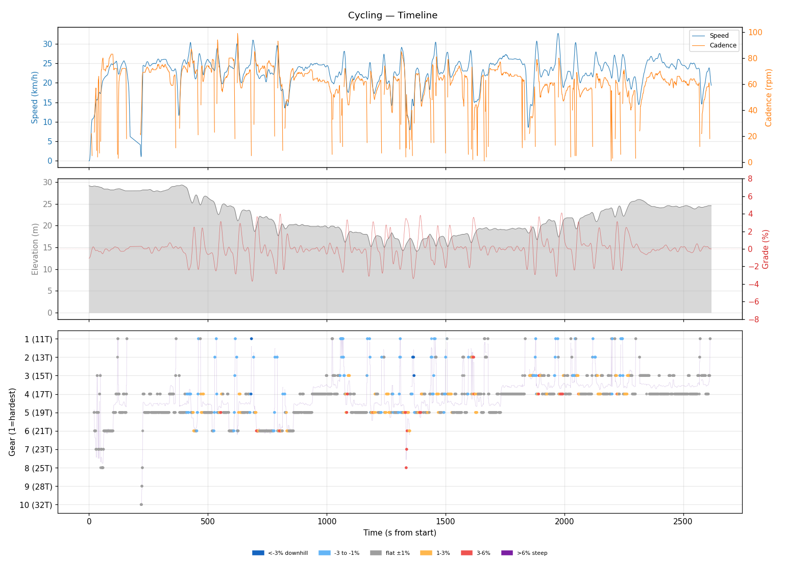
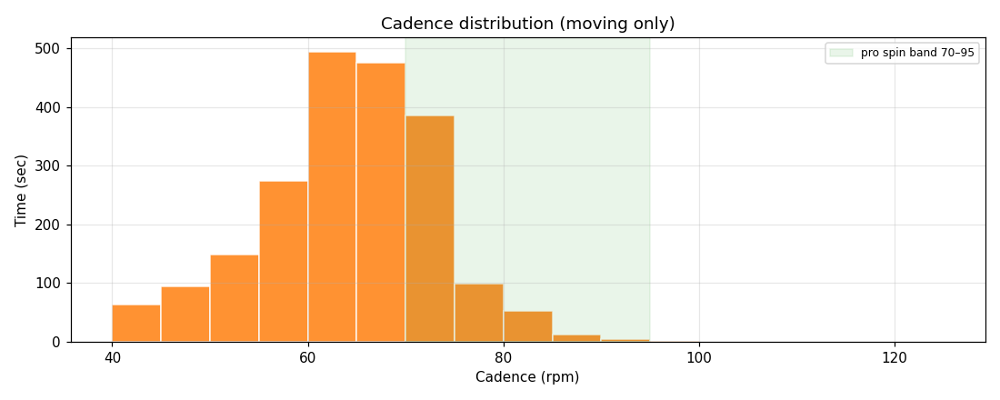
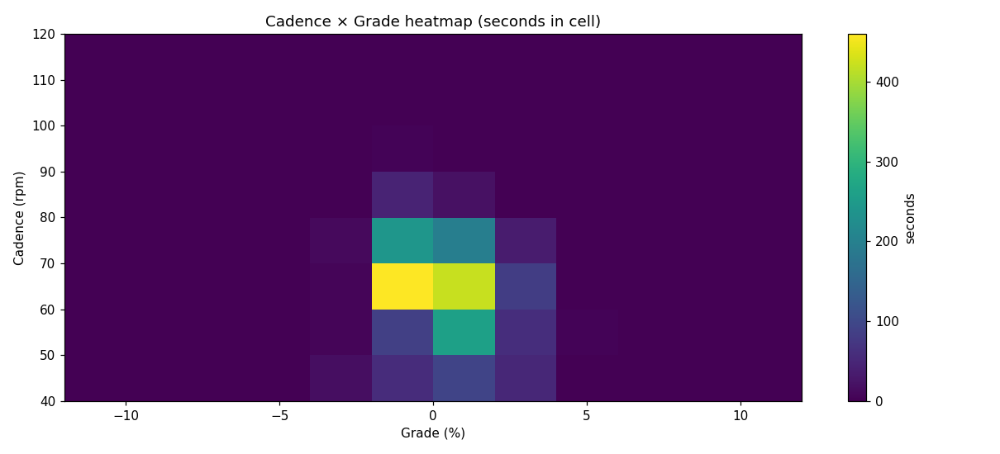
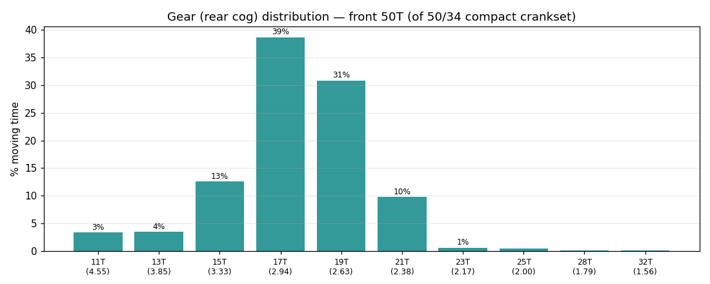
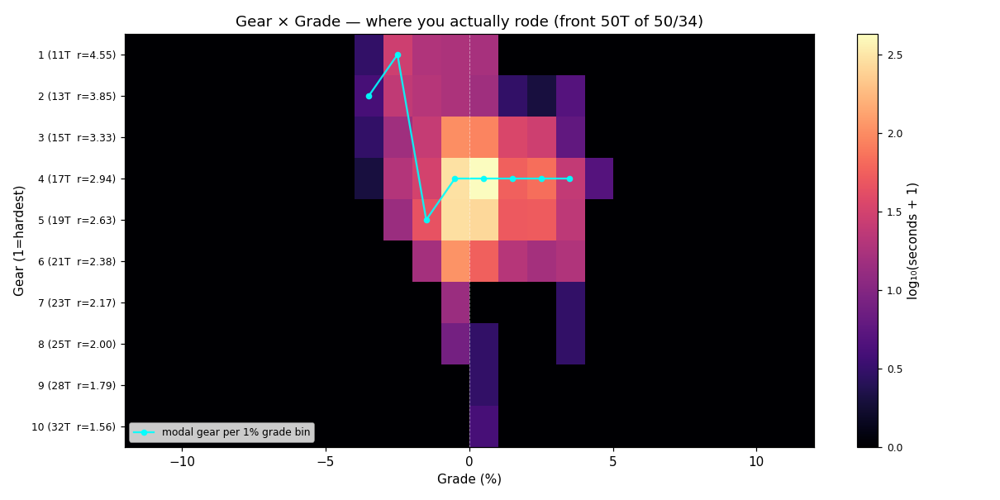
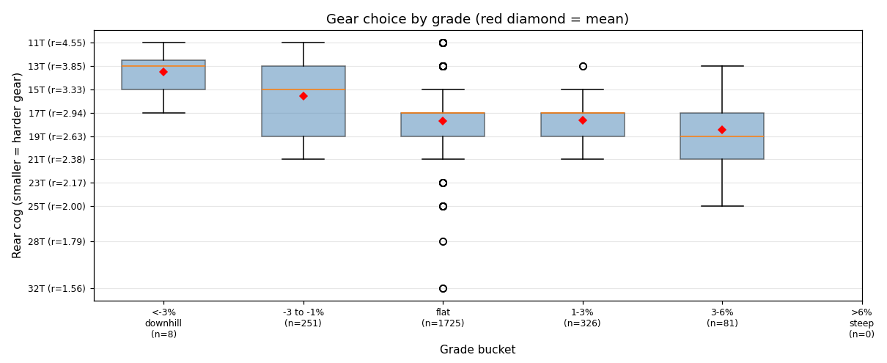
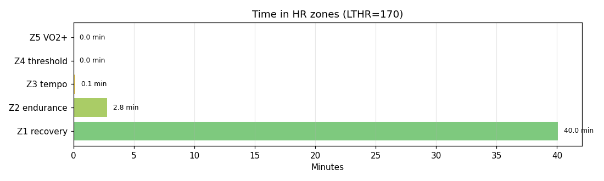

# Cycling

**2026-06-01 19:35**

> Standard ride — 16.3 km, 72 m gain (mostly flat with bumps). Easy day: hrTSS 19. Grinding tendency — 74% time below 70 rpm. Aerobic durability sound (decoupling 2.9%).

First logged ride — baseline established.

## Summary

| | |
|---|---|
| Distance | 16.29 km |
| Moving time | 0:42:43 |
| Total time | 0:43:38 |
| Avg speed | 22.8 km/h |
| Max speed | 32.6 km/h |
| Elev gain / loss | 72 / 76 m |
| Max grade | 4.1% |
| Avg HR | 136 bpm |
| Max HR | 154 bpm |
| Avg cadence | 63 rpm |
| **hrTSS** | **19** |
| TRIMP (Banister) | 55.6 |
| EF (speed/HR) | 2.80 |
| Pa:Hr decoupling | 2.9% |

## Timeline

## Cadence

| Stat | Value |
|---|---|
| Mean | 63 rpm |
| Median | 64 rpm |
| SD | 10 |
| Grind (<70) | 74% |
| Normal (70–85) | 25% |
| Spin (85–100) | 1% |
| High (>100) | 0% |

## Gear selection — front **50T** (of 50/34 compact crankset)

| Cog | Ratio | Time(s) | % moving |
|---|---|---|---|
| 11T | 4.55 | 81 | 3.4% |
| 13T | 3.85 | 84 | 3.5% |
| 15T | 3.33 | 301 | 12.6% |
| 17T | 2.94 | 924 | 38.6% |
| 19T | 2.63 | 737 | 30.8% |
| 21T | 2.38 | 233 | 9.7% |
| 23T | 2.17 | 15 | 0.6% |
| 25T | 2.00 | 11 | 0.5% |
| 28T | 1.79 | 2 | 0.1% |
| 32T | 1.56 | 3 | 0.1% |

### Gear by grade bucket

| Grade bucket | Time (s) | Avg cog | Modal cog |
|---|---|---|---|
| downhill (<-3%) | 8 | 13.5T | 13T (38%) |
| false flat down | 251 | 15.6T | 19T (23%) |
| flat | 1725 | 17.7T | 17T (42%) |
| false flat up | 326 | 17.6T | 17T (38%) |
| rolling climb | 81 | 18.5T | 17T (35%) |
| steep climb (>6%) | 0 | – | – |

### Interpretation
- No use of climbing cogs (25T+) — terrain didn't demand it, or you're under-utilising bailout.
- Most-used cog: 17T (39% of moving time).
- On rolling climbs (3-6%): mostly 17T.

## HR zones

LTHR assumed: **170 bpm** (configurable in `secrets/profile.json`).

## Climbs

_No detected climbs._

---

_Generated by bike-report. Bike: 2020 Allez Sport — Praxis Alba 50/34 compact, Shimano HG500 11-32T 10-spd. This ride analyzed assuming **50T** front. Override per-ride with `#34T` or `#50T` in Strava description._
