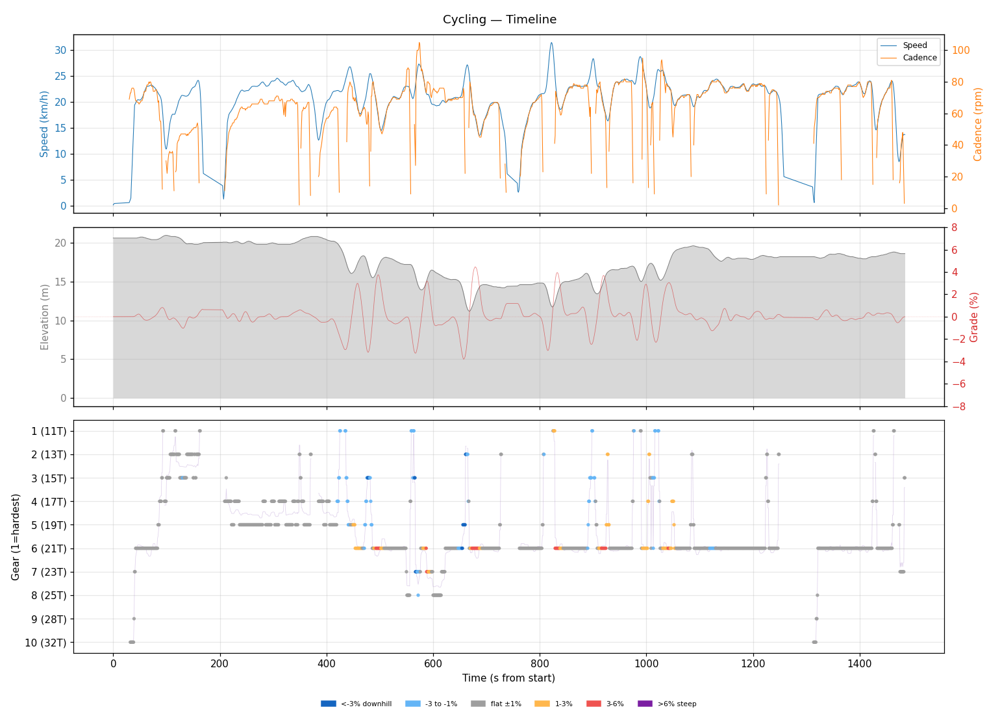
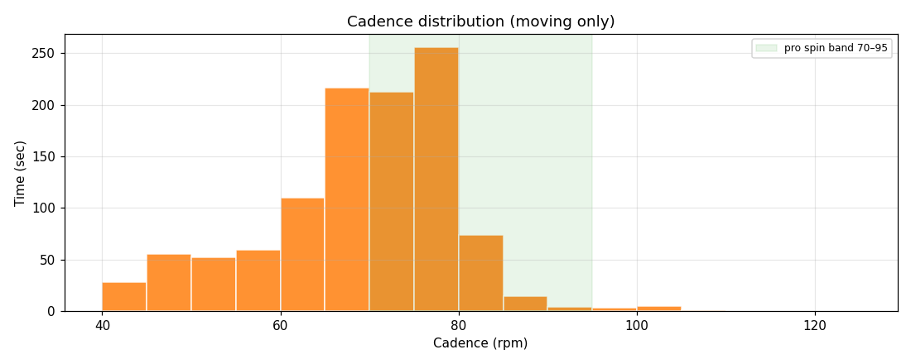
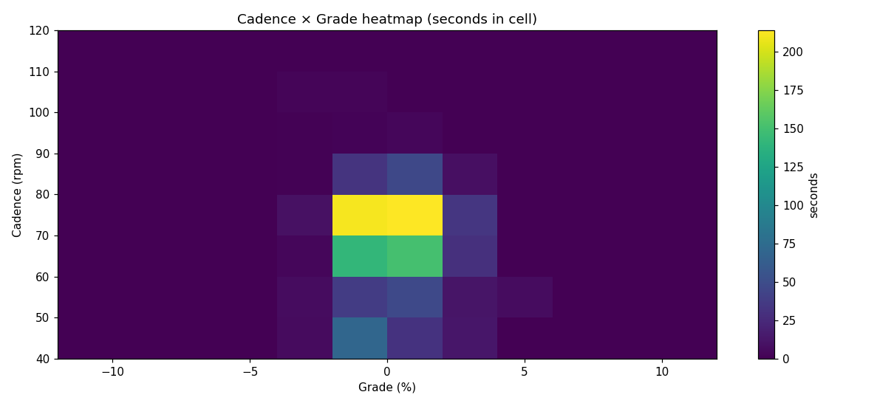
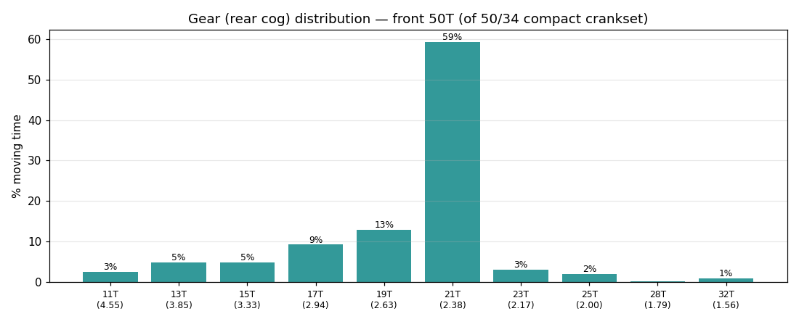
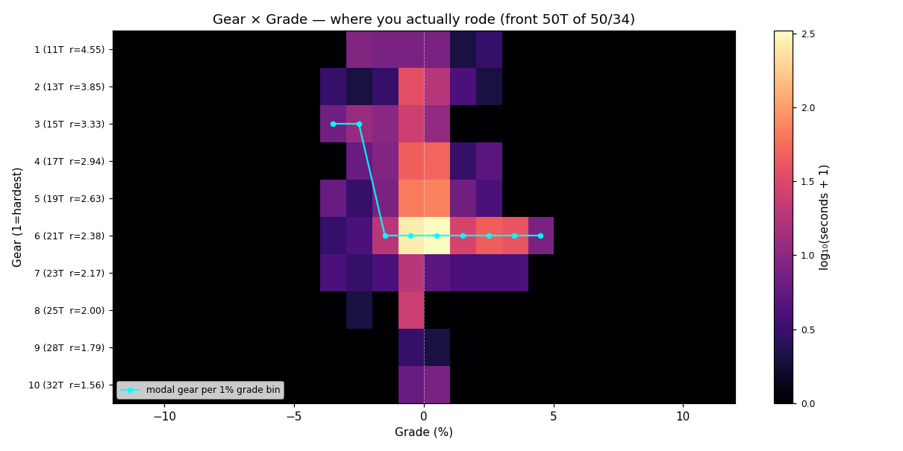
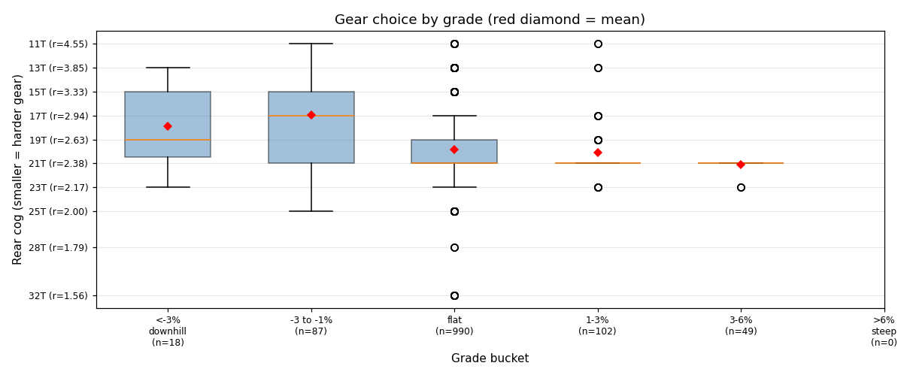
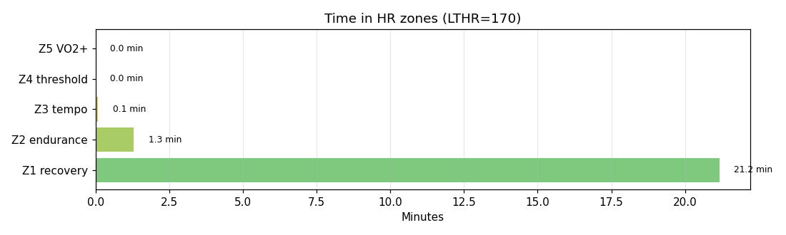

# Cycling

**2026-06-05 19:56**

> Short ride — 7.9 km, 32 m gain (flat). Easy day: hrTSS 10. Grinding tendency — 50% time below 70 rpm. Aerobic durability sound (decoupling -4.6%).

First logged ride — baseline established.

## Summary

| | |
|---|---|
| Distance | 7.92 km |
| Moving time | 0:22:10 |
| Total time | 0:24:45 |
| Avg speed | 21.3 km/h |
| Max speed | 31.5 km/h |
| Elev gain / loss | 32 / 34 m |
| Max grade | 4.5% |
| Avg HR | 135 bpm |
| Max HR | 152 bpm |
| Avg cadence | 67 rpm |
| **hrTSS** | **10** |
| TRIMP (Banister) | 28.5 |
| EF (speed/HR) | 2.62 |
| Pa:Hr decoupling | -4.6% |

## Timeline

## Cadence

| Stat | Value |
|---|---|
| Mean | 67 rpm |
| Median | 70 rpm |
| SD | 12 |
| Grind (<70) | 50% |
| Normal (70–85) | 48% |
| Spin (85–100) | 2% |
| High (>100) | 1% |

## Gear selection — front **50T** (of 50/34 compact crankset)

| Cog | Ratio | Time(s) | % moving |
|---|---|---|---|
| 11T | 4.55 | 32 | 2.6% |
| 13T | 3.85 | 61 | 4.9% |
| 15T | 3.33 | 60 | 4.8% |
| 17T | 2.94 | 115 | 9.2% |
| 19T | 2.63 | 161 | 12.9% |
| 21T | 2.38 | 739 | 59.3% |
| 23T | 2.17 | 39 | 3.1% |
| 25T | 2.00 | 24 | 1.9% |
| 28T | 1.79 | 3 | 0.2% |
| 32T | 1.56 | 12 | 1.0% |

### Gear by grade bucket

| Grade bucket | Time (s) | Avg cog | Modal cog |
|---|---|---|---|
| downhill (<-3%) | 18 | 17.9T | 15T (33%) |
| false flat down | 87 | 17.0T | 21T (24%) |
| flat | 990 | 19.9T | 21T (60%) |
| false flat up | 102 | 20.1T | 21T (73%) |
| rolling climb | 49 | 21.1T | 21T (94%) |
| steep climb (>6%) | 0 | – | – |

### Interpretation
- Most-used cog: 21T (59% of moving time).
- On rolling climbs (3-6%): mostly 21T.

## HR zones

LTHR assumed: **170 bpm** (configurable in `secrets/profile.json`).

## Climbs

_No detected climbs._

---

_Generated by bike-report. Bike: 2020 Allez Sport — Praxis Alba 50/34 compact, Shimano HG500 11-32T 10-spd. This ride analyzed assuming **50T** front. Override per-ride with `#34T` or `#50T` in Strava description._
