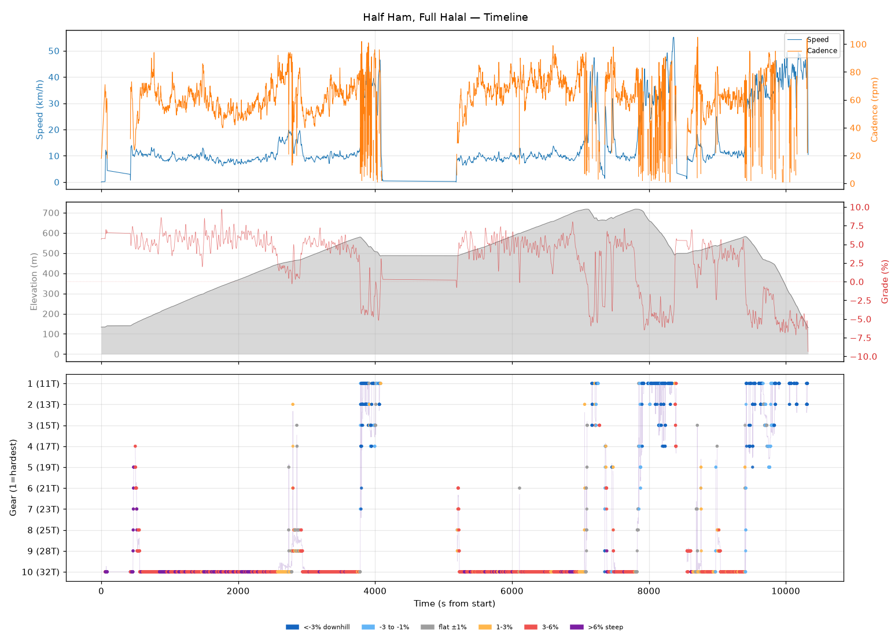
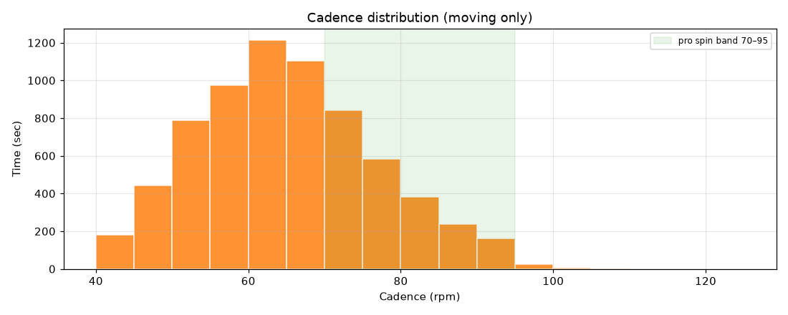
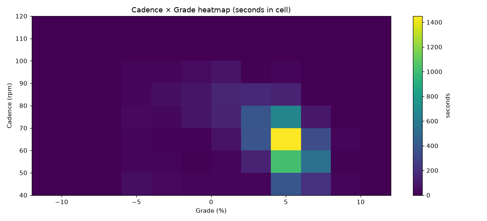
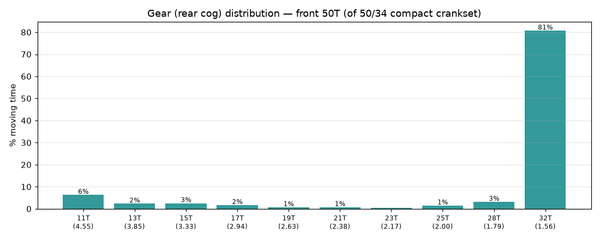
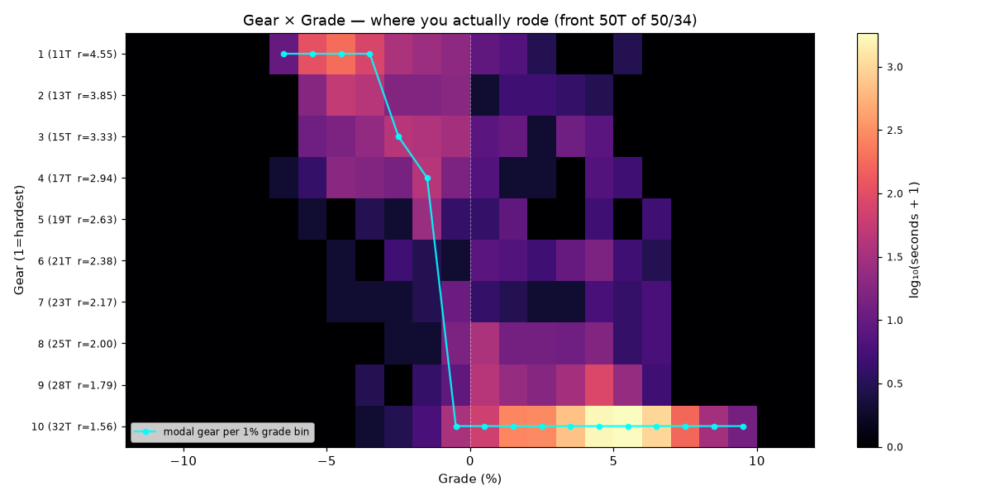
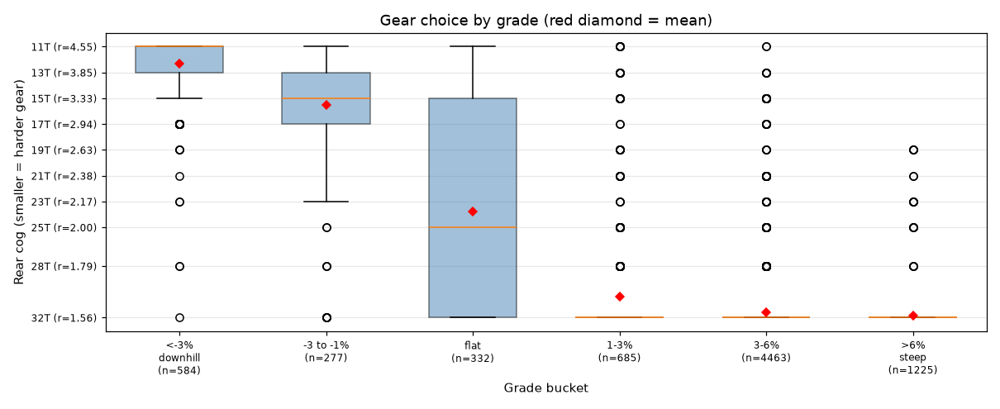
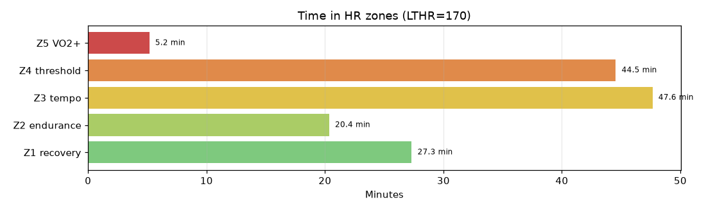

# Half Ham, Full Halal

**2026-06-14 08:19**

> Endurance ride — 38.7 km, 842 m gain (hilly). High effort: hrTSS 155. Grinding tendency — 68% time below 70 rpm. Aerobic durability sound (decoupling -79.7%). 6 climb(s); biggest: 6326m @ 5.1% (cat 2, VAM 426).

First logged ride — baseline established.

## Summary

| | |
|---|---|
| Distance | 38.73 km |
| Moving time | 2:23:53 |
| Total time | 2:52:07 |
| Avg speed | 16.1 km/h |
| Max speed | 55.2 km/h |
| Elev gain / loss | 842 / 844 m |
| Max grade | 9.7% |
| Avg HR | 153 bpm |
| Max HR | 174 bpm |
| Avg cadence | 64 rpm |
| **hrTSS** | **155** |
| TRIMP (Banister) | 288.5 |
| EF (speed/HR) | 1.76 |
| Pa:Hr decoupling | -79.7% |

## Timeline

## Cadence

| Stat | Value |
|---|---|
| Mean | 64 rpm |
| Median | 64 rpm |
| SD | 12 |
| Grind (<70) | 68% |
| Normal (70–85) | 25% |
| Spin (85–100) | 6% |
| High (>100) | 0% |

## Gear selection — front **50T** (of 50/34 compact crankset)

| Cog | Ratio | Time(s) | % moving |
|---|---|---|---|
| 11T | 4.55 | 477 | 6.3% |
| 13T | 3.85 | 176 | 2.3% |
| 15T | 3.33 | 193 | 2.6% |
| 17T | 2.94 | 127 | 1.7% |
| 19T | 2.63 | 51 | 0.7% |
| 21T | 2.38 | 54 | 0.7% |
| 23T | 2.17 | 35 | 0.5% |
| 25T | 2.00 | 110 | 1.5% |
| 28T | 1.79 | 239 | 3.2% |
| 32T | 1.56 | 6104 | 80.7% |

### Gear by grade bucket

| Grade bucket | Time (s) | Avg cog | Modal cog |
|---|---|---|---|
| downhill (<-3%) | 584 | 12.3T | 11T (65%) |
| false flat down | 277 | 15.5T | 15T (29%) |
| flat | 332 | 23.8T | 32T (30%) |
| false flat up | 685 | 30.4T | 32T (84%) |
| rolling climb | 4463 | 31.6T | 32T (95%) |
| steep climb (>6%) | 1225 | 31.9T | 32T (98%) |

### Interpretation
- Significant climbing-cog use (85% in 25T+).
- Most-used cog: 32T (81% of moving time).
- On rolling climbs (3-6%): mostly 32T.

## HR zones

LTHR assumed: **170 bpm** (configurable in `secrets/profile.json`).

## Climbs

| Length | Avg grade | Gain | Duration | VAM | Cat | Avg HR | Avg cad | Modal cog |
|---|---|---|---|---|---|---|---|---|
| 6.33 km | 5.1% | 323 m | 0:45:35 | 426 | cat 2 | 155 | 60 | 32T |
| 2.37 km | 4.7% | 112 m | 0:14:27 | 467 | cat 4 | 160 | 60 | 32T |
| 2.25 km | 4.9% | 110 m | 0:14:57 | 441 | cat 4 | 155 | 66 | 32T |
| 2.75 km | 4.3% | 119 m | 0:15:59 | 448 | cat 4 | 166 | 74 | 32T |
| 0.92 km | 4.9% | 45 m | 0:05:26 | 501 | cat uncat | 167 | 64 | 32T |
| 1.17 km | 3.8% | 44 m | 0:06:22 | 418 | cat uncat | 161 | 61 | 32T |

---

_Generated by bike-report. Bike: 2020 Allez Sport — Praxis Alba 50/34 compact, Shimano HG500 11-32T 10-spd. This ride analyzed assuming **50T** front. Override per-ride with `#34T` or `#50T` in Strava description._
