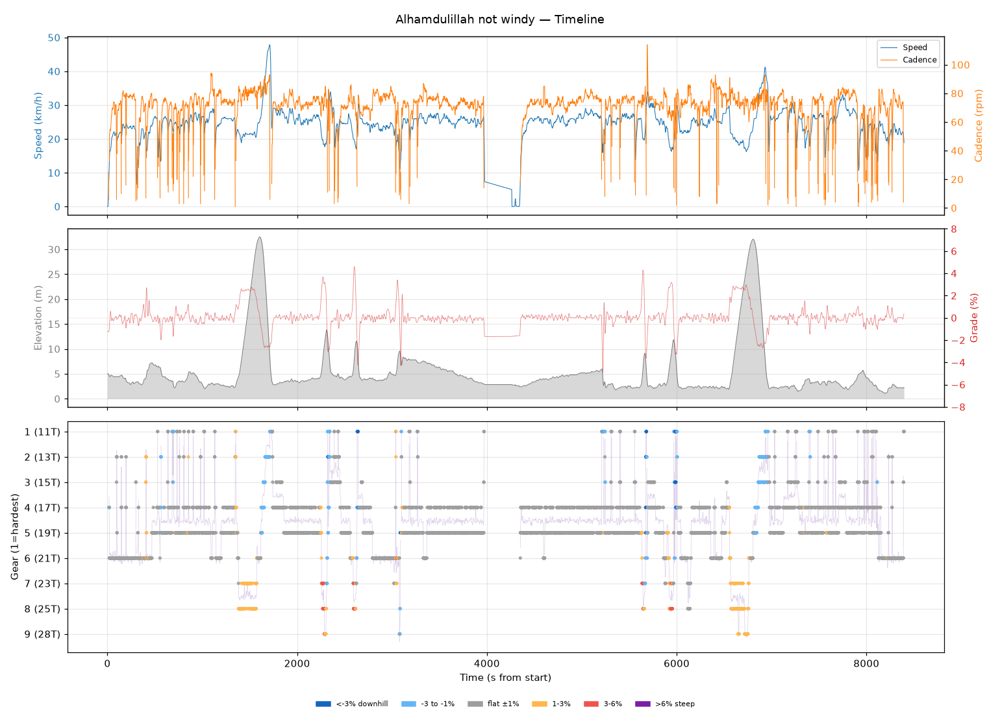
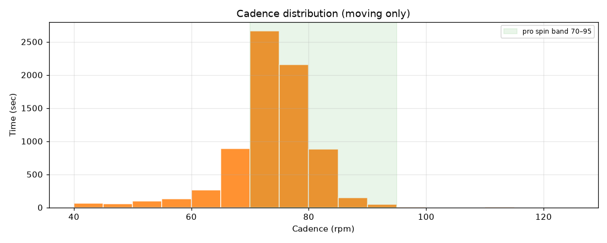
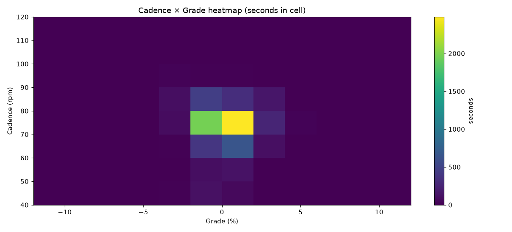
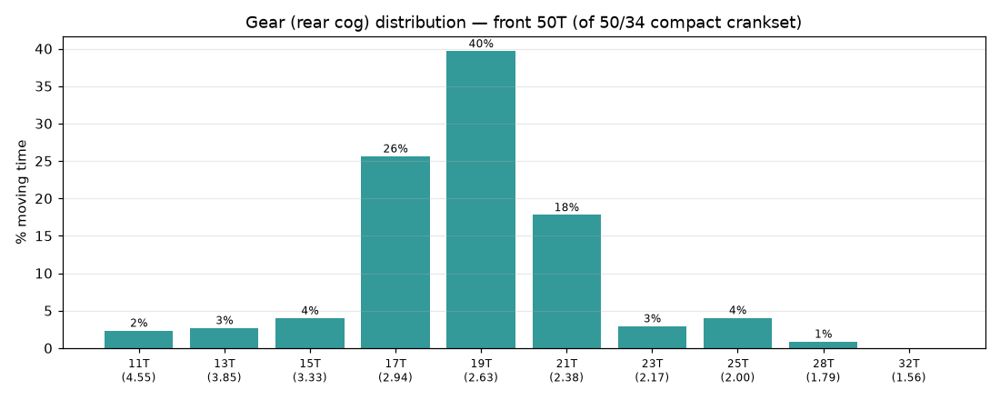
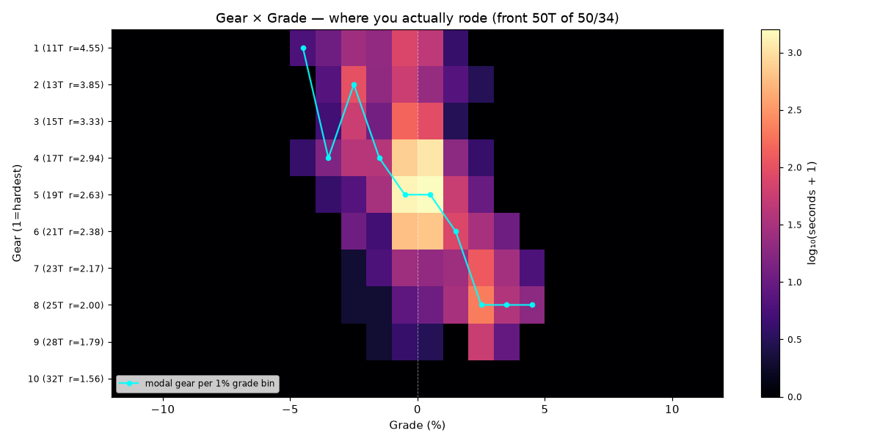
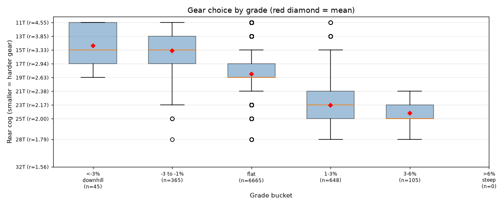
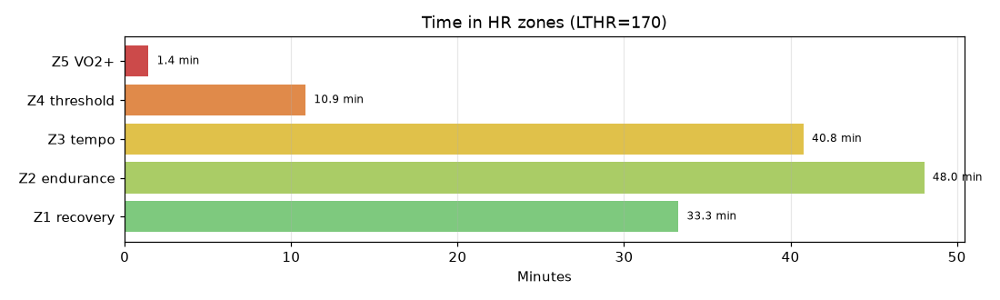

# Alhamdulillah not windy

**2026-06-21 08:12**

> Endurance ride — 55.1 km, 151 m gain (flat). Solid aerobic effort: hrTSS 111. Cadence in good range (mean 73 rpm, SD 8). Aerobic durability sound (decoupling -0.5%).

First logged ride — baseline established.

## Summary

| | |
|---|---|
| Distance | 55.08 km |
| Moving time | 2:13:31 |
| Total time | 2:19:56 |
| Avg speed | 24.7 km/h |
| Max speed | 47.9 km/h |
| Elev gain / loss | 151 / 154 m |
| Max grade | 4.6% |
| Avg HR | 149 bpm |
| Max HR | 173 bpm |
| Avg cadence | 73 rpm |
| **hrTSS** | **111** |
| TRIMP (Banister) | 239.6 |
| EF (speed/HR) | 2.77 |
| Pa:Hr decoupling | -0.5% |

## Timeline

## Cadence

| Stat | Value |
|---|---|
| Mean | 73 rpm |
| Median | 74 rpm |
| SD | 8 |
| Grind (<70) | 21% |
| Normal (70–85) | 76% |
| Spin (85–100) | 3% |
| High (>100) | 0% |

## Gear selection — front **50T** (of 50/34 compact crankset)

| Cog | Ratio | Time(s) | % moving |
|---|---|---|---|
| 11T | 4.55 | 184 | 2.4% |
| 13T | 3.85 | 211 | 2.7% |
| 15T | 3.33 | 313 | 4.0% |
| 17T | 2.94 | 2007 | 25.6% |
| 19T | 2.63 | 3105 | 39.7% |
| 21T | 2.38 | 1393 | 17.8% |
| 23T | 2.17 | 230 | 2.9% |
| 25T | 2.00 | 317 | 4.0% |
| 28T | 1.79 | 68 | 0.9% |

### Gear by grade bucket

| Grade bucket | Time (s) | Avg cog | Modal cog |
|---|---|---|---|
| downhill (<-3%) | 45 | 14.4T | 17T (38%) |
| false flat down | 365 | 15.1T | 13T (32%) |
| flat | 6665 | 18.5T | 19T (45%) |
| false flat up | 648 | 23.1T | 25T (38%) |
| rolling climb | 105 | 24.2T | 25T (51%) |
| steep climb (>6%) | 0 | – | – |

### Interpretation
- Most-used cog: 19T (40% of moving time).
- On rolling climbs (3-6%): mostly 25T.

## HR zones

LTHR assumed: **170 bpm** (configurable in `secrets/profile.json`).

## Climbs

_No detected climbs._

---

_Generated by bike-report. Bike: 2020 Allez Sport — Praxis Alba 50/34 compact, Shimano HG500 11-32T 10-spd. This ride analyzed assuming **50T** front. Override per-ride with `#34T` or `#50T` in Strava description._
