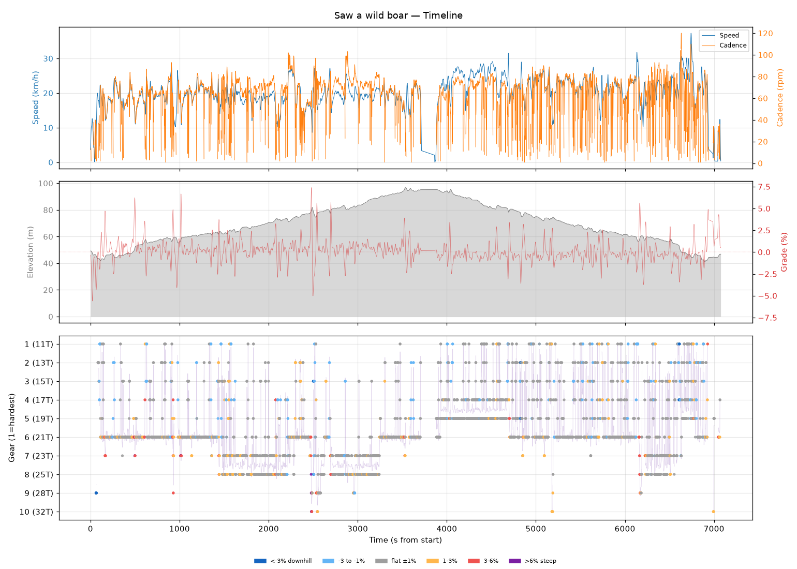
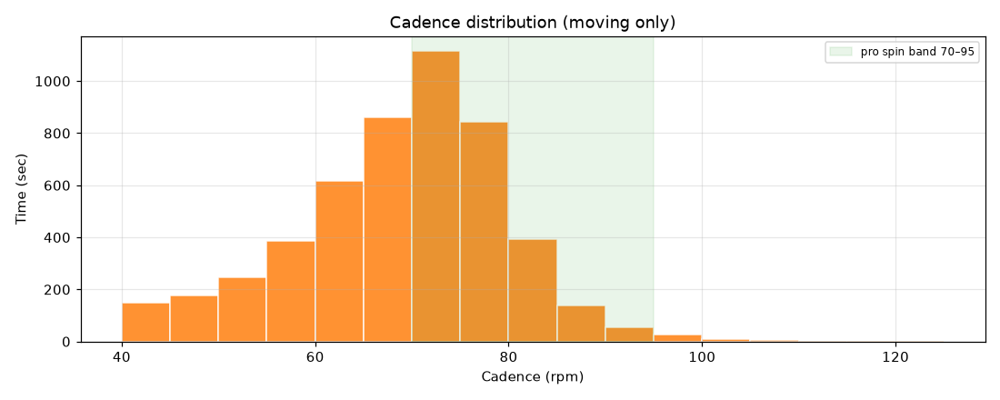
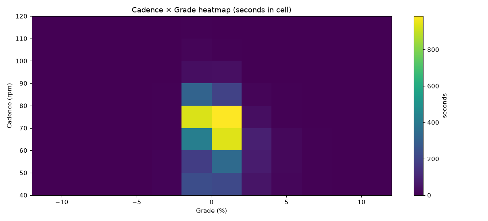
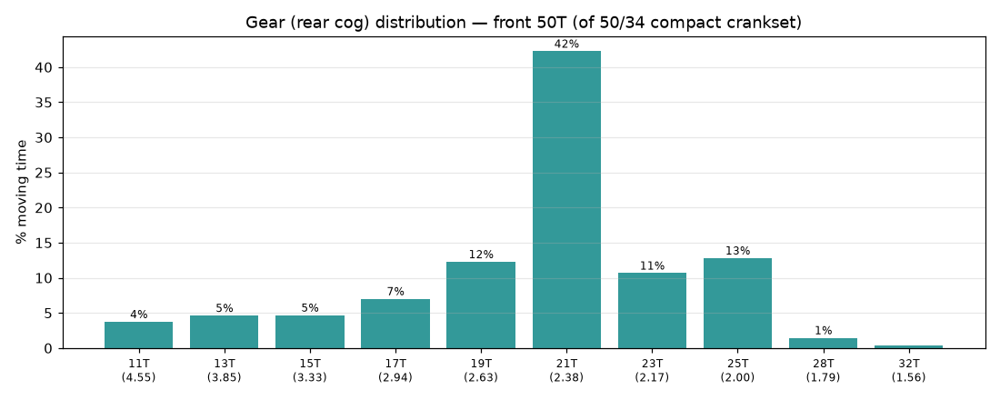
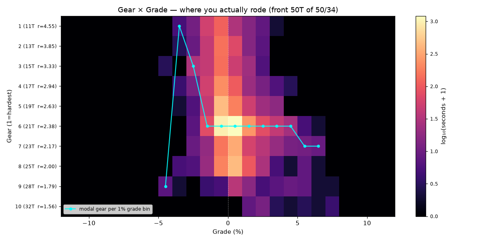
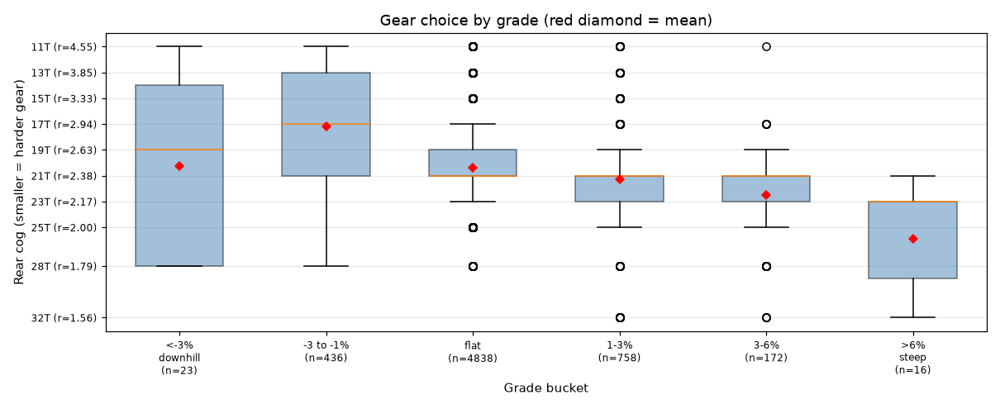
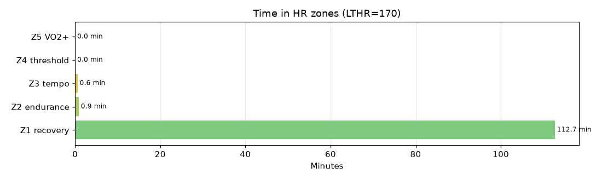

# Saw a wild boar

**2026-06-28 07:40**

> Endurance ride — 38.7 km, 163 m gain (mostly flat with bumps). Easy day: hrTSS 48. Grinding tendency — 51% time below 70 rpm. Aerobic durability sound (decoupling -18.0%).

First logged ride — baseline established.

## Summary

| | |
|---|---|
| Distance | 38.65 km |
| Moving time | 1:53:02 |
| Total time | 1:57:55 |
| Avg speed | 20.5 km/h |
| Max speed | 37.3 km/h |
| Elev gain / loss | 163 / 166 m |
| Max grade | 7.4% |
| Avg HR | 124 bpm |
| Max HR | 158 bpm |
| Avg cadence | 67 rpm |
| **hrTSS** | **48** |
| TRIMP (Banister) | 107.9 |
| EF (speed/HR) | 2.76 |
| Pa:Hr decoupling | -18.0% |

## Timeline

## Cadence

| Stat | Value |
|---|---|
| Mean | 67 rpm |
| Median | 69 rpm |
| SD | 13 |
| Grind (<70) | 51% |
| Normal (70–85) | 45% |
| Spin (85–100) | 4% |
| High (>100) | 0% |

## Gear selection — front **50T** (of 50/34 compact crankset)

| Cog | Ratio | Time(s) | % moving |
|---|---|---|---|
| 11T | 4.55 | 234 | 3.7% |
| 13T | 3.85 | 289 | 4.6% |
| 15T | 3.33 | 292 | 4.7% |
| 17T | 2.94 | 438 | 7.0% |
| 19T | 2.63 | 767 | 12.3% |
| 21T | 2.38 | 2639 | 42.3% |
| 23T | 2.17 | 666 | 10.7% |
| 25T | 2.00 | 800 | 12.8% |
| 28T | 1.79 | 91 | 1.5% |
| 32T | 1.56 | 27 | 0.4% |

### Gear by grade bucket

| Grade bucket | Time (s) | Avg cog | Modal cog |
|---|---|---|---|
| downhill (<-3%) | 23 | 20.3T | 28T (30%) |
| false flat down | 436 | 17.2T | 21T (19%) |
| flat | 4838 | 20.4T | 21T (45%) |
| false flat up | 758 | 21.3T | 21T (43%) |
| rolling climb | 172 | 22.5T | 21T (41%) |
| steep climb (>6%) | 16 | 25.9T | 23T (50%) |

### Interpretation
- Most-used cog: 21T (42% of moving time).
- On rolling climbs (3-6%): mostly 21T.

## HR zones

LTHR assumed: **170 bpm** (configurable in `secrets/profile.json`).

## Climbs

_No detected climbs._

---

_Generated by bike-report. Bike: 2020 Allez Sport — Praxis Alba 50/34 compact, Shimano HG500 11-32T 10-spd. This ride analyzed assuming **50T** front. Override per-ride with `#34T` or `#50T` in Strava description._
