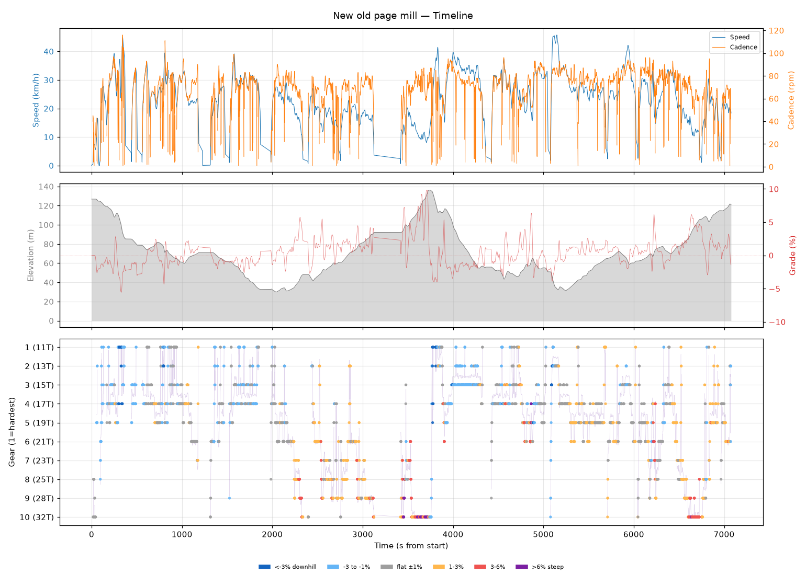
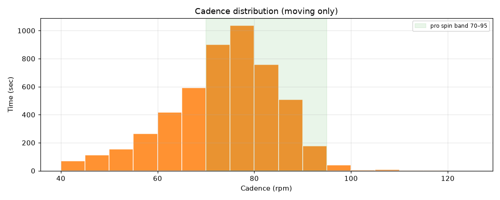
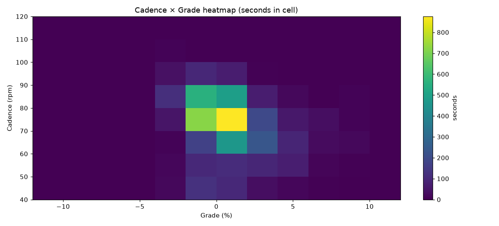
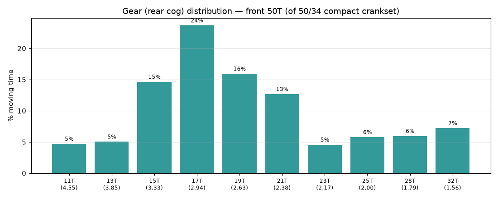
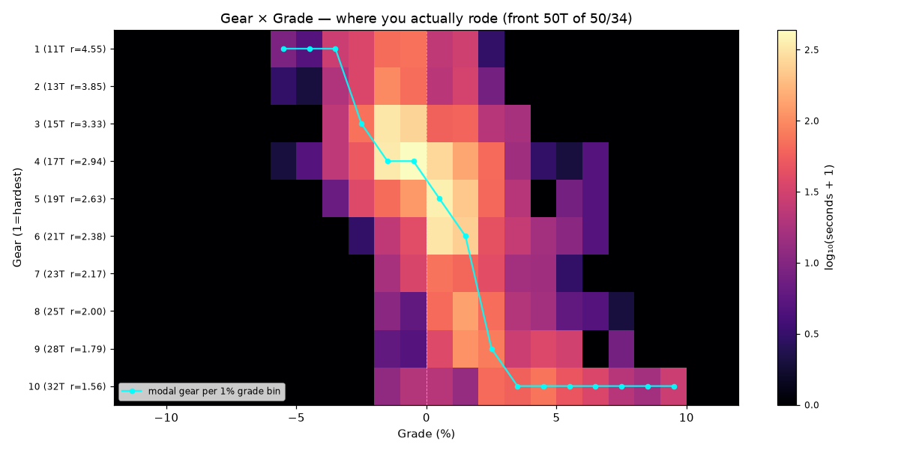
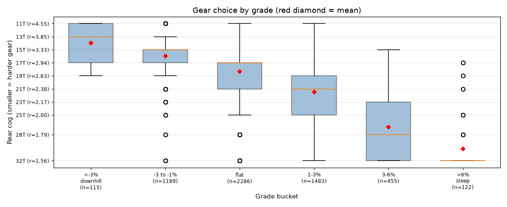
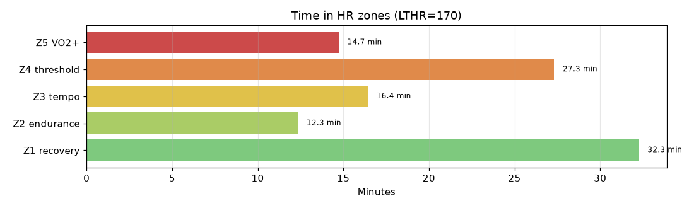

# New old page mill

**2026-07-24 16:38**

> Endurance ride — 41.8 km, 307 m gain (mostly flat with bumps). Solid aerobic effort: hrTSS 113. Cadence in good range (mean 72 rpm, SD 12). Aerobic durability sound (decoupling -1.4%). 1 climb(s); biggest: 739m @ 4.9% (cat uncat, VAM 585).

First logged ride — baseline established.

## Summary

| | |
|---|---|
| Distance | 41.76 km |
| Moving time | 1:41:06 |
| Total time | 1:57:57 |
| Avg speed | 24.7 km/h |
| Max speed | 45.8 km/h |
| Elev gain / loss | 307 / 313 m |
| Max grade | 9.8% |
| Avg HR | 151 bpm |
| Max HR | 178 bpm |
| Avg cadence | 72 rpm |
| **hrTSS** | **113** |
| TRIMP (Banister) | 203.3 |
| EF (speed/HR) | 2.71 |
| Pa:Hr decoupling | -1.4% |

## Timeline

## Cadence

| Stat | Value |
|---|---|
| Mean | 72 rpm |
| Median | 74 rpm |
| SD | 12 |
| Grind (<70) | 33% |
| Normal (70–85) | 52% |
| Spin (85–100) | 14% |
| High (>100) | 0% |

## Gear selection — front **50T** (of 50/34 compact crankset)

| Cog | Ratio | Time(s) | % moving |
|---|---|---|---|
| 11T | 4.55 | 265 | 4.7% |
| 13T | 3.85 | 284 | 5.0% |
| 15T | 3.33 | 826 | 14.6% |
| 17T | 2.94 | 1337 | 23.7% |
| 19T | 2.63 | 899 | 15.9% |
| 21T | 2.38 | 715 | 12.7% |
| 23T | 2.17 | 257 | 4.5% |
| 25T | 2.00 | 325 | 5.8% |
| 28T | 1.79 | 335 | 5.9% |
| 32T | 1.56 | 407 | 7.2% |

### Gear by grade bucket

| Grade bucket | Time (s) | Avg cog | Modal cog |
|---|---|---|---|
| downhill (<-3%) | 115 | 14.0T | 11T (34%) |
| false flat down | 1189 | 16.0T | 15T (33%) |
| flat | 2286 | 18.3T | 17T (31%) |
| false flat up | 1483 | 21.5T | 21T (19%) |
| rolling climb | 455 | 26.8T | 32T (40%) |
| steep climb (>6%) | 122 | 30.2T | 32T (80%) |

### Interpretation
- Most-used cog: 17T (24% of moving time).
- On rolling climbs (3-6%): mostly 32T.

## HR zones

LTHR assumed: **170 bpm** (configurable in `secrets/profile.json`).

## Climbs

| Length | Avg grade | Gain | Duration | VAM | Cat | Avg HR | Avg cad | Modal cog |
|---|---|---|---|---|---|---|---|---|
| 0.74 km | 4.9% | 36 m | 0:03:44 | 585 | cat uncat | 167 | 72 | 32T |

---

_Generated by bike-report. Bike: 2020 Allez Sport — Praxis Alba 50/34 compact, Shimano HG500 11-32T 10-spd. This ride analyzed assuming **50T** front. Override per-ride with `#34T` or `#50T` in Strava description._
