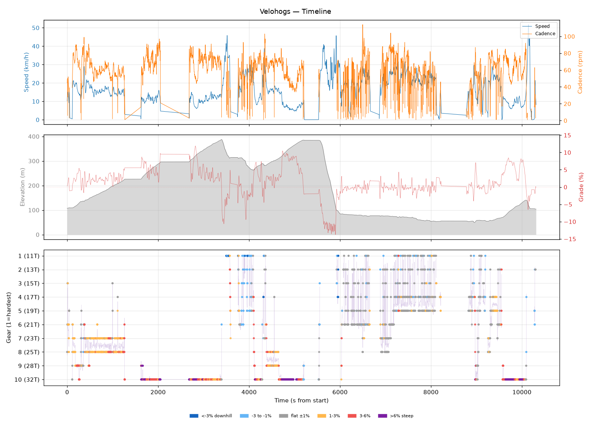
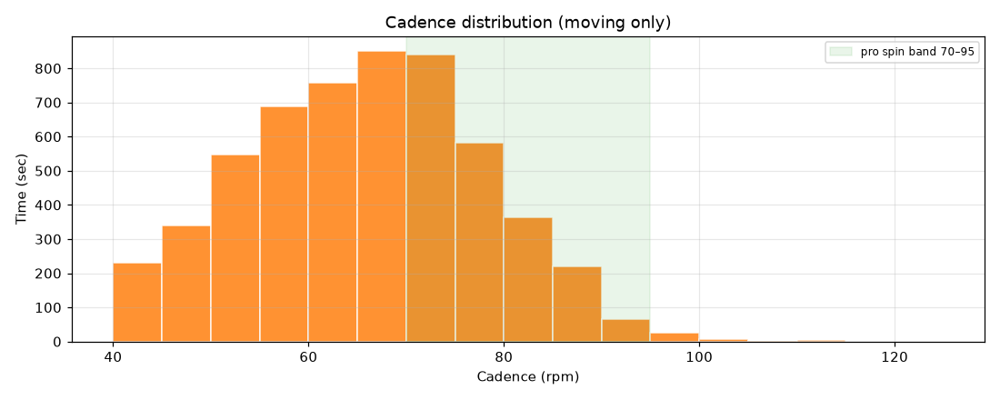
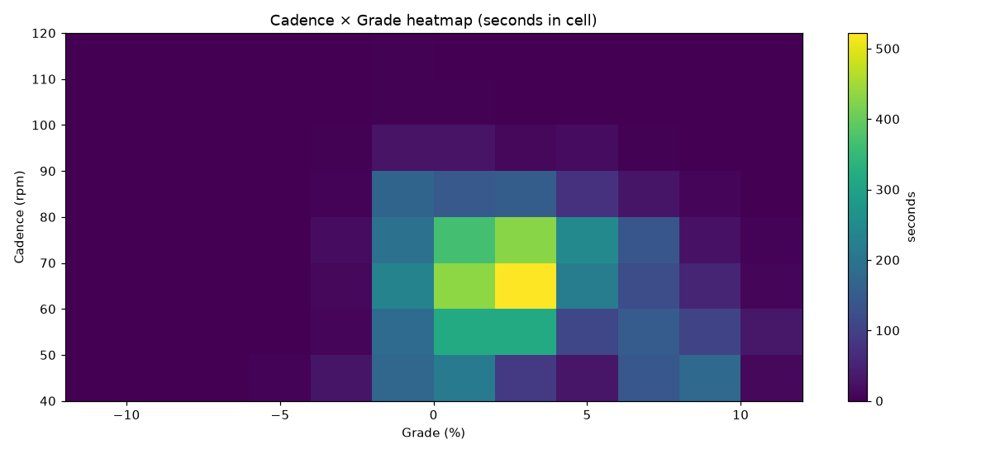
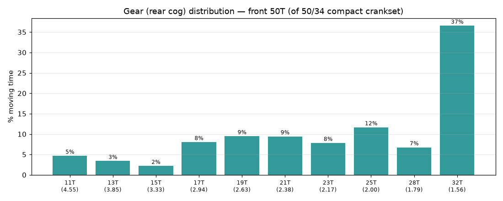
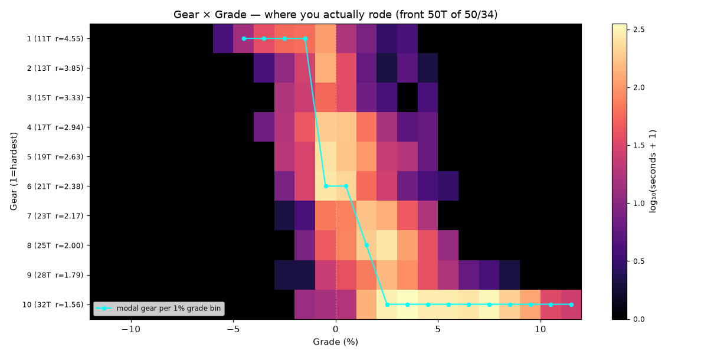
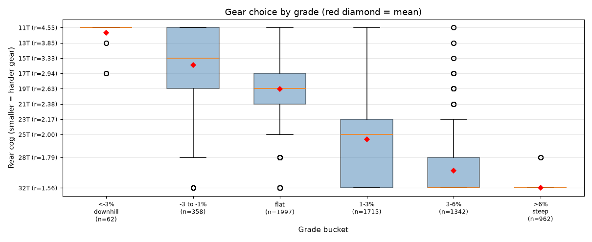
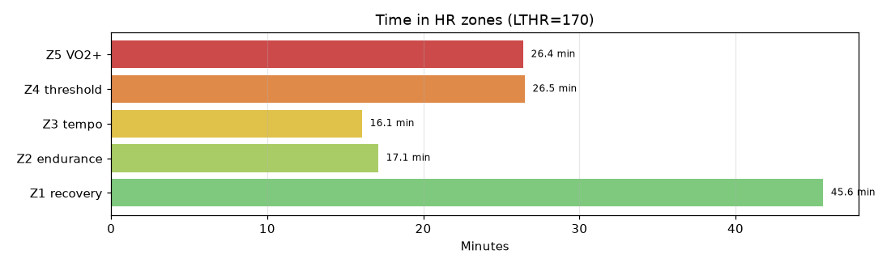

# Velohogs

**2026-08-02 08:43**

> Endurance ride — 37.5 km, 552 m gain (rolling). High effort: hrTSS 146. Grinding tendency — 64% time below 70 rpm. Aerobic durability sound (decoupling -41.2%). 3 climb(s); biggest: 4568m @ 4.1% (cat 3, VAM 287).

First logged ride — baseline established.

## Summary

| | |
|---|---|
| Distance | 37.54 km |
| Moving time | 2:07:40 |
| Total time | 2:51:50 |
| Avg speed | 17.5 km/h |
| Max speed | 51.7 km/h |
| Elev gain / loss | 552 / 555 m |
| Max grade | 11.9% |
| Avg HR | 152 bpm |
| Max HR | 185 bpm |
| Avg cadence | 64 rpm |
| **hrTSS** | **146** |
| TRIMP (Banister) | 268.5 |
| EF (speed/HR) | 1.91 |
| Pa:Hr decoupling | -41.2% |

## Timeline

## Cadence

| Stat | Value |
|---|---|
| Mean | 64 rpm |
| Median | 65 rpm |
| SD | 13 |
| Grind (<70) | 64% |
| Normal (70–85) | 31% |
| Spin (85–100) | 5% |
| High (>100) | 0% |

## Gear selection — front **50T** (of 50/34 compact crankset)

| Cog | Ratio | Time(s) | % moving |
|---|---|---|---|
| 11T | 4.55 | 301 | 4.7% |
| 13T | 3.85 | 219 | 3.4% |
| 15T | 3.33 | 141 | 2.2% |
| 17T | 2.94 | 517 | 8.0% |
| 19T | 2.63 | 610 | 9.5% |
| 21T | 2.38 | 607 | 9.4% |
| 23T | 2.17 | 504 | 7.8% |
| 25T | 2.00 | 750 | 11.7% |
| 28T | 1.79 | 434 | 6.7% |
| 32T | 1.56 | 2353 | 36.6% |

### Gear by grade bucket

| Grade bucket | Time (s) | Avg cog | Modal cog |
|---|---|---|---|
| downhill (<-3%) | 62 | 11.7T | 11T (85%) |
| false flat down | 358 | 15.9T | 11T (32%) |
| flat | 1997 | 19.1T | 21T (24%) |
| false flat up | 1715 | 25.6T | 25T (27%) |
| rolling climb | 1342 | 29.8T | 32T (69%) |
| steep climb (>6%) | 962 | 32.0T | 32T (99%) |

### Interpretation
- Significant climbing-cog use (55% in 25T+).
- Most-used cog: 32T (37% of moving time).
- On rolling climbs (3-6%): mostly 32T.

## HR zones

LTHR assumed: **170 bpm** (configurable in `secrets/profile.json`).

## Climbs

| Length | Avg grade | Gain | Duration | VAM | Cat | Avg HR | Avg cad | Modal cog |
|---|---|---|---|---|---|---|---|---|
| 4.57 km | 4.1% | 189 m | 0:39:33 | 287 | cat 3 | 169 | 68 | 32T |
| 1.15 km | 6.5% | 75 m | 0:08:54 | 504 | cat uncat | 174 | 53 | 32T |
| 1.32 km | 5.4% | 71 m | 0:08:57 | 478 | cat uncat | 169 | 63 | 32T |

---

_Generated by bike-report. Bike: 2020 Allez Sport — Praxis Alba 50/34 compact, Shimano HG500 11-32T 10-spd. This ride analyzed assuming **50T** front. Override per-ride with `#34T` or `#50T` in Strava description._
