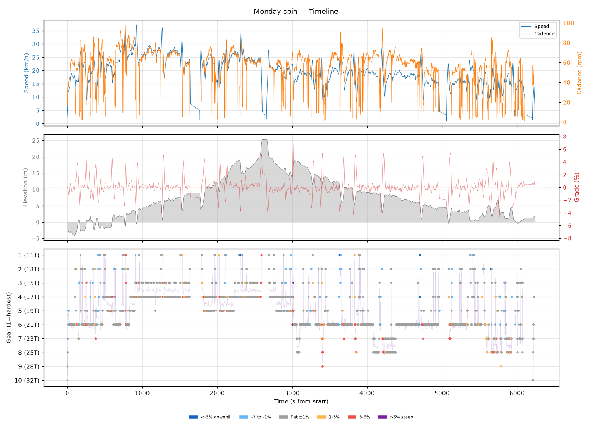
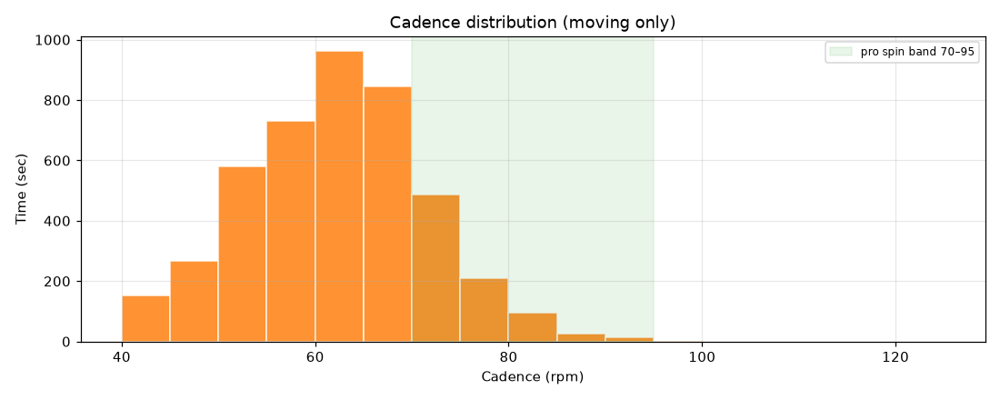
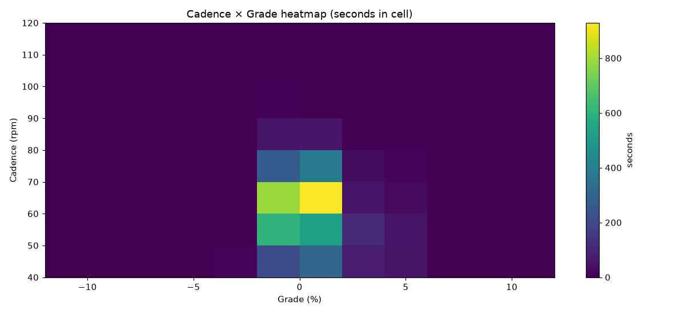
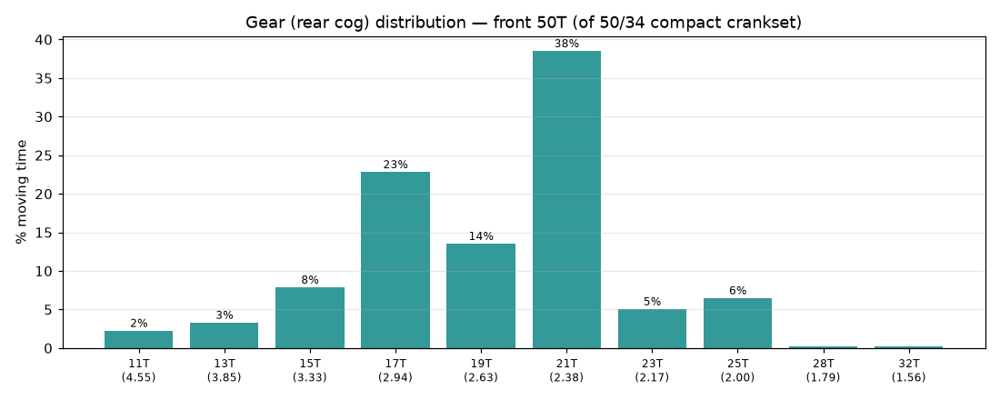
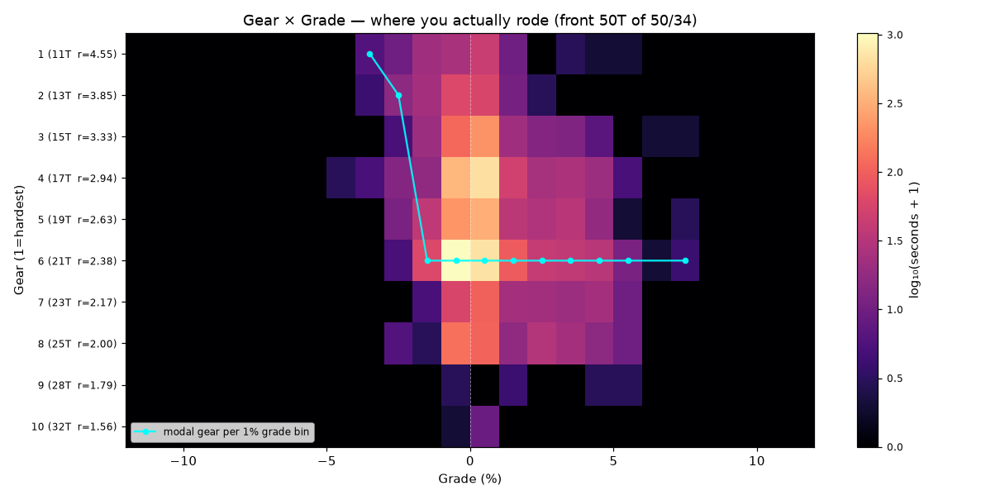
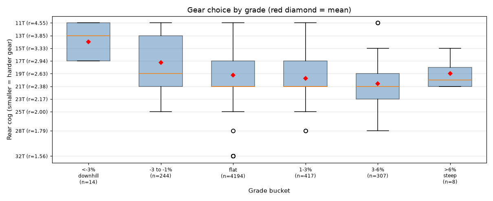
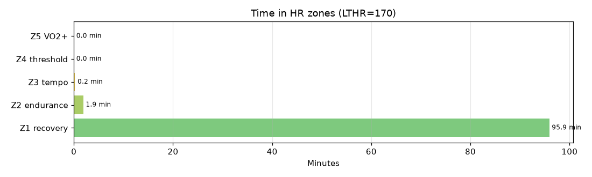

# Monday spin

**2026-08-10 16:18**

> Endurance ride — 32.3 km, 148 m gain (mostly flat with bumps). Easy day: hrTSS 42. Grinding tendency — 82% time below 70 rpm. Aerobic decoupling 27.6% — high; check pacing/hydration.

First logged ride — baseline established.

## Summary

| | |
|---|---|
| Distance | 32.32 km |
| Moving time | 1:37:24 |
| Total time | 1:44:04 |
| Avg speed | 19.9 km/h |
| Max speed | 37.3 km/h |
| Elev gain / loss | 148 / 143 m |
| Max grade | 7.6% |
| Avg HR | 125 bpm |
| Max HR | 154 bpm |
| Avg cadence | 60 rpm |
| **hrTSS** | **42** |
| TRIMP (Banister) | 97.6 |
| EF (speed/HR) | 2.64 |
| Pa:Hr decoupling | 27.6% |

## Timeline

## Cadence

| Stat | Value |
|---|---|
| Mean | 60 rpm |
| Median | 61 rpm |
| SD | 11 |
| Grind (<70) | 82% |
| Normal (70–85) | 17% |
| Spin (85–100) | 1% |
| High (>100) | 0% |

## Gear selection — front **50T** (of 50/34 compact crankset)

| Cog | Ratio | Time(s) | % moving |
|---|---|---|---|
| 11T | 4.55 | 116 | 2.2% |
| 13T | 3.85 | 170 | 3.3% |
| 15T | 3.33 | 407 | 7.9% |
| 17T | 2.94 | 1182 | 22.8% |
| 19T | 2.63 | 700 | 13.5% |
| 21T | 2.38 | 1995 | 38.5% |
| 23T | 2.17 | 261 | 5.0% |
| 25T | 2.00 | 335 | 6.5% |
| 28T | 1.79 | 9 | 0.2% |
| 32T | 1.56 | 9 | 0.2% |

### Gear by grade bucket

| Grade bucket | Time (s) | Avg cog | Modal cog |
|---|---|---|---|
| downhill (<-3%) | 14 | 14.0T | 17T (43%) |
| false flat down | 244 | 17.2T | 21T (27%) |
| flat | 4194 | 19.2T | 21T (41%) |
| false flat up | 417 | 19.8T | 21T (32%) |
| rolling climb | 307 | 20.6T | 21T (26%) |
| steep climb (>6%) | 8 | 19.0T | 21T (50%) |

### Interpretation
- Most-used cog: 21T (38% of moving time).
- On rolling climbs (3-6%): mostly 21T.

## HR zones

LTHR assumed: **170 bpm** (configurable in `secrets/profile.json`).

## Climbs

_No detected climbs._

---

_Generated by bike-report. Bike: 2020 Allez Sport — Praxis Alba 50/34 compact, Shimano HG500 11-32T 10-spd. This ride analyzed assuming **50T** front. Override per-ride with `#34T` or `#50T` in Strava description._
