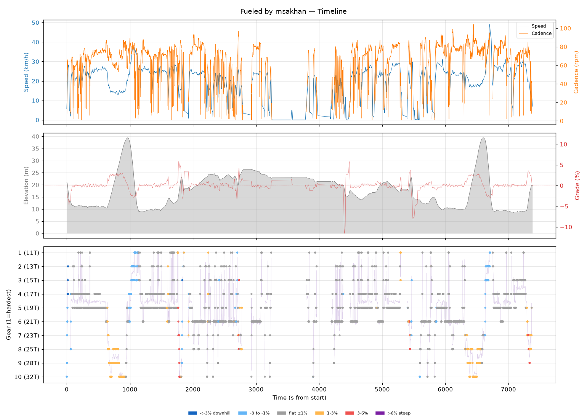
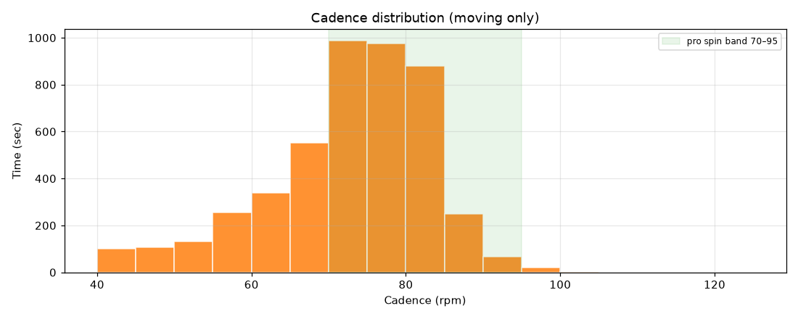
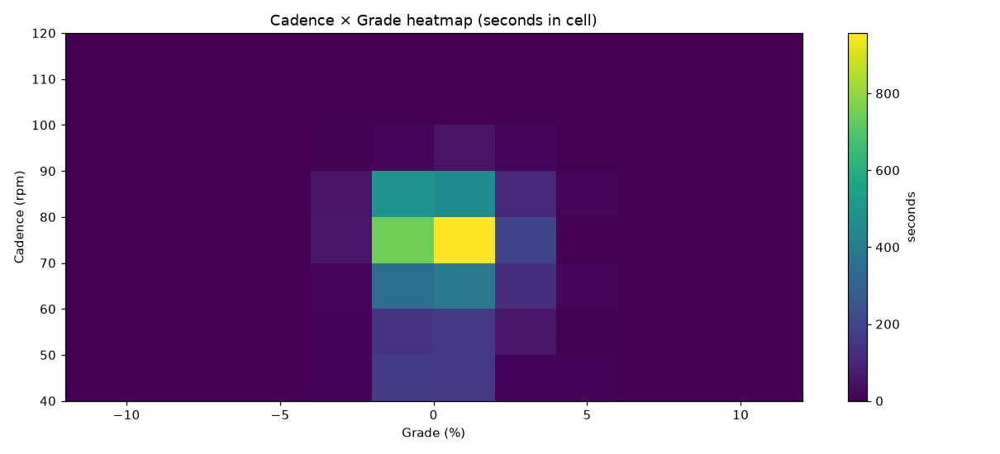
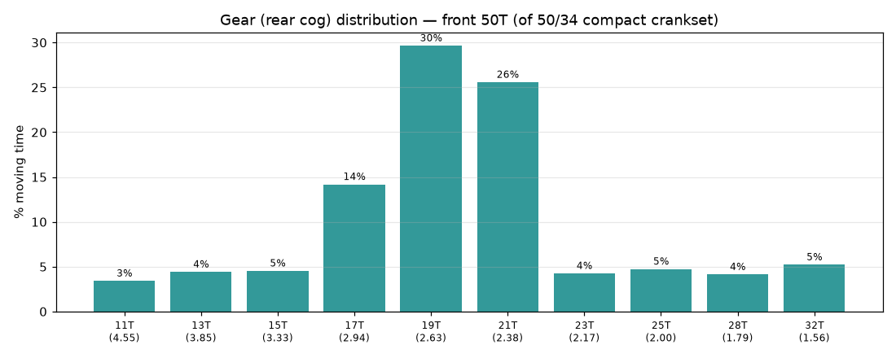
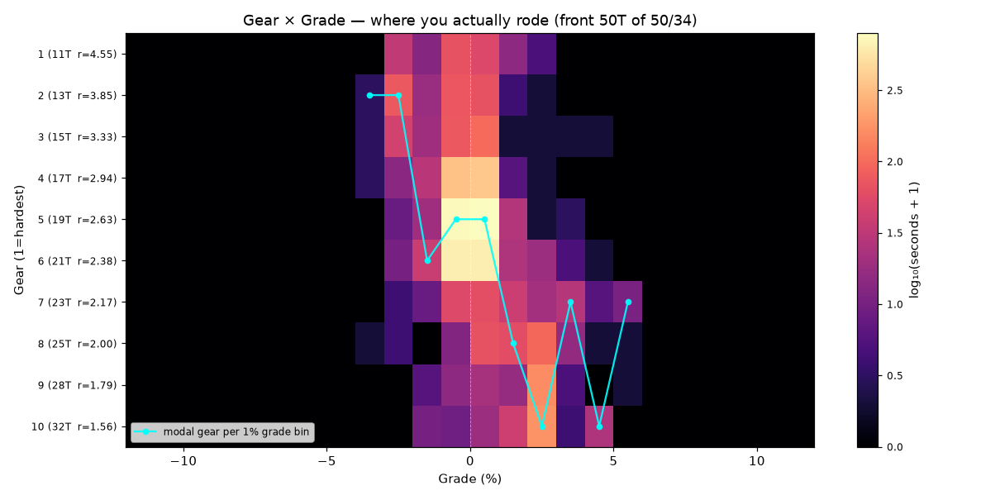
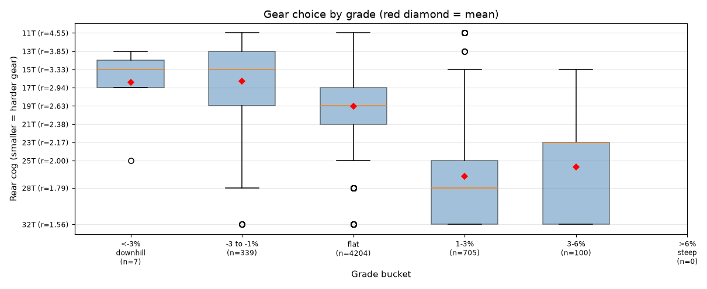
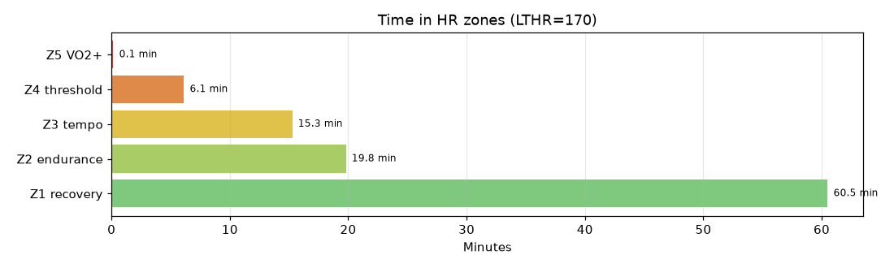

# Fueled by msakhan

**2026-08-16 07:38**

> Endurance ride — 36.3 km, 137 m gain (flat). Solid aerobic effort: hrTSS 65. Cadence in good range (mean 71 rpm, SD 12). Aerobic durability sound (decoupling 4.3%).

First logged ride — baseline established.

## Summary

| | |
|---|---|
| Distance | 36.34 km |
| Moving time | 1:37:40 |
| Total time | 2:03:00 |
| Avg speed | 22.1 km/h |
| Max speed | 49.0 km/h |
| Elev gain / loss | 137 / 138 m |
| Max grade | 5.9% |
| Avg HR | 139 bpm |
| Max HR | 174 bpm |
| Avg cadence | 71 rpm |
| **hrTSS** | **65** |
| TRIMP (Banister) | 146.5 |
| EF (speed/HR) | 2.65 |
| Pa:Hr decoupling | 4.3% |

## Timeline

## Cadence

| Stat | Value |
|---|---|
| Mean | 71 rpm |
| Median | 73 rpm |
| SD | 12 |
| Grind (<70) | 34% |
| Normal (70–85) | 59% |
| Spin (85–100) | 7% |
| High (>100) | 0% |

## Gear selection — front **50T** (of 50/34 compact crankset)

| Cog | Ratio | Time(s) | % moving |
|---|---|---|---|
| 11T | 4.55 | 182 | 3.4% |
| 13T | 3.85 | 236 | 4.4% |
| 15T | 3.33 | 242 | 4.5% |
| 17T | 2.94 | 759 | 14.2% |
| 19T | 2.63 | 1587 | 29.6% |
| 21T | 2.38 | 1369 | 25.6% |
| 23T | 2.17 | 227 | 4.2% |
| 25T | 2.00 | 253 | 4.7% |
| 28T | 1.79 | 221 | 4.1% |
| 32T | 1.56 | 279 | 5.2% |

### Gear by grade bucket

| Grade bucket | Time (s) | Avg cog | Modal cog |
|---|---|---|---|
| downhill (<-3%) | 7 | 16.4T | 17T (29%) |
| false flat down | 339 | 16.3T | 13T (27%) |
| flat | 4204 | 19.1T | 19T (36%) |
| false flat up | 705 | 26.7T | 32T (31%) |
| rolling climb | 100 | 25.7T | 23T (42%) |
| steep climb (>6%) | 0 | – | – |

### Interpretation
- Most-used cog: 19T (30% of moving time).
- On rolling climbs (3-6%): mostly 23T.

## HR zones

LTHR assumed: **170 bpm** (configurable in `secrets/profile.json`).

## Climbs

_No detected climbs._

---

_Generated by bike-report. Bike: 2020 Allez Sport — Praxis Alba 50/34 compact, Shimano HG500 11-32T 10-spd. This ride analyzed assuming **50T** front. Override per-ride with `#34T` or `#50T` in Strava description._
