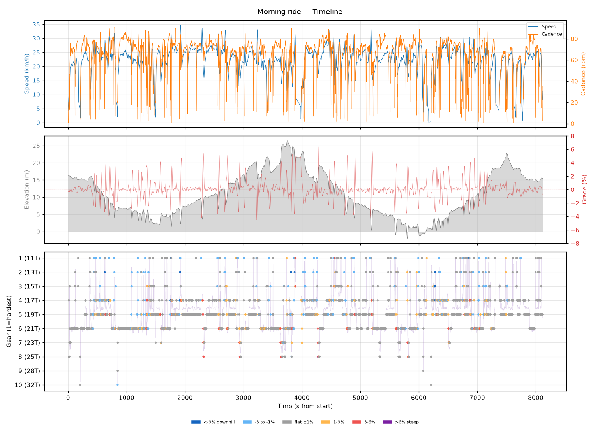
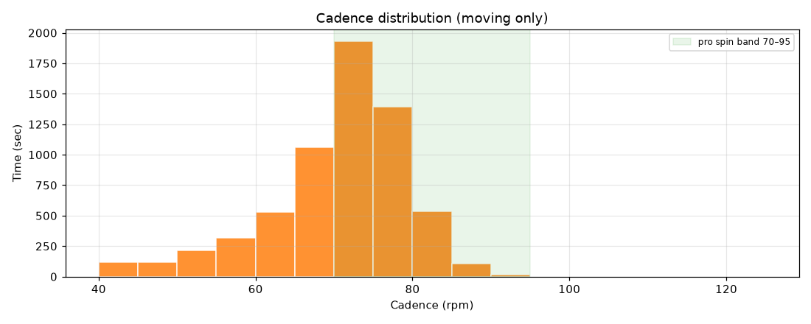
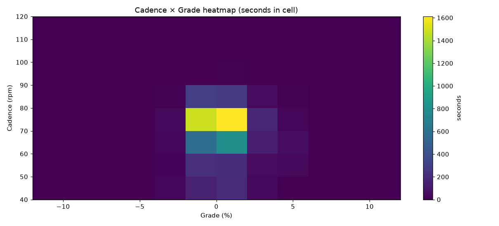
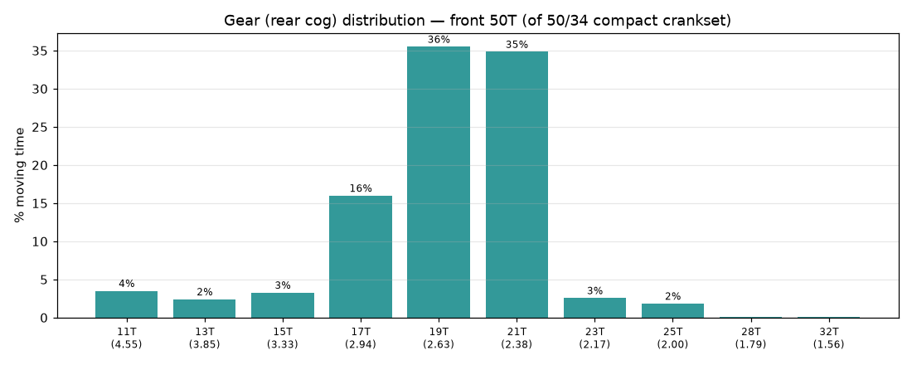
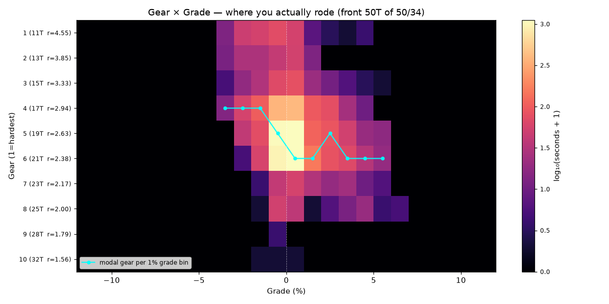
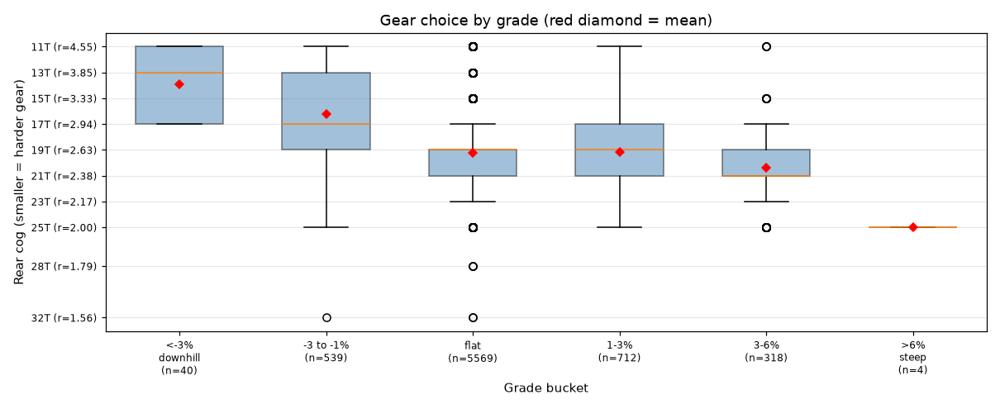
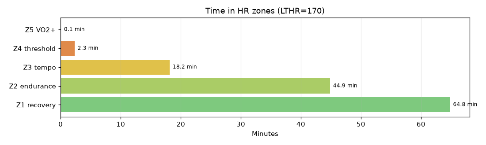

# Morning ride

**2026-08-18 08:57**

> Endurance ride — 49.0 km, 215 m gain (mostly flat with bumps). Solid aerobic effort: hrTSS 82. Cadence in good range (mean 69 rpm, SD 10). Aerobic durability sound (decoupling 3.2%).

First logged ride — baseline established.

## Summary

| | |
|---|---|
| Distance | 49.00 km |
| Moving time | 2:09:12 |
| Total time | 2:15:17 |
| Avg speed | 22.7 km/h |
| Max speed | 34.7 km/h |
| Elev gain / loss | 215 / 216 m |
| Max grade | 6.4% |
| Avg HR | 143 bpm |
| Max HR | 170 bpm |
| Avg cadence | 69 rpm |
| **hrTSS** | **82** |
| TRIMP (Banister) | 202.1 |
| EF (speed/HR) | 2.65 |
| Pa:Hr decoupling | 3.2% |

## Timeline

## Cadence

| Stat | Value |
|---|---|
| Mean | 69 rpm |
| Median | 72 rpm |
| SD | 10 |
| Grind (<70) | 39% |
| Normal (70–85) | 59% |
| Spin (85–100) | 2% |
| High (>100) | 0% |

## Gear selection — front **50T** (of 50/34 compact crankset)

| Cog | Ratio | Time(s) | % moving |
|---|---|---|---|
| 11T | 4.55 | 252 | 3.5% |
| 13T | 3.85 | 173 | 2.4% |
| 15T | 3.33 | 235 | 3.3% |
| 17T | 2.94 | 1148 | 16.0% |
| 19T | 2.63 | 2550 | 35.5% |
| 21T | 2.38 | 2502 | 34.8% |
| 23T | 2.17 | 184 | 2.6% |
| 25T | 2.00 | 132 | 1.8% |
| 28T | 1.79 | 3 | 0.0% |
| 32T | 1.56 | 3 | 0.0% |

### Gear by grade bucket

| Grade bucket | Time (s) | Avg cog | Modal cog |
|---|---|---|---|
| downhill (<-3%) | 40 | 13.9T | 17T (32%) |
| false flat down | 539 | 16.2T | 17T (29%) |
| flat | 5569 | 19.3T | 19T (39%) |
| false flat up | 712 | 19.1T | 21T (33%) |
| rolling climb | 318 | 20.4T | 21T (37%) |
| steep climb (>6%) | 4 | 25.0T | 25T (100%) |

### Interpretation
- Most-used cog: 19T (36% of moving time).
- On rolling climbs (3-6%): mostly 21T.

## HR zones

LTHR assumed: **170 bpm** (configurable in `secrets/profile.json`).

## Climbs

_No detected climbs._

---

_Generated by bike-report. Bike: 2020 Allez Sport — Praxis Alba 50/34 compact, Shimano HG500 11-32T 10-spd. This ride analyzed assuming **50T** front. Override per-ride with `#34T` or `#50T` in Strava description._
