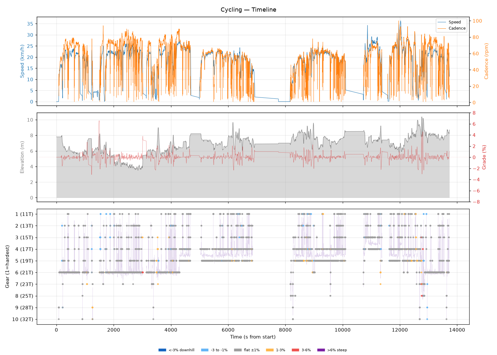
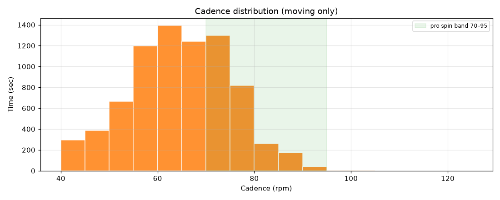
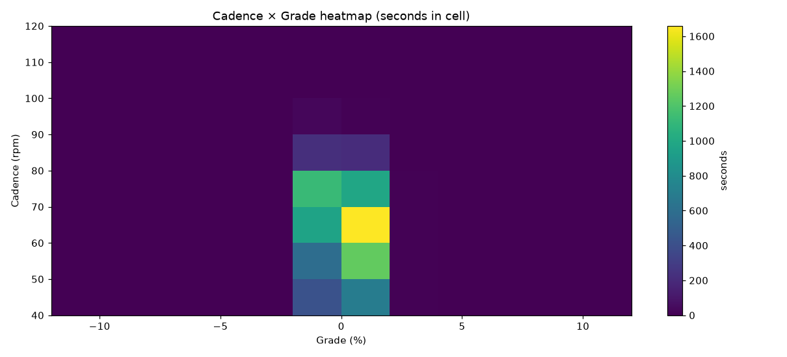
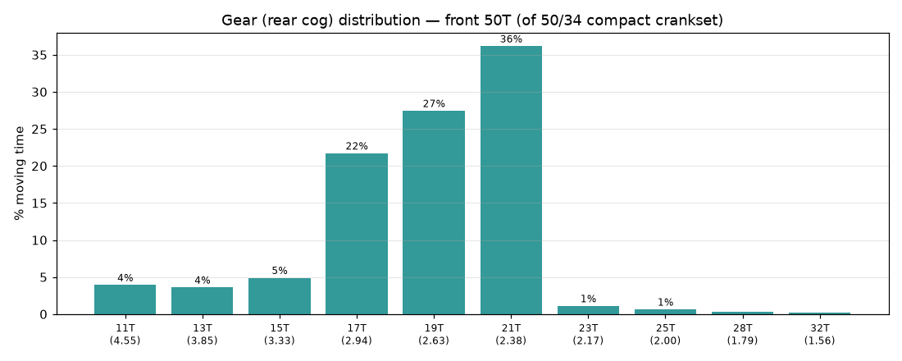
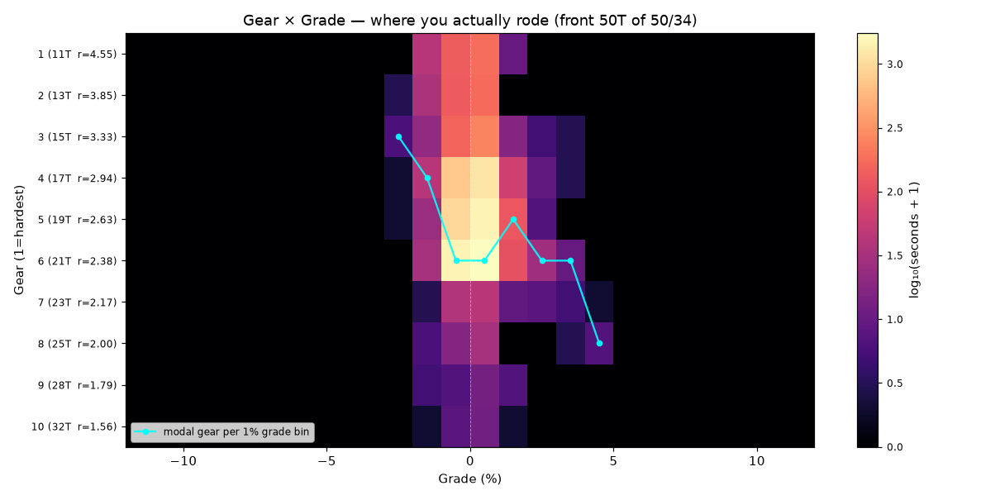
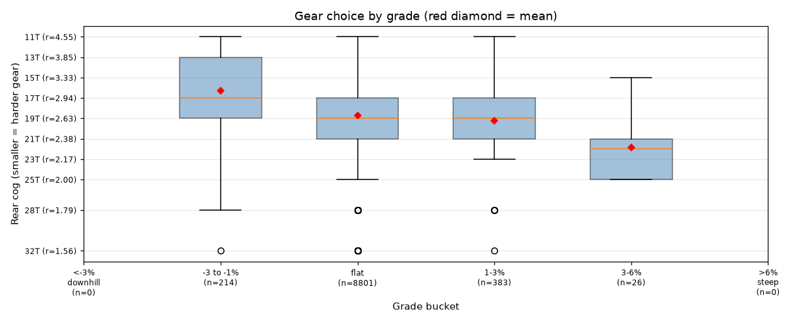
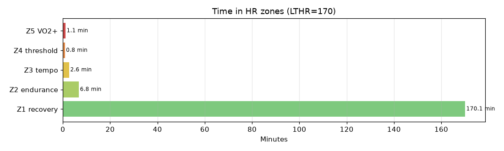

# Cycling

**2026-08-23 07:18**

> Endurance ride — 59.1 km, 105 m gain (flat). Solid aerobic effort: hrTSS 82. Grinding tendency — 68% time below 70 rpm. Mild decoupling 5.7%.

First logged ride — baseline established.

## Summary

| | |
|---|---|
| Distance | 59.12 km |
| Moving time | 2:53:30 |
| Total time | 3:48:52 |
| Avg speed | 20.3 km/h |
| Max speed | 36.3 km/h |
| Elev gain / loss | 105 / 105 m |
| Max grade | 6.6% |
| Avg HR | 125 bpm |
| Max HR | 179 bpm |
| Avg cadence | 63 rpm |
| **hrTSS** | **82** |
| TRIMP (Banister) | 180.5 |
| EF (speed/HR) | 2.70 |
| Pa:Hr decoupling | 5.7% |

## Timeline

## Cadence

| Stat | Value |
|---|---|
| Mean | 63 rpm |
| Median | 63 rpm |
| SD | 12 |
| Grind (<70) | 68% |
| Normal (70–85) | 29% |
| Spin (85–100) | 3% |
| High (>100) | 0% |

## Gear selection — front **50T** (of 50/34 compact crankset)

| Cog | Ratio | Time(s) | % moving |
|---|---|---|---|
| 11T | 4.55 | 370 | 3.9% |
| 13T | 3.85 | 340 | 3.6% |
| 15T | 3.33 | 462 | 4.9% |
| 17T | 2.94 | 2046 | 21.7% |
| 19T | 2.63 | 2586 | 27.4% |
| 21T | 2.38 | 3408 | 36.2% |
| 23T | 2.17 | 104 | 1.1% |
| 25T | 2.00 | 60 | 0.6% |
| 28T | 1.79 | 28 | 0.3% |
| 32T | 1.56 | 20 | 0.2% |

### Gear by grade bucket

| Grade bucket | Time (s) | Avg cog | Modal cog |
|---|---|---|---|
| downhill (<-3%) | 0 | – | – |
| false flat down | 214 | 16.3T | 17T (20%) |
| flat | 8801 | 18.7T | 21T (37%) |
| false flat up | 383 | 19.2T | 21T (35%) |
| rolling climb | 26 | 21.8T | 21T (35%) |
| steep climb (>6%) | 0 | – | – |

### Interpretation
- Most-used cog: 21T (36% of moving time).
- On rolling climbs (3-6%): mostly 21T.

## HR zones

LTHR assumed: **170 bpm** (configurable in `secrets/profile.json`).

## Climbs

_No detected climbs._

---

_Generated by bike-report. Bike: 2020 Allez Sport — Praxis Alba 50/34 compact, Shimano HG500 11-32T 10-spd. This ride analyzed assuming **50T** front. Override per-ride with `#34T` or `#50T` in Strava description._
